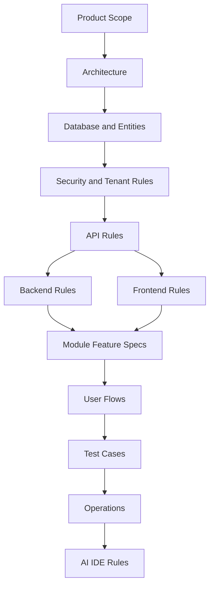

# Start Here

This folder is the entry point for the Unified Commerce 2nd Brain.

The system documented here is a production-ready multi-tenant Unified Commerce SaaS platform for E-POS, E-Commerce, offline POS, inventory, payments, refunds, fulfillment, hardware, reporting, audit, tenant configuration, and AI-assisted data onboarding.

This is not a basic POS project and not an MVP-only scope.

---

## Source baseline

All documentation must align with these uploaded source documents.

| Source | Used for |
|---|---|
| Unified Commerce Scope document | Production modules, business workflows, actors, rules, and boundaries. |
| Unified Commerce Database Design document | Table names, relationships, constraints, source-of-truth rules, offline sync, reporting read models. |
| Backend Architecture document | .NET Clean Architecture, modules, services, validators, DTOs, repositories, strategies, Unit of Work. |
| Frontend Architecture document | React TypeScript structure, bootstrap, core, features, shells, pages, state, shared-kernel. |
| Current 2nd Brain structure | Folder organization, module placement, templates, and documentation navigation. |

Related:

- [[source-document-alignment]]
- [[documentation-rules]]
- [[folder-structure-guide]]
- [[production-readiness-index]]
- [[file-inventory]]

---

## Who uses this vault

| Reader | Main use |
|---|---|
| Product owner | Scope, modules, workflows, and business rules. |
| Architect | System design, tenancy, offline architecture, security, integrations, and source-of-truth boundaries. |
| Backend developer | Clean Architecture, validation, services, repositories, transactions, and domain rules. |
| Frontend developer | React structure, POS UI, state management, offline behavior, and peripheral handling. |
| QA engineer | Feature specs, user flows, acceptance criteria, edge cases, and regression coverage. |
| DevOps/support | Deployment, tenant onboarding, monitoring, support, incident, backup, and recovery. |
| AI IDE tools | Safe reading order and implementation gates before changing code. |

---

## Production scope summary

| Area | Scope |
|---|---|
| Tenant and platform | Tenant lifecycle, outlets, operating mode, document sequences, feature entitlements. |
| Identity and access | Platform users, tenant users, customers, roles, permissions, feature flags, role-feature assignment. |
| Catalog | Categories, brands, suppliers, products, variants, attributes, images, return policies. |
| Tax and pricing | Tax classes, tax rates, tax mappings, price lists, outlet overrides, pricing snapshots. |
| Inventory | Balances, allocations, movements, reservations, receiving, transfers, adjustments, stocktakes. |
| POS | Devices, tills, sessions, cash movements, sales, sale lines, hold/recall, void/cancel. |
| E-Commerce | Storefront, carts, checkout, orders, addresses, status history, wishlists, reviews. |
| Fulfillment | Delivery methods, zones, rates, pickup, delivery, items, and tracking. |
| Payments | Payment methods, provider configs, payments, transactions, allocations, refunds. |
| Discounts | Policies, requests, approvals, coupons, applications, redemptions. |
| Returns/exchanges | Return documents, return lines, exchange documents, refund/payment allocations. |
| Receipts | Templates, receipt records, print logs, frozen payloads, barcode/QR lookup. |
| Offline sync | Sync batches, sync items, sale/payment queues, conflicts, sync audit logs. |
| Reporting | Sales, payment, inventory, discount, return, exchange, tax, cash, reconciliation reports. |
| Security | Tenant isolation, RBAC, OTP, offline data protection, payment security, audit. |
| Data import/AI | Import jobs, validation review, duplicate detection, AI extraction review. |

---

## Recommended reading order

```text
00-start-here
12-templates
01-product
02-architecture
03-data
09-security-and-compliance
04-api
05-backend
06-frontend
07-modules
08-user-flows
10-testing-quality
11-delivery-and-operations
14-ai-ide-rules
13-project-history
99-archive
```

Do not start from feature folders before understanding product scope, architecture, database, security, API, backend, and frontend rules.

---

## Dependency model



---

## Main folders

| Folder | Role |
|---|---|
| [[00-start-here]] | Entry point, rules, source alignment, structure, readiness, inventory. |
| [[01-product]] | Product vision, business objectives, scope, module catalog, actors. |
| [[02-architecture]] | System, tenancy, RBAC, backend, frontend, offline, security, integration. |
| [[03-data]] | Database overview, entity references, tenant rules, indexing, migration, EF Core. |
| [[04-api]] | API standards, tenant context, feature access, idempotency, errors, endpoints. |
| [[05-backend]] | Clean Architecture, services, validation, repositories, transactions, domain logic. |
| [[06-frontend]] | React structure, POS UI, offline frontend, peripherals, state, routing. |
| [[07-modules]] | Module READMEs, feature specs, feature histories. |
| [[08-user-flows]] | Actor-based workflows. |
| [[09-security-and-compliance]] | Auth, RBAC, OTP, tenant isolation, payment/device/offline security, audit. |
| [[10-testing-quality]] | Test strategy, test cases, regression, release readiness. |
| [[11-delivery-and-operations]] | Deployment, go-live, onboarding, device provisioning, monitoring, support. |
| [[12-templates]] | Reusable templates. |
| [[13-project-history]] | Changelog, bugs, releases, alignment log, link report. |
| [[14-ai-ide-rules]] | AI IDE reading order and implementation gates. |
| [[99-archive]] | Draft, old, or superseded content only. |

---

## Hard rules

Do not:

- Reclassify this as a basic POS or MVP-only system.
- Rename database tables casually.
- Store stock quantity on `products` or `product_variants`.
- Treat offline queues as final business records.
- Treat frontend hiding as authorization.
- Put financial source-of-truth logic only in frontend helpers.
- Put backend business rules in controllers.
- Add confirmed requirements that are not in the uploaded files; mark gaps instead.
- Export `.git` or Obsidian Local REST API secret files in shared zips.

---

## Before writing any file

Check:

- [ ] Does it match the uploaded scope?
- [ ] Does it match the uploaded database design?
- [ ] Does it respect backend Clean Architecture?
- [ ] Does it respect frontend React architecture?
- [ ] Does it belong in the correct folder?
- [ ] Does it use correct wiki links?
- [ ] Does it help developers, architects, QA, product owners, support, and AI IDE tools?

Use [[documentation-rules]] for detailed writing rules.
