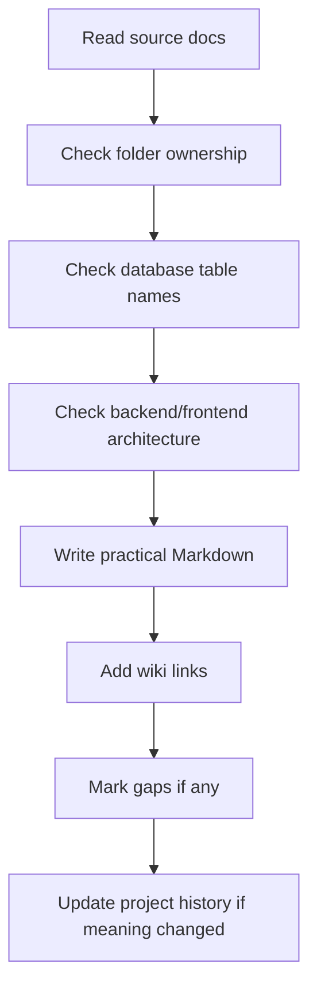

# Source Document Alignment

This file explains how the 2nd Brain must align with the uploaded source documents.

Use this before writing product, architecture, data, API, backend, frontend, module, workflow, testing, operations, or AI IDE content.

---

## Source documents

| Source | Main responsibility |
|---|---|
| Unified Commerce Scope document | Production modules, workflows, business rules, operational gaps, and system boundaries. |
| Unified Commerce Database Design document | Table inventory, relationships, constraints, source-of-truth rules, offline sync, reporting read models. |
| Backend Architecture document | Clean Architecture, feature-based API modules, services, DTOs, validators, repositories, strategies, Unit of Work. |
| Frontend Architecture document | React TypeScript structure, bootstrap, core, features, shells, pages, state, offline, peripherals, shared-kernel. |
| Current 2nd Brain structure | Folder placement, module grouping, templates, and documentation navigation. |

---

## Alignment priority

| Priority | Source | Use it for |
|---:|---|---|
| 1 | Database design | Table names, relationships, constraints, entity ownership. |
| 2 | Scope document | Production modules, workflows, actors, business rules. |
| 3 | Backend architecture | Backend layer and code organization. |
| 4 | Frontend architecture | Frontend folder and state organization. |
| 5 | Current 2nd Brain structure | Documentation location and navigation. |

If a conflict affects implementation, record it in [[13-project-history/production-alignment-change-log]].

---

## Scope-to-folder map

| Scope area | Primary location |
|---|---|
| Platform and Tenant Management | [[07-modules/tenant-management]], [[07-modules/platform-administration]] |
| Authentication, RBAC, Feature Access | [[07-modules/identity-access]], [[09-security-and-compliance/authorization-model]] |
| Data Import and AI-Assisted Onboarding | [[07-modules/data-import-ai]] |
| Product and Catalog Management | [[07-modules/catalog]] |
| Tax and Pricing Rules | [[07-modules/tax]], [[07-modules/pricing]] |
| Inventory and Stock Management | [[07-modules/inventory]] |
| POS Device, Terminal and Hardware | [[07-modules/pos-devices-hardware]] |
| Cash Drawer, Shift and Session | [[07-modules/sales-pos]] |
| POS Sales and Checkout | [[07-modules/sales-pos]], [[06-frontend/pos-ui-rules]] |
| Payments, Refunds and Receipts | [[07-modules/payments]], [[07-modules/receipts]] |
| Discounts, Coupons and Approvals | [[07-modules/discounts-promotions]] |
| Returns and Exchanges | [[07-modules/returns-exchanges]] |
| E-Commerce Storefront, Cart, Checkout, Orders | [[07-modules/ecommerce-orders]], [[06-frontend/ecommerce-storefront-rules]] |
| Order Status and Workflow Rules | [[07-modules/order-workflow]] |
| Fulfillment, Pickup and Delivery | [[07-modules/fulfillment-logistics]] |
| Customer Management | [[07-modules/customers]] |
| Offline-First POS and Sync | [[02-architecture/offline-first-architecture]], [[07-modules/offline-sync]] |
| Reporting, Dashboards and Audit | [[07-modules/reporting]], [[07-modules/audit-compliance]] |
| Tenant Configuration and Themes | [[07-modules/settings-configuration]] |
| Security and Operational Controls | [[09-security-and-compliance]] |

---

## Database group alignment

| Database group | Documentation location |
|---|---|
| Platform and Tenant Foundation | [[03-data/entities/tenant-outlet-entities]] |
| Identity, RBAC and Feature Access | [[03-data/entities/identity-access-entities]] |
| Tenant Runtime Configuration | [[03-data/entities/tax-receipt-audit-configuration-entities]] |
| Catalog, Tax and Pricing | [[03-data/entities/product-catalog-entities]] |
| Inventory and Stock Control | [[03-data/entities/inventory-entities]] |
| POS Devices, Sessions and Sales | [[03-data/entities/pos-sales-entities]] |
| Customer, Cart and E-Commerce Orders | [[03-data/entities/customer-entities]], [[03-data/entities/ecommerce-entities]] |
| Fulfillment, Pickup and Delivery | [[03-data/entities/logistics-entities]] |
| Payments, Refunds and Receipts | [[03-data/entities/payments-entities]] |
| Discounts, Coupons and Approvals | [[03-data/entities/discounts-coupons-entities]] |
| Returns and Exchanges | [[03-data/entities/returns-exchanges-entities]] |
| Receipts, Audit and Offline Sync | [[03-data/offline-sync-data-model]], [[03-data/entities/offline-sync-entities]] |
| Reporting Read Models | [[03-data/entities/reporting-entities]] |

---

## Database rules to preserve

| Rule | Documentation impact |
|---|---|
| Platform users are separate from tenant users | Do not merge `platform_users` and `users`. |
| Permissions are platform catalog values | Do not make permission rows tenant-owned. |
| Roles are tenant-owned | Role assignment must always include tenant context. |
| Feature access is layered | Use `platform_features`, `tenant_feature_entitlements`, `role_feature_assignments`, `feature_flags`. |
| Variants are sellable units | Sales, carts, orders, stock, returns, exchanges use `variant_id`. |
| Stock quantity is not on products or variants | Use `inventory_balances` and `stock_movements`. |
| Stock movements use positive quantities | Direction comes from `stock_movement_types`. |
| Offline queues are staging | Accepted records land in sales, payments, stock movements, receipts, or related tables. |
| Payment allocation is explicit | Use sale/order payment allocation tables. |
| Refunds must be bounded | Refund amount cannot exceed captured payment amount. |
| Receipts keep frozen payloads | Receipt output remains traceable after source data changes. |
| Reporting read models are not source of truth | Reports reconcile to transaction records. |

---

## Backend architecture alignment

Correct backend layer structure:

```text
src/
├── POS.Api/
├── POS.Application/
├── POS.Domain/
└── POS.Infrastructure/
```

Important correction:

Do not document `POS.Application`, `POS.Domain`, or `POS.Infrastructure` as folders inside `POS.Api`.

Backend source concepts map to:

| Concept | 2nd Brain file |
|---|---|
| Controllers, requests, responses | [[04-api/endpoint-design]], [[05-backend/backend-folder-structure]] |
| Application services | [[05-backend/backend-overview]] |
| DTOs and validators | [[05-backend/dto-handling]], [[05-backend/validation-rules]] |
| Strategies and factories | [[05-backend/backend-folder-structure]] |
| Domain entities/services | [[05-backend/domain-service-rules]] |
| Repositories and Unit of Work | [[05-backend/transaction-boundary-rules]] |
| Infrastructure integrations | [[02-architecture/integration-architecture]] |

---

## Frontend architecture alignment

Frontend source structure:

```text
src/
├── bootstrap/
├── core/
├── features/
├── shells/
├── pages/
├── state/
└── shared-kernel/
```

| Area | Responsibility |
|---|---|
| `bootstrap` | App entry, router, guards, providers, layouts. |
| `core/api` | HTTP client, endpoint constants, query client. |
| `core/auth` | Token and session helpers. |
| `core/offline` | Sync queue and connectivity monitor. |
| `core/peripherals` | Printer bridge, scanner listener, cash drawer helpers. |
| `features` | Feature-specific API, components, hooks, services, types. |
| `shells` | POS screen composition areas. |
| `pages` | Routed screens. |
| `state` | Zustand stores and cart orchestrator. |
| `shared-kernel` | Money, tax, pricing, discount, receipt, invoice helpers. |

Related:

- [[06-frontend/frontend-folder-structure]]
- [[06-frontend/state-management-rules]]
- [[06-frontend/pos-terminal-state-rules]]

---

## Frontend authority rule

Frontend helpers may preview and speed up UI behavior.

Backend remains final authority for:

- Tenant access.
- Feature access.
- Role/permission checks.
- Price, tax, and discount validity.
- Stock availability.
- Payment completion.
- Refund eligibility.
- Receipt finalization.
- Offline sync acceptance.

---

## Gap labels

Use these labels when source detail is missing:

| Label | Meaning |
|---|---|
| `Open Question` | Business decision not confirmed. |
| `Schema Gap` | Required table or field is missing from database design. |
| `Scope Gap` | Behavior is implied but not explicit. |
| `Implementation Decision Needed` | Technical decision required before coding. |
| `Future Integration Detail` | External provider details required. |

Do not convert gaps into confirmed requirements without approval.

---

## Alignment-sensitive areas

| Area | Risk |
|---|---|
| Data import and AI onboarding | Scope requires it; persistence must be checked. |
| Printer/scanner assignment | Hardware scope exists; schema may need peripheral extensions. |
| Tax policy | Tax tables exist; calculation policy may need explicit rules. |
| Order statuses | Database separates order, payment, fulfillment status. |
| Offline sync | Duplicate prevention and conflict handling are critical. |
| Loyalty/membership | Database includes it; docs must treat it consistently. |
| Reporting | Read models are not source of truth. |

---

## Update workflow



---

## Final checklist

- [ ] Uses production scope language.
- [ ] Does not reduce scope to basic/MVP.
- [ ] Uses correct table names.
- [ ] Respects Clean Architecture.
- [ ] Respects React frontend structure.
- [ ] Explains tenant isolation where relevant.
- [ ] Explains feature access where relevant.
- [ ] Explains offline behavior where relevant.
- [ ] Marks gaps instead of inventing requirements.
- [ ] Links to related docs.
