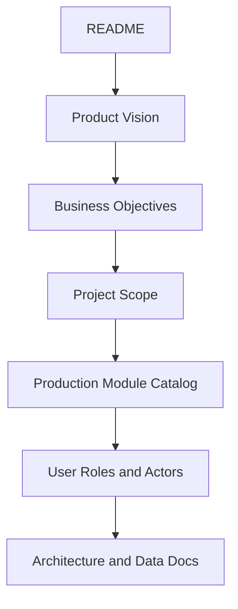

# Product Documentation Index

## Purpose

This folder defines the product-level foundation for the production Unified Commerce platform.

The system is a multi-tenant Unified Commerce SaaS product that combines E-POS, E-Commerce,
offline POS, inventory, payments, returns, fulfillment, tenant configuration, reporting, and audit.

This folder must be read before writing module specifications, user flows, API contracts,
backend services, frontend pages, test cases, or AI IDE implementation prompts.

## Product classification

| Decision | Product position |
|---|---|
| Product type | Production-ready Unified Commerce SaaS |
| Channels | E-POS, E-Commerce, and hybrid operation |
| Tenancy | Multi-tenant with tenant, outlet, channel, role, and feature boundaries |
| POS model | Touchscreen-first, barcode-first, offline-capable counter workflow |
| Commerce model | Shared product, inventory, customer, payment, return, and fulfillment foundation |
| Documentation model | 2nd Brain for product, architecture, engineering, QA, operations, and AI IDE tools |

This product must not be documented as a basic POS, basic e-commerce site, or reduced MVP unless
a future decision record explicitly changes the product boundary.

## Files in this folder

| File | Purpose | Main readers |
|---|---|---|
| [[01-product/product-vision|product-vision]] | Explains the product direction and non-negotiable platform principles | Product, architects, developers, AI IDE |
| [[01-product/business-objectives|business-objectives]] | Converts the product direction into measurable business and operational objectives | Product, stakeholders, QA |
| [[01-product/project-scope|project-scope]] | Defines what the production system must cover and where boundaries exist | Product, architects, developers |
| [[01-product/production-module-catalog|production-module-catalog]] | Lists production modules and their ownership responsibilities | Architects, developers, QA, AI IDE |
| [[01-product/user-roles-and-actors|user-roles-and-actors]] | Defines actors, access expectations, and role boundaries | Product, backend, frontend, QA |

## Required reading path

Use this order when starting product understanding:

Recommended next folders:

- [[02-architecture/README|Architecture]]
- [[03-data/README|Data Documentation]]
- [[04-api/README|API Documentation]]
- [[05-backend/backend-overview|Backend Overview]]
- [[06-frontend/frontend-overview|Frontend Overview]]
- [[07-modules/README|Production Modules]]
- [[08-user-flows/README|User Flows]]
- [[10-testing-quality/test-strategy|Testing Strategy]]

## Source document alignment

This folder is based on the uploaded source documents only.

| Source document | Product-level information used |
|---|---|
| Unified Commerce Scope V1 | Production module list, workflow boundaries, operational scope, missing production rules |
| Unified Commerce Database Design final V2 | Production entity groups, source-of-truth rules, table ownership, status and audit expectations |
| Backend Architecture final | Clean Architecture, service/repository pattern, feature-based backend grouping |
| Frontend archi V1 | React folder model, POS shell layout, offline/peripheral core, Zustand state and shared kernel |

If a product rule conflicts with the database design, stop and create/update a decision record before implementation.

## Product boundaries at a glance

| Area | In product scope | Not owned here |
|---|---|---|
| Tenant management | Tenant, outlet, operating mode, feature availability | External CRM tenant creation |
| Identity and access | Platform users, tenant staff, customer auth, roles, permissions, feature access | Global shared customer identity across tenants |
| Catalog | Products, variants, attributes, barcodes, images, return policy | Marketplace seller catalog unless separately documented |
| Inventory | Outlet stock, reservations, movement ledger, transfer, stocktake | Untraceable manual stock changes |
| POS | Scan, cart, hold, payment, receipt, session, offline sync | Marketing-style browsing UI as primary cashier workflow |
| E-Commerce | Storefront, cart, checkout, order, fulfillment readiness | Uncontrolled third-party marketplace sync |
| Payment | Cash, card, QR, gateway readiness, refunds, allocations | Storing raw card data or gateway secrets in plain JSON |
| Offline | Local queue, sync batches/items, conflicts, audit logs | Silent stock/payment corruption during reconnect |
| Reporting | Daily summaries, payment, inventory, discount/return summaries | Manual totals without transaction references |

## Product rules that affect every folder

- Tenant isolation is mandatory for tenant-owned business data.
- Backend validation is the final authority for tenant, role, permission, feature, price, tax, stock, payment, and status rules.
- POS and E-Commerce share catalog, customer, payment, return, receipt, and inventory foundations.
- Offline POS records must use idempotent client identifiers and server-side sync validation.
- Financial, stock, payment, refund, return, exchange, and receipt actions must be traceable.
- Feature specs must reference affected entities, APIs, backend rules, frontend rules, tests, and user flows.

## Relationship to templates

Before writing any product-adjacent document, use the templates in [[12-templates/README|Templates]].

| Work item | Template |
|---|---|
| New module documentation | [[12-templates/module-readme-template|module-readme-template]] |
| New feature specification | [[12-templates/feature-spec-template|feature-spec-template]] |
| Entity reference | [[12-templates/entity-reference-template|entity-reference-template]] |
| API contract | [[12-templates/api-spec-template|api-spec-template]] |
| User workflow | [[12-templates/user-flow-template|user-flow-template]] |
| Test case set | [[12-templates/test-case-template|test-case-template]] |
| Product/architecture decision | [[12-templates/decision-record-template|decision-record-template]] |
| Bug or production issue | [[12-templates/bug-report-template|bug-report-template]] |

## Product documentation checklist

Use this checklist before approving product docs:

- [ ] The document names the correct production module.
- [ ] The document avoids MVP/basic wording unless it is explicitly about release planning.
- [ ] The document references the correct database/entity ownership.
- [ ] The document identifies actors and permissions where relevant.
- [ ] The document explains business rules, not only screen names.
- [ ] The document includes failure/edge cases for production workflows.
- [ ] The document links to related architecture, API, backend, frontend, module, user-flow, and test docs.
- [ ] The document does not invent tables, screens, or features outside the uploaded scope/database/architecture sources.

## Maintenance rule

When the production scope, database design, backend architecture, or frontend architecture changes, update this folder first.

Then update dependent folders in this order:

1. [[02-architecture/README|Architecture]]
2. [[03-data/README|Data]]
3. [[04-api/README|API]]
4. [[05-backend/backend-overview|Backend]]
5. [[06-frontend/frontend-overview|Frontend]]
6. [[07-modules/README|Modules]]
7. [[08-user-flows/README|User flows]]
8. [[10-testing-quality/test-strategy|Testing]]
9. [[14-ai-ide-rules/README|AI IDE rules]]
