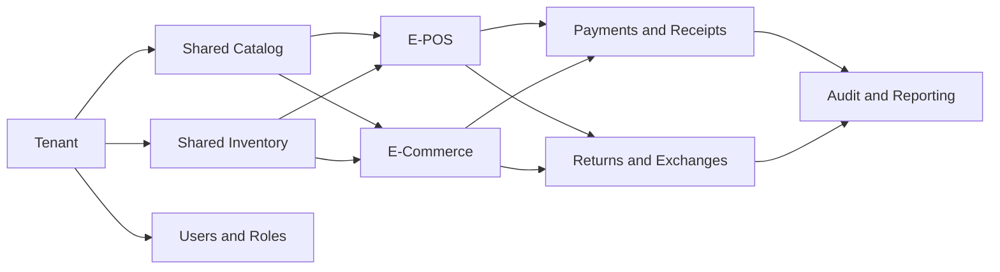
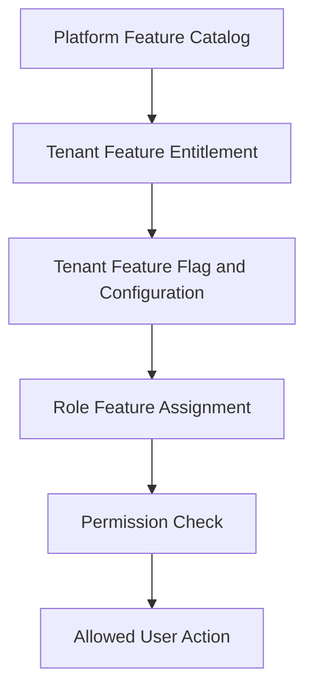

# Product Vision

## Vision statement

Build a production-ready Unified Commerce SaaS platform where each tenant can operate E-POS,
E-Commerce, or both using one shared business foundation for products, inventory, customers,
payments, returns, receipts, reporting, configuration, and audit.

The platform must support real retail counter speed, online order handling, offline POS resilience,
and tenant-specific configuration without mixing data or permissions across tenants.

## Product identity

| Area | Vision |
|---|---|
| Platform | Multi-tenant SaaS for retail businesses |
| Commerce model | Unified E-POS and E-Commerce on shared operational data |
| POS experience | Fast, touchscreen-first, barcode-first, low-typing, cashier-friendly |
| E-Commerce experience | Product browsing, cart, checkout, customer order tracking, fulfillment readiness |
| Data model | Tenant-scoped, outlet-aware, variant-level, auditable, ledger-based where needed |
| Access model | Platform-enabled features plus tenant-side roles, permissions, and configuration |
| Operational model | Production workflows for sales, orders, payments, refunds, returns, exchanges, stock, receipts, reports |

## What makes this product unified

This system is not two unrelated products joined later.

It uses shared foundations:

- One product and variant catalog for POS and online sales.
- One inventory foundation with outlet stock, reservations, transfers, adjustments, and movements.
- One customer foundation scoped by tenant.
- One payment/refund foundation for POS and E-Commerce.
- One return/exchange model for POS sale and online order sources.
- One receipt/audit/reporting foundation.
- One tenant configuration and feature access model.

## Production principles

| Principle | Product meaning |
|---|---|
| Tenant isolation | Tenant data, users, outlets, customers, stock, and reports must not leak across tenants. |
| Variant-level selling | Sales, carts, orders, stock, returns, exchanges, and pricing must operate at variant level. |
| Outlet-aware operation | POS, inventory, sessions, devices, fulfillment, and reporting must know outlet context where applicable. |
| Auditability | Sensitive actions must be traceable with actor, time, tenant, outlet/device where relevant. |
| Offline safety | Offline POS must continue core billing but sync through server validation and conflict handling. |
| Backend authority | Frontend can preview and guide, but backend must validate business rules and access. |
| Configuration over code | Tenant settings, feature flags, roles, themes, receipt templates, and payment methods must be configurable. |

## POS vision

The POS is an operator tool, not a marketing website.

Cashiers need to scan, add, adjust, pay, print, hold, recall, return, and exchange quickly.
The UI must make the current basket, payable amount, payment trigger, and session state obvious.

The POS experience must support:

- Always-focused search/scan behavior.
- Touch-friendly controls.
- Active outlet, till, device, and session context.
- Cash, card, QR, split payments, and refund workflows.
- Receipt generation and reprint control.
- Offline billing when enabled.
- Sync conflict visibility after reconnection.
- Cash drawer/session reconciliation.

Related docs:

- [[06-frontend/pos-ui-rules|POS UI rules]]
- [[07-modules/sales-pos/README|Sales POS module]]
- [[08-user-flows/cashier/scan-add-pay|Scan add pay flow]]

## E-Commerce vision

The E-Commerce side allows tenant customers to browse products, select variants, manage carts,
checkout, place orders, and track order progress.

It must share the same production foundations as POS:

- Product and variant catalog.
- Channel visibility rules.
- Price and tax calculation.
- Stock reservation.
- Customer account and guest checkout readiness.
- Payment and order status tracking.
- Fulfillment, pickup, delivery, and tracking readiness.
- Returns and refunds where configured.

Related docs:

- [[07-modules/ecommerce-orders/README|E-Commerce orders module]]
- [[07-modules/fulfillment-logistics/README|Fulfillment logistics module]]
- [[08-user-flows/ecommerce-customer/add-to-cart-checkout|Add to cart checkout flow]]

## Tenant vision

Each tenant represents one customer business using the platform.

The tenant may operate:

- POS only.
- E-Commerce only.
- Hybrid POS and E-Commerce.

Tenant administrators configure their outlets, staff, roles, features, settings, themes, payment methods,
receipt templates, catalog, pricing, inventory, delivery rules, and reports within platform-enabled boundaries.

Platform administrators control tenant lifecycle and feature entitlements.

Related docs:

- [[02-architecture/tenancy-architecture|Tenancy architecture]]
- [[03-data/entities/tenant-outlet-entities|Tenant outlet entities]]
- [[07-modules/tenant-management/README|Tenant management module]]

## Feature access vision

Feature access must not be hardcoded to fixed roles only.

The intended model is:

This supports tenant-specific operation while keeping platform control.

A tenant may have different access rules for cashier, outlet manager, inventory staff, e-commerce operator,
reporting user, or tenant admin.

## Data vision

The database design is part of the product identity.

The product must preserve these data decisions:

| Product area | Data decision |
|---|---|
| Products | Product master plus sellable variants; stock is not stored on products or variants. |
| Inventory | `stock_movements` is the immutable stock ledger; `inventory_balances` is current projection. |
| Payments | Payments are separated from allocations to sales/orders/exchanges. |
| Refunds | Refunds are business records linked to original payment and optional outbound refund payment. |
| Offline sync | Sync queues are staging; accepted data belongs in source-of-truth tables. |
| Reports | Read models support dashboards but are not the financial source of truth. |

Related docs:

- [[03-data/database-overview|Database overview]]
- [[03-data/entity-relationship-map|Entity relationship map]]
- [[03-data/schema-principles|Schema principles]]

## Backend vision

Backend implementation follows Clean Architecture with separate API, Application, Domain, and Infrastructure layers.

Product workflows must be implemented through application services, validators, interfaces, repositories,
strategies where needed, and transaction boundaries.

Domain rules such as stock movement requirements, order transition validity, payment/refund allocation,
discount approval, and return eligibility must not be buried in controllers.

Related docs:

- [[02-architecture/backend-architecture|Backend architecture]]
- [[05-backend/backend-overview|Backend overview]]
- [[05-backend/clean-architecture-rules|Clean architecture rules]]

## Frontend vision

Frontend implementation follows the uploaded React architecture:

- `bootstrap` for app startup, routes, guards, providers, and layouts.
- `core` for API, auth, offline, peripherals, config, and utilities.
- `features` for feature-owned UI and logic.
- `shells` for POS screen composition.
- `pages` for routed screens.
- `state` for Zustand workflow state.
- `shared-kernel` for client-side helpers such as money, tax preview, pricing preview, and receipt preview.

Backend remains the final authority for production totals, permissions, stock, payment, and status changes.

Related docs:

- [[02-architecture/frontend-architecture|Frontend architecture]]
- [[06-frontend/frontend-overview|Frontend overview]]
- [[06-frontend/state-management-rules|State management rules]]

## Product success direction

This platform is successful when:

- Tenants can operate POS and/or E-Commerce without data mixing.
- Cashiers can complete counter sales quickly with minimal typing.
- Online customers can browse, checkout, and track orders.
- Inventory stays auditable across sales, orders, returns, exchanges, transfers, and stocktakes.
- Payments, refunds, receipts, and reports reconcile.
- Offline POS sync does not corrupt stock, sales, or payment data.
- Tenant admins can configure settings, themes, roles, features, and receipts without developer changes.
- Developers and AI IDE tools can follow the 2nd Brain to implement consistently.

## Vision guardrails

- Do not split POS and E-Commerce into unrelated data models.
- Do not bypass tenant isolation for convenience.
- Do not store raw card data, plain OTP values, or gateway secrets in general JSON config.
- Do not silently resolve offline stock/payment conflicts.
- Do not treat frontend hidden buttons as security.
- Do not create feature specs without database, API, backend, frontend, test, and user-flow impact.
- Do not describe this system as basic/MVP in production documentation.

## Product vision checklist

- [ ] The feature supports unified POS/E-Commerce foundations where relevant.
- [ ] The feature respects tenant, outlet, role, and feature boundaries.
- [ ] The feature can be traced to database entities or an approved schema gap.
- [ ] The feature has clear backend and frontend responsibility.
- [ ] The feature has testable workflow and failure behavior.
- [ ] The feature does not introduce hidden unaudited financial, stock, or access behavior.
