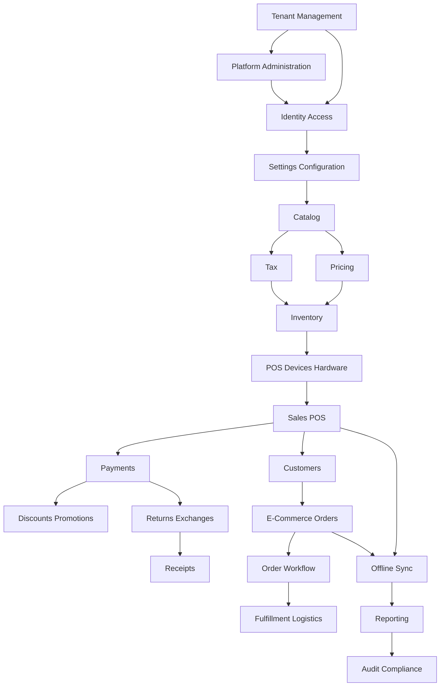

# Production Module Catalog

## Purpose

This document lists the production modules for the Unified Commerce platform and defines what each module owns.

It prevents module confusion during product writing, database mapping, API design, backend implementation,
frontend implementation, testing, and AI IDE coding.

## Module ownership rule

A module owns:

- Its business purpose.
- Its feature specs.
- Its main user flows.
- Its primary database entities.
- Its API endpoint group.
- Its backend application service boundaries.
- Its frontend feature/page boundaries.
- Its test cases and production acceptance criteria.

If a feature touches several modules, one module must be the primary owner and the others must be referenced.

## Module catalog overview

| No. | Module folder | Production responsibility |
|---:|---|---|
| 1 | `tenant-management` | Tenant, outlets, outlet addresses, document sequences |
| 2 | `platform-administration` | Platform users, tenant lifecycle, feature entitlement administration |
| 3 | `identity-access` | Users, roles, permissions, tenant/outlet role assignments, role-feature assignments |
| 4 | `settings-configuration` | Feature flags, tenant settings, UI themes, runtime configuration |
| 5 | `catalog` | Brands, suppliers, categories, products, variants, attributes, images, return policies |
| 6 | `tax` | Tax classes, tax rates, tax class rates, tax calculation policy documentation |
| 7 | `pricing` | Price lists, price list items, outlet/channel price behavior |
| 8 | `inventory` | Balances, allocations, stock movements, reservations, receipts, adjustments, transfers, stocktakes |
| 9 | `pos-devices-hardware` | POS devices, tills, printers, scanners, peripheral setup and test behavior |
| 10 | `sales-pos` | Till sessions, cash movements, POS sales, sale lines, cashier checkout |
| 11 | `payments` | Payment methods, provider configs, payments, transactions, allocations, refunds |
| 12 | `discounts-promotions` | Discount types/scopes, policies, requests, coupons, applications, redemptions |
| 13 | `customers` | Customers, customer auth accounts, identities, addresses |
| 14 | `ecommerce-orders` | Carts, cart items, orders, order items, order addresses, storefront checkout |
| 15 | `order-workflow` | Order/payment/fulfillment transitions and status history |
| 16 | `fulfillment-logistics` | Delivery methods, zones, rates, deliveries, items, tracking |
| 17 | `returns-exchanges` | Returns, return lines, refund allocations, exchanges, exchange lines, difference allocation |
| 18 | `receipts` | Receipt templates, receipts, print logs, barcode receipt lookup |
| 19 | `offline-sync` | Sync batches, items, typed queues, conflicts, sync audit logs |
| 20 | `reporting` | Daily sales, payment, inventory, discount/return summaries and operational reporting |
| 21 | `loyalty` | Loyalty programs, tiers, customer memberships, loyalty transactions |
| 22 | `wishlist-reviews` | Wishlists, wishlist items, product reviews and moderation |
| 23 | `otp-auth-security` | OTP channels, purposes, verification history, attempt/resend/blocking behavior |
| 24 | `data-import-ai` | CSV/Excel import, AI extraction review, duplicate detection, validation review |
| 25 | `audit-compliance` | Audit logs, sensitive actions, compliance review across modules |

## Module dependency order

Write and implement modules in dependency order, not alphabetical order.

## Module 1: Tenant Management

| Item | Detail |
|---|---|
| Purpose | Manage tenant business accounts, outlets, outlet addresses, and document numbering. |
| Main entities | `tenants`, `outlets`, `outlet_addresses`, `document_sequences` |
| Main users | Platform admin, tenant admin |
| Related folders | [[07-modules/tenant-management/README]], [[03-data/entities/tenant-outlet-entities]] |
| Must not own | Staff role rules, product catalog, payment provider setup |

Key production rules:

- Tenant operating mode can be POS-only, E-Commerce-only, or hybrid.
- Outlet records must stay tenant-scoped.
- Document sequence allocation must be safe under concurrent transactions.

## Module 2: Platform Administration

| Item | Detail |
|---|---|
| Purpose | Manage platform-side users, tenant lifecycle, and tenant feature availability. |
| Main entities | `platform_users`, `platform_features`, `tenant_feature_entitlements` |
| Main users | Platform admin, platform support |
| Related folders | [[07-modules/platform-administration/README]], [[02-architecture/role-permission-capability-model]] |
| Must not own | Tenant staff daily operations |

Key production rules:

- Platform users are not tenant staff.
- Platform admin enables available platform features for tenants.
- Tenant cannot self-enable disabled platform features.

## Module 3: Identity Access

| Item | Detail |
|---|---|
| Purpose | Manage tenant staff identity, roles, permissions, outlet assignments, and feature-role access. |
| Main entities | `users`, `roles`, `permissions`, `role_permissions`, `tenant_user_roles`, `outlet_user_roles`, `role_feature_assignments` |
| Main users | Tenant admin, outlet manager, platform support |
| Related folders | [[07-modules/identity-access/README]], [[09-security-and-compliance/authorization-model]] |
| Must not own | Customer storefront profile data beyond access links |

Key production rules:

- Feature access requires entitlement, feature config, role feature assignment, and permission where applicable.
- Sensitive actions need explicit permissions.
- Outlet-level roles cannot silently grant tenant-wide access.

## Module 4: Settings Configuration

| Item | Detail |
|---|---|
| Purpose | Configure tenant, outlet, channel, feature, and theme behavior. |
| Main entities | `feature_flags`, `tenant_settings`, `ui_themes` |
| Main users | Tenant admin, platform-enabled configuration users |
| Related folders | [[07-modules/settings-configuration/README]], [[06-frontend/theme-and-configuration-rules]] |
| Must not own | Transactional records such as sales, payments, stock movements |

Key production rules:

- Runtime configuration must not replace relational transaction tables.
- Scope priority must be documented.
- UI theme tokens must be validated.

## Module 5: Catalog

| Item | Detail |
|---|---|
| Purpose | Manage product master data shared by POS and E-Commerce. |
| Main entities | `brands`, `suppliers`, `supplier_addresses`, `categories`, `return_policies`, `products`, `product_variants`, `product_attributes`, `attribute_values`, `attribute_templates`, `attribute_presets`, `category_attributes`, `variant_attribute_values`, `product_suppliers`, `product_images` |
| Main users | Tenant admin, catalog manager, inventory staff |
| Related folders | [[07-modules/catalog/README]], [[03-data/entities/product-catalog-entities]] |
| Must not own | Price calculation policy, stock balances, online order status |

Key production rules:

- Sellable units are variants.
- SKU and barcode are tenant-unique.
- Stock quantity must not live on product or variant master records.

## Module 6: Tax

| Item | Detail |
|---|---|
| Purpose | Define tax classification and effective tax rates for calculations and reports. |
| Main entities | `tax_classes`, `tax_rates`, `tax_class_rates` |
| Main users | Tenant admin, finance/admin user |
| Related folders | [[07-modules/tax/README]], [[03-data/entities/tax-receipt-audit-configuration-entities]] |
| Must not own | Product pricing or payment collection |

Key production rules:

- Tax calculation must be consistent across POS, E-Commerce, receipts, returns, and reports.
- Refund tax reversal must follow original sale/order tax context.

## Module 7: Pricing

| Item | Detail |
|---|---|
| Purpose | Manage price lists, variant prices, channel prices, and outlet overrides. |
| Main entities | `price_lists`, `price_list_items` |
| Main users | Tenant admin, pricing manager |
| Related folders | [[07-modules/pricing/README]] |
| Must not own | Discount approval or tax class maintenance |

Key production rules:

- Price list overlap must be resolved deterministically.
- Outlet overrides need tenant/outlet/variant consistency.

## Module 8: Inventory

| Item | Detail |
|---|---|
| Purpose | Maintain auditable stock state by outlet and variant. |
| Main entities | `inventory_balances`, `inventory_channel_allocations`, `stock_movement_types`, `stock_movements`, `stock_reservations`, `purchase_receipts`, `stock_adjustments`, `stock_transfers`, `stocktakes` |
| Main users | Inventory staff, outlet manager, e-commerce operator |
| Related folders | [[07-modules/inventory/README]], [[03-data/entities/inventory-entities]] |
| Must not own | Payment capture, customer account data |

Key production rules:

- Every stock change needs a movement.
- Quantity in movement rows is positive; direction comes from movement type.
- Online orders reserve stock; POS sales deduct outlet stock.

## Module 9: POS Devices Hardware

| Item | Detail |
|---|---|
| Purpose | Register POS devices and support printer/scanner/cash drawer setup behavior. |
| Main entities | `pos_devices`, `tills`; additional peripheral documentation where schema is extended |
| Main users | Tenant admin, outlet manager, support user |
| Related folders | [[07-modules/pos-devices-hardware/README]], [[06-frontend/scanner-printer-integration]] |
| Must not own | POS sales totals or stock deduction |

Key production rules:

- POS device outlet must match till outlet.
- Printer failure must not corrupt a completed sale.
- Barcode scanners can behave as keyboard input unless advanced integration is documented.

## Module 10: Sales POS

| Item | Detail |
|---|---|
| Purpose | Cashier POS operations, till sessions, cash movements, sales, and sale lines. |
| Main entities | `till_sessions`, `cash_movement_types`, `cash_movements`, `cash_count_denominations`, `sales`, `sale_lines` |
| Main users | Cashier, outlet manager |
| Related folders | [[07-modules/sales-pos/README]], [[08-user-flows/cashier/scan-add-pay]] |
| Must not own | Gateway processing, product master maintenance |

Key production rules:

- Session-controlled sales require an active session.
- Completed sale must create payment, stock, and receipt records as required.
- Void/cancel behavior must be permission-controlled and audited.

## Module 11: Payments

| Item | Detail |
|---|---|
| Purpose | Record payments, provider traces, allocations, and refunds. |
| Main entities | `payment_method_types`, `tenant_payment_methods`, `payment_provider_configs`, `payments`, `payment_transactions`, `sale_payment_allocations`, `order_payment_allocations`, `refunds` |
| Main users | Cashier, e-commerce operator, manager, tenant admin |
| Related folders | [[07-modules/payments/README]], [[03-data/entities/payments-entities]] |
| Must not own | Receipt layout or stock restoration |

Key production rules:

- Do not store raw card data or private gateway keys.
- Refunds must not exceed original captured payments.
- Allocation totals must reconcile.

## Module 12: Discounts Promotions

| Item | Detail |
|---|---|
| Purpose | Control manual discounts, coupons, approvals, and applied discount history. |
| Main entities | `discount_types`, `discount_scopes`, `discount_policies`, `discount_requests`, `coupons`, `discount_applications`, `coupon_redemptions` |
| Main users | Cashier, manager, tenant admin |
| Related folders | [[07-modules/discounts-promotions/README]] |
| Must not own | Base price list maintenance |

Key production rules:

- Discounts above threshold require approval.
- Coupon validity checks status, date, channel, and usage limits.
- Refunds must consider original discount allocation.

## Module 13: Customers

| Item | Detail |
|---|---|
| Purpose | Manage tenant-scoped customer profiles, auth accounts, identities, and addresses. |
| Main entities | `customers`, `customer_auth_accounts`, `customer_auth_identities`, `customer_addresses` |
| Main users | Customer, cashier, tenant admin, e-commerce operator |
| Related folders | [[07-modules/customers/README]], [[03-data/entities/customer-entities]] |
| Must not own | Staff users or global customer identity |

Key production rules:

- Customers are tenant-scoped.
- Guest checkout creates tenant-scoped guest identity as documented.
- Same email may exist under different tenants.

## Module 14: E-Commerce Orders

| Item | Detail |
|---|---|
| Purpose | Manage online carts, checkout, order creation, and order items. |
| Main entities | `carts`, `cart_items`, `orders`, `order_items`, `order_addresses` |
| Main users | Customer, e-commerce operator |
| Related folders | [[07-modules/ecommerce-orders/README]] |
| Must not own | Delivery tracking implementation or POS checkout |

Key production rules:

- Cart validates price and stock before order placement.
- Order addresses are snapshots.
- Order status, payment status, and fulfillment status remain separate.

## Module 15: Order Workflow

| Item | Detail |
|---|---|
| Purpose | Control valid status transitions and history for order/payment/fulfillment workflows. |
| Main entities | `order_status_transitions`, `order_status_history` |
| Main users | E-commerce operator, fulfillment staff, manager |
| Related folders | [[07-modules/order-workflow/README]] |
| Must not own | Payment transaction capture or physical delivery data |

Key production rules:

- Invalid transitions must be blocked.
- Status history must record actor, time, and reason where applicable.

## Module 16: Fulfillment Logistics

| Item | Detail |
|---|---|
| Purpose | Manage pickup/delivery methods, rates, delivery records, and tracking events. |
| Main entities | `delivery_methods`, `delivery_zones`, `delivery_zone_rates`, `deliveries`, `delivery_items`, `delivery_tracking` |
| Main users | E-commerce operator, fulfillment staff, customer |
| Related folders | [[07-modules/fulfillment-logistics/README]] |
| Must not own | Cart pricing or payment capture |

Key production rules:

- Pickup uses collected status, not delivered.
- Delivery fee must be included when configured.

## Module 17: Returns Exchanges

| Item | Detail |
|---|---|
| Purpose | Handle return and exchange documents linked to original sale/order. |
| Main entities | `return_reason_codes`, `returns`, `return_lines`, `return_refund_allocations`, `exchanges`, `exchange_lines`, `exchange_payment_allocations`, `exchange_refund_allocations` |
| Main users | Cashier, manager, e-commerce operator |
| Related folders | [[07-modules/returns-exchanges/README]] |
| Must not own | Original sale/order editing |

Key production rules:

- Returned quantity cannot exceed eligible sold quantity.
- Damaged return handling must not automatically restock sellable stock.
- Exchange difference direction controls payment/refund handling.

## Module 18: Receipts

| Item | Detail |
|---|---|
| Purpose | Generate, store, print, reprint, email, and audit receipt output. |
| Main entities | `receipt_templates`, `receipts`, `receipt_print_logs` |
| Main users | Cashier, customer, manager |
| Related folders | [[07-modules/receipts/README]] |
| Must not own | Payment capture or discount calculation |

Key production rules:

- Receipt payload is frozen output.
- Reprint is permission-controlled and audited.

## Module 19: Offline Sync

| Item | Detail |
|---|---|
| Purpose | Safely sync offline POS records after reconnection. |
| Main entities | `offline_sync_batches`, `offline_sync_items`, `offline_sale_sync_queue`, `offline_payment_sync_queue`, `offline_sync_conflicts`, `offline_sync_audit_logs` |
| Main users | Cashier, manager, support user |
| Related folders | [[07-modules/offline-sync/README]], [[03-data/offline-sync-data-model]] |
| Must not own | Final source-of-truth sale/payment creation after acceptance |

Key production rules:

- Offline queues are staging.
- Duplicate prevention uses tenant/device/client IDs.
- Conflicts must be explicit.

## Module 20: Reporting

| Item | Detail |
|---|---|
| Purpose | Provide operational read models and reports for sales, payments, inventory, discounts, returns. |
| Main entities | `daily_sales_summaries`, `daily_payment_summaries`, `daily_inventory_summaries`, `daily_discount_return_summaries` |
| Main users | Tenant admin, outlet manager, reporting user |
| Related folders | [[07-modules/reporting/README]] |
| Must not own | Source transaction mutation |

Key production rules:

- Reports must be traceable to source records.
- Read models are not financial source of truth.

## Module 21: Loyalty

| Item | Detail |
|---|---|
| Purpose | Manage loyalty program configuration, tiers, memberships, and points ledger. |
| Main entities | `loyalty_programs`, `membership_tiers`, `customer_memberships`, `loyalty_transactions` |
| Main users | Tenant admin, customer, cashier/e-commerce operator where enabled |
| Related folders | [[07-modules/loyalty/README]] |
| Must not own | Payment balance or discount coupon engine unless explicitly linked |

Key production rules:

- Points balance is projection from loyalty transactions.
- Loyalty ledger rows are immutable.

## Module 22: Wishlist Reviews

| Item | Detail |
|---|---|
| Purpose | Support customer saved items and moderated product reviews. |
| Main entities | `wishlists`, `wishlist_items`, `product_reviews` |
| Main users | Customer, tenant admin, moderator/e-commerce operator |
| Related folders | [[07-modules/wishlist-reviews/README]] |
| Must not own | Product master creation |

Key production rules:

- Product reviews require moderation before public display.
- Wishlist items are variant-based.

## Module 23: OTP Auth Security

| Item | Detail |
|---|---|
| Purpose | Manage OTP verification channels, purposes, attempt control, and verification history. |
| Main entities | `otp_channels`, `otp_purposes`, `otp_verifications` |
| Main users | Customer, staff user where OTP enabled |
| Related folders | [[07-modules/otp-auth-security/README]], [[09-security-and-compliance/password-and-otp-rules]] |
| Must not own | Full customer profile or staff role assignment |

Key production rules:

- Store hashed OTP only.
- Track attempts, resend count, blocked until, IP, and user agent.

## Module 24: Data Import AI

| Item | Detail |
|---|---|
| Purpose | Support controlled product/customer import and AI-assisted extraction review. |
| Main entities | Schema must be aligned before implementation if import tables are absent/incomplete. |
| Main users | Tenant admin, catalog manager, support user |
| Related folders | [[07-modules/data-import-ai/README]] |
| Must not own | Direct unreviewed writes to product/customer source tables |

Key production rules:

- Imported records require validation.
- Duplicates must be reviewed.
- AI extraction must not save low-confidence data without review.

## Module 25: Audit Compliance

| Item | Detail |
|---|---|
| Purpose | Define audit coverage and sensitive action traceability across production modules. |
| Main entities | `audit_logs`, plus module-specific audit/link records |
| Main users | Platform admin, tenant admin, support, compliance reviewer |
| Related folders | [[07-modules/audit-compliance/README]], [[09-security-and-compliance/audit-requirements]] |
| Must not own | Normal business action implementation, but must define audit expectations |

Key production rules:

- Sensitive actions must include actor, action, entity, old/new values where relevant, time, IP/user-agent where available.
- Audit logs must not be editable by normal application users.

## Module catalog checklist

Before a module is considered documentation-ready:

- [ ] Module README exists.
- [ ] Feature specs exist for each owned production feature.
- [ ] Feature history exists for each feature.
- [ ] Main database entities are linked.
- [ ] API group is identified.
- [ ] Backend service responsibility is identified.
- [ ] Frontend pages/components/state are identified where relevant.
- [ ] User flows are linked.
- [ ] Test cases are linked.
- [ ] Audit and permission rules are documented.
