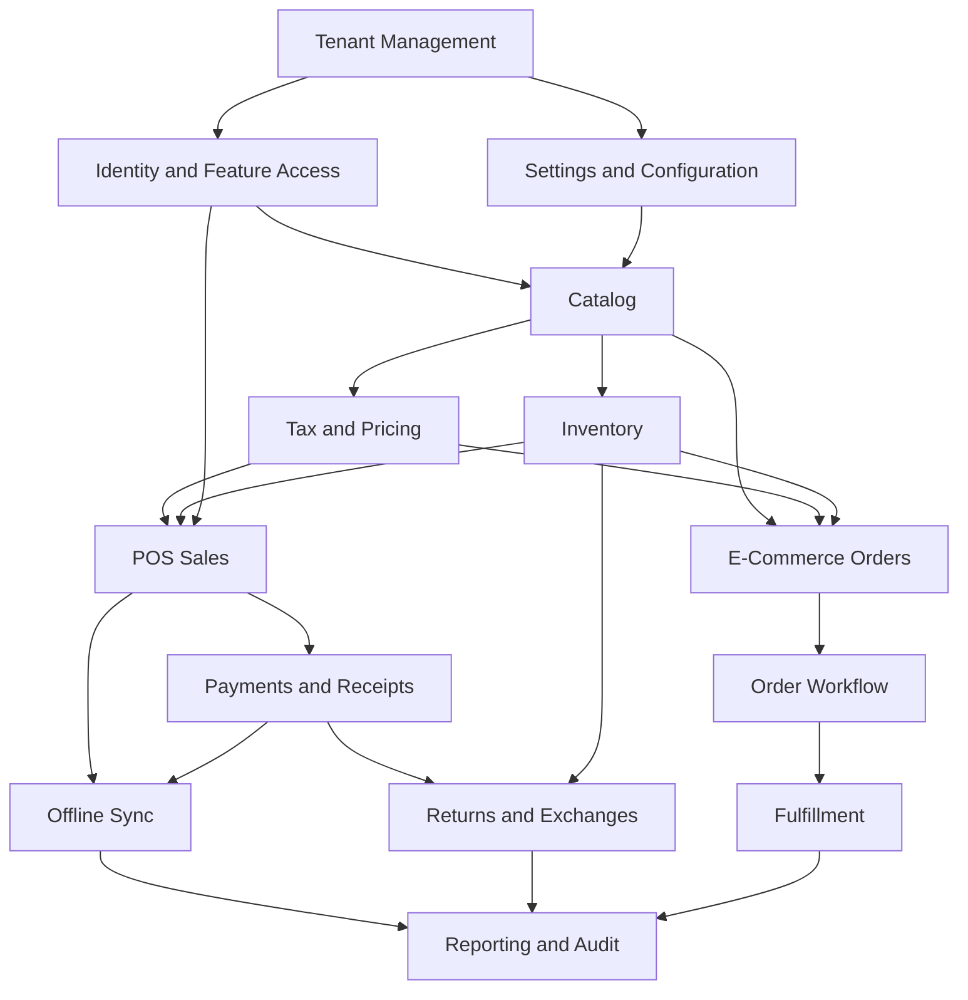

# Production Project Scope

## Scope statement

This project is a production-ready multi-tenant Unified Commerce SaaS platform for E-POS and
E-Commerce operations.

It includes shared business foundations for tenant management, identity/access, data import and
AI-assisted onboarding, catalog, tax, pricing, inventory, POS devices and hardware, cash sessions,
POS checkout, payments, refunds, receipts, discounts, returns, exchanges, e-commerce orders,
order workflow, fulfillment, customers, wishlist, reviews, loyalty, OTP, offline sync, reporting,
tenant configuration, security, validation, and audit.

This scope is not a basic POS scope and not a reduced MVP scope.

## Scope inputs

| Source | Scope contribution |
|---|---|
| Unified Commerce Scope V1 | Production modules, business rules, workflow expectations, missing operational modules |
| Unified Commerce Database Design final V2 | Entity groups, table ownership, source-of-truth rules, status models, audit/offline/reporting design |
| Backend Architecture final | Clean Architecture, feature modules, services, DTOs, validators, repositories, strategies, Unit of Work |
| Frontend archi V1 | React feature structure, POS shells, pages, state stores, offline/peripherals core, shared kernel |
| Current 2nd Brain | Folder conventions, templates, feature spec structure, AI IDE documentation workflow |

## Scope principles

- Tenant isolation is mandatory.
- POS and E-Commerce are separate workflows but share core business data.
- Variant-level stock, pricing, sales, returns, and orders are required.
- Backend is the final authority for business rules and security.
- Offline POS is allowed only through controlled local queue and server validation.
- All financial, stock, refund, receipt, and sensitive configuration actions must be auditable.
- Runtime configuration is supported, but not as a replacement for relational transaction data.

## In-scope production modules

| No. | Module | Scope summary |
|---:|---|---|
| 1 | Platform and Tenant Management | Tenant lifecycle, outlet setup, operating mode, document sequences |
| 2 | Authentication, Identity, RBAC, Feature Access | Platform users, tenant staff, customers, roles, permissions, feature entitlements |
| 3 | Data Import and AI-Assisted Onboarding | CSV/Excel import, duplicate review, AI-assisted extraction review where enabled |
| 4 | Product and Catalog Management | Categories, brands, suppliers, products, variants, attributes, images, return policy |
| 5 | Tax and Pricing Rules | Tax classes, rates, class rates, price lists, outlet overrides, tax/discount calculation rules |
| 6 | Inventory and Stock Management | Balances, channel allocations, stock movements, reservations, receipts, adjustments, transfers, stocktakes |
| 7 | POS Device, Terminal, and Hardware Management | POS devices, tills, printers, scanners, peripheral assignment and test behavior |
| 8 | Cash Drawer, Shift, and Session Management | Till sessions, opening float, cash movements, denomination counts, variance handling |
| 9 | POS Sales and Checkout | Scan, add, cart, hold, recall, void, payment trigger, receipt trigger, offline sale readiness |
| 10 | Payments, Refunds, and Receipt Management | Payment methods, provider config, payments, transactions, allocations, refunds, receipts, print logs |
| 11 | Discounts, Coupons, and Approval Management | Discount policies, requests, applications, coupons, redemptions, approval thresholds |
| 12 | Returns and Exchanges | Return documents, return lines, refund allocations, exchanges, payment/refund difference allocation |
| 13 | E-Commerce Storefront, Cart, Checkout, and Orders | Product listing, cart, checkout, order, addresses, order history, customer order tracking |
| 14 | Order Status and Workflow Rules | Transition rules and status history for order, payment, and fulfillment statuses |
| 15 | E-Commerce Fulfillment, Pickup, and Delivery | Delivery methods, zones, rates, deliveries, items, tracking, pickup/collected flow |
| 16 | Customer Management | Tenant-scoped customer profiles, auth accounts, identities, addresses, purchase links |
| 17 | Wishlist, Reviews, Loyalty, and Membership | Wishlists, product reviews, loyalty programs, tiers, memberships, loyalty transactions |
| 18 | OTP and Customer/Auth Security | OTP channels, purposes, verifications, hashed OTP, attempts, resend, blocking |
| 19 | Offline-First POS and Sync | Sync batches, sync items, typed sale/payment queues, conflicts, sync audit logs |
| 20 | Reporting, Dashboards, and Audit | Daily sales, payment, inventory, discount/return summaries, audit logs |
| 21 | Tenant Configuration, Feature Flags, and Themes | Feature flags, tenant settings, UI themes, receipt templates and scoped configuration |
| 22 | Security, Validation, and Operational Controls | Tenant isolation, access validation, idempotency, status validation, override controls |

## Scope dependency map

## In-scope user-facing areas

| Area | Users |
|---|---|
| Platform administration | Platform admin/support users |
| Tenant administration | Tenant admin, authorized managers |
| POS terminal | Cashier, outlet manager |
| Inventory operations | Inventory staff, outlet manager |
| E-Commerce storefront | Customer/guest customer |
| E-Commerce operations | E-commerce operator, fulfillment staff |
| Reporting dashboards | Tenant admin, outlet manager, reporting user |
| Configuration screens | Tenant admin, platform-enabled configuration users |

## In-scope backend areas

The backend scope follows Clean Architecture and feature-based organization.

| Layer | Responsibility |
|---|---|
| API | Controllers, request models, response models, middleware, filters, endpoint exposure |
| Application | Services, DTOs, validators, orchestration, interfaces, strategies, factories |
| Domain | Entities, value objects, enums/reference concepts, domain services, pure business rules |
| Infrastructure | EF Core persistence, repositories, external services, Unit of Work, provider integrations |

Backend rules are documented in [[05-backend/backend-overview|Backend overview]].

## In-scope frontend areas

The frontend scope follows the uploaded React architecture.

| Area | Responsibility |
|---|---|
| `bootstrap` | App startup, routes, guards, providers, layouts |
| `core` | API client, auth/session, offline, peripherals, config, utilities |
| `features` | Feature-specific UI, API hooks, services, types, components |
| `shells` | POS screen composition: product grid, cart, payment, customer, discount, receipt |
| `pages` | Routed screens such as POS, Payment, Return, Till Open/Close, Stocktake, Dashboard |
| `state` | Zustand stores for app, session, till, cart, UI, offline, orchestration |
| `shared-kernel` | Client-side money, tax, pricing, discount, receipt, invoice helpers |

Frontend rules are documented in [[06-frontend/frontend-overview|Frontend overview]].

## Data scope

The database design groups the system into production schema areas:

- Platform and tenant foundation.
- Identity, RBAC, and feature access.
- Tenant runtime configuration.
- Catalog, tax, and pricing.
- Inventory and stock control.
- POS devices, sessions, and sales.
- Customer, cart, and E-Commerce orders.
- Fulfillment, pickup, and delivery.
- Payments, refunds, and receipts.
- Discounts, coupons, and approvals.
- Returns and exchanges.
- Receipts, audit, and offline sync.
- Reporting read models.

Detailed data documentation belongs in [[03-data/README|Data Documentation]].

## Explicit boundaries

| Topic | Scope boundary |
|---|---|
| Tenant data | Tenant-owned data must stay tenant-scoped. |
| Customers | Customers are tenant-scoped, not a global shared identity across tenants. |
| Products | Sellable stock and pricing operate at variant level. |
| Inventory | Stock quantity is not stored on products or variants as source of truth. |
| Payments | Payment recording and gateway processing are separate concerns. |
| Offline POS | Offline local records are not final until server validation and sync acceptance. |
| Reporting | Summary/read models support dashboard speed but are not the source of truth. |
| Frontend security | UI hiding is not security; backend validates all sensitive actions. |
| Configuration | JSON configuration cannot replace relational records for transactions. |

## Known documentation alignment notes

The database design already includes many production tables, but some product scope areas require
careful documentation before coding:

| Area | Required documentation attention |
|---|---|
| Data import/AI | If tables are absent or incomplete, document required schema gap before implementation. |
| POS peripherals | `pos_devices` exists; printer/scanner assignment needs explicit module documentation. |
| Tax calculation policy | Tax classes/rates exist; calculation and rounding policy must be specified in feature docs. |
| Order status wording | Keep order, payment, and fulfillment statuses separate. |
| Loyalty/membership | Database includes loyalty; feature specs must define exact production behavior before coding. |
| Offline sync | Generic and typed queues must be documented as staging, not source of truth. |

## Out-of-scope unless separately documented

The uploaded documents do not provide enough product rules for the following to be implemented without a new decision/spec:

- Third-party marketplace synchronization.
- Global cross-tenant customer identity merge.
- Raw card-data storage.
- Silent automatic conflict overwrite for offline sync.
- Unapproved biometric/person identification features.
- Complex external courier API integration beyond delivery tracking readiness.
- Accounting ledger/general ledger replacement.

## Project scope approval checklist

- [ ] Every production module has a folder under [[07-modules/README|Modules]].
- [ ] Every production module has at least one feature spec and feature history file.
- [ ] Scope documents avoid describing the product as basic/MVP.
- [ ] Database entity docs match the uploaded schema design.
- [ ] Backend docs follow Clean Architecture and feature-based grouping.
- [ ] Frontend docs follow the uploaded React folder structure.
- [ ] User flows exist for POS, tenant admin, platform admin, e-commerce, inventory, manager, and offline conflict workflows.
- [ ] Testing docs cover tenant isolation, financial totals, inventory, offline sync, permission, and status transitions.
- [ ] AI IDE rules force reading scope, data, architecture, module, and template docs before implementation.

## Change control rule

Any product scope change must update these documents in order:

1. [[01-product/project-scope|Project scope]]
2. [[01-product/production-module-catalog|Production module catalog]]
3. [[03-data/database-overview|Database overview]] or relevant entity files
4. [[07-modules/README|Module documentation]]
5. [[04-api/README|API documentation]]
6. [[05-backend/backend-overview|Backend documentation]]
7. [[06-frontend/frontend-overview|Frontend documentation]]
8. [[08-user-flows/README|User flows]]
9. [[10-testing-quality/test-strategy|Testing]]
10. [[14-ai-ide-rules/README|AI IDE rules]]
