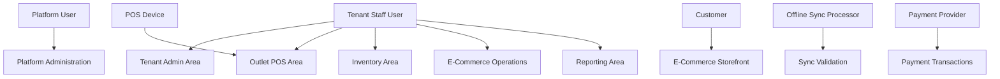
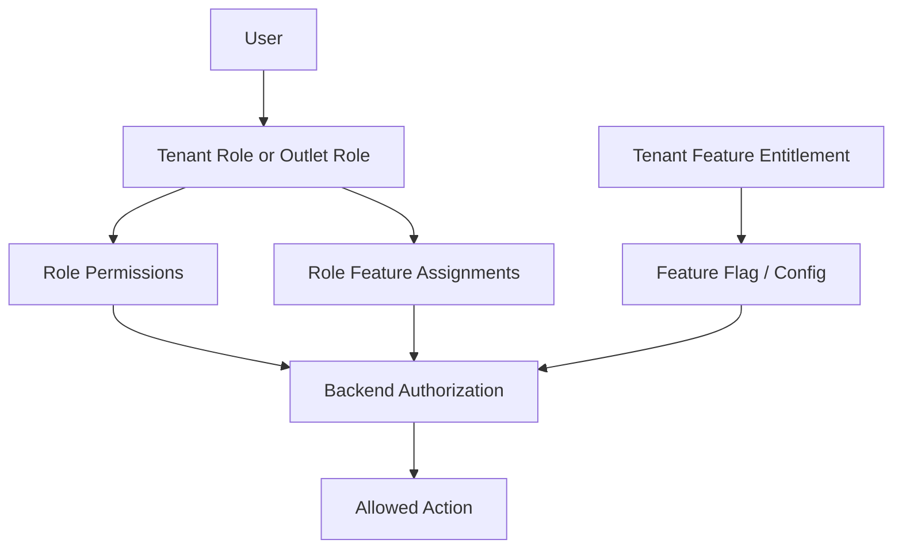

# User Roles and Actors

## Purpose

This document defines the human and system actors involved in the Unified Commerce platform.

It is not a fixed permission matrix. The uploaded scope and database design support tenant-specific RBAC,
feature entitlements, role permissions, outlet roles, and feature-role assignments.

Default role names help documentation and setup, but production access must be configurable.

## Actor model overview

## Primary actor categories

| Actor category | Stored as | Scope |
|---|---|---|
| Platform user | `platform_users` | Platform-level administration and tenant support |
| Tenant staff user | `users` | Tenant and outlet operations |
| Customer | `customers`, `customer_auth_accounts`, `customer_auth_identities` | Tenant-scoped online/POS customer identity |
| POS device | `pos_devices` | Outlet/till-bound terminal/browser/device identity |
| System process | Service/background job | Sync, reporting, audit, expiry, status updates |
| External provider | Provider reference/config | Payment gateway or delivery/tracking provider where integrated |

## Platform Admin

| Area | Detail |
|---|---|
| Purpose | Manage SaaS platform-level setup and tenant availability. |
| Entity | `platform_users` |
| Typical access | Tenant lifecycle, platform features, tenant entitlements, support actions |
| Must not be confused with | Tenant staff user |

Responsibilities:

- Create and manage tenants where allowed.
- Enable or disable platform features for a tenant.
- Support tenant-level configuration issues.
- Perform platform support actions with audit trail.

Important rules:

- Platform users are not stored as tenant users.
- Platform support actions may have `tenant_id` when acting on a tenant.
- Platform actions must be auditable.

Related docs:

- [[07-modules/platform-administration/README|Platform administration]]
- [[03-data/entities/platform-admin-entities|Platform admin entities]]

## Tenant Admin

| Area | Detail |
|---|---|
| Purpose | Configure and operate one tenant business. |
| Entity | `users` with tenant-scope role assignment |
| Typical access | Outlets, roles, staff, catalog, settings, reports, tenant configuration |
| Must not be confused with | Platform admin |

Responsibilities:

- Configure outlets and business settings.
- Manage staff users and role assignments.
- Configure enabled features within tenant boundary.
- Manage catalog, pricing, tax, payments, themes, receipt templates, and reports where permitted.

Important rules:

- Tenant admin cannot enable platform-disabled features.
- Tenant admin access is tenant-scoped.
- Sensitive configuration changes must be audited.

Related docs:

- [[07-modules/tenant-management/README|Tenant management]]
- [[07-modules/settings-configuration/README|Settings configuration]]

## Outlet Manager

| Area | Detail |
|---|---|
| Purpose | Manage operations for one or more assigned outlets. |
| Entity | `users` with `outlet_user_roles` and manager permissions |
| Typical access | Till sessions, cashier supervision, refunds/voids/discount approvals, stock review |
| Must not be confused with | Tenant-wide admin |

Responsibilities:

- Open or supervise outlet operations.
- Approve sensitive POS actions where configured.
- Review shift/cash variances.
- Resolve operational issues such as returns, reprints, and offline conflicts where permitted.

Important rules:

- Outlet manager permissions may be outlet-scoped.
- Approval actions must capture actor and reason where required.
- Manager override must not bypass backend validation.

Related docs:

- [[08-user-flows/manager/refund-approval|Refund approval flow]]
- [[08-user-flows/manager/offline-conflict-resolution|Offline conflict resolution]]

## Cashier

| Area | Detail |
|---|---|
| Purpose | Operate POS billing and related counter workflows. |
| Entity | `users` with outlet role assignment |
| Typical access | POS sale, hold/recall, payment trigger, receipt print, customer lookup, returns if permitted |
| Must not own | Tenant configuration or unrestricted refunds/voids |

Responsibilities:

- Login to assigned outlet/device/session.
- Scan or search products.
- Manage cart and quantities.
- Accept payments through allowed methods.
- Print receipts.
- Handle hold/recall, returns, and exchanges where permitted.

Important rules:

- Cashier cannot complete session-controlled sale without active till session.
- Cashier cannot approve their own restricted discount/refund if policy requires manager approval.
- Offline sale behavior depends on tenant/device configuration.

Related docs:

- [[08-user-flows/cashier/scan-add-pay|Scan add pay]]
- [[07-modules/sales-pos/README|Sales POS]]

## Inventory Staff

| Area | Detail |
|---|---|
| Purpose | Manage stock operations under tenant/outlet boundaries. |
| Entity | `users` with inventory permissions |
| Typical access | Stock receiving, adjustments, transfers, stocktakes, low-stock review |
| Must not own | Payment or customer account access unless separately granted |

Responsibilities:

- Receive supplier stock.
- Perform stock adjustments with reasons.
- Transfer stock between outlets.
- Count stock and post stocktake differences.
- Review stock movements and balances.

Important rules:

- Every stock change must create a stock movement.
- Adjustments may require approval depending on policy.
- Inventory staff cannot directly edit source-of-truth stock balances without controlled workflow.

Related docs:

- [[07-modules/inventory/README|Inventory module]]
- [[08-user-flows/inventory-staff/stock-adjustment|Stock adjustment flow]]

## E-Commerce Operator

| Area | Detail |
|---|---|
| Purpose | Manage online order operations. |
| Entity | `users` with e-commerce operations permissions |
| Typical access | Orders, fulfillment status, pickup/delivery handling, refunds/returns where permitted |
| Must not own | Platform tenant entitlements |

Responsibilities:

- Review placed orders.
- Progress order, payment, and fulfillment statuses according to allowed transitions.
- Assign fulfillment outlet where required.
- Manage pickup/delivery readiness.
- Support cancellation, refund, and return workflows where permitted.

Important rules:

- Order, payment, and fulfillment statuses are separate.
- Invalid status transitions must be blocked.
- Address snapshots must not be overwritten casually after placement.

Related docs:

- [[07-modules/ecommerce-orders/README|E-Commerce orders]]
- [[07-modules/order-workflow/README|Order workflow]]
- [[07-modules/fulfillment-logistics/README|Fulfillment logistics]]

## Reporting User

| Area | Detail |
|---|---|
| Purpose | View permitted reports and dashboards. |
| Entity | `users` with report permissions |
| Typical access | Sales, payments, stock, discount, return, cash, tax, channel reports |
| Must not own | Transaction mutation |

Responsibilities:

- Review business performance.
- Filter by date, outlet, channel, payment method, product/category, or report type where supported.
- Export or view reports where permitted.

Important rules:

- Report access is permission-controlled.
- Report summaries must be traceable to source records.
- Reporting users should not automatically get edit permissions.

Related docs:

- [[07-modules/reporting/README|Reporting module]]
- [[10-testing-quality/reporting-reconciliation-test-cases|Reporting reconciliation tests]]

## Customer

| Area | Detail |
|---|---|
| Purpose | Buy from the tenant online or be linked to POS transactions. |
| Entity | `customers`, optional `customer_auth_accounts` and `customer_auth_identities` |
| Typical access | Storefront, cart, checkout, order tracking, addresses, wishlist, reviews, loyalty where enabled |
| Must not be confused with | Tenant staff user |

Responsibilities:

- Browse products available online.
- Add variants to cart.
- Checkout as guest or logged-in customer where supported.
- Track order progress.
- Manage addresses, wishlist, reviews, and loyalty where enabled.

Important rules:

- Customer identity is tenant-scoped.
- Same email can exist under different tenants as separate customer identities.
- Product reviews require moderation before public display.

Related docs:

- [[07-modules/customers/README|Customers module]]
- [[07-modules/wishlist-reviews/README|Wishlist reviews module]]
- [[07-modules/loyalty/README|Loyalty module]]

## Guest Customer

| Area | Detail |
|---|---|
| Purpose | Allow checkout without full registered account where configured. |
| Entity | `customers` with guest/source status as documented |
| Typical access | Cart and checkout without full account login |
| Must not own | Full account recovery or loyalty unless converted/linked by rules |

Important rules:

- Guest checkout still belongs to one tenant.
- Guest order must preserve customer/order identity for return, payment, and receipt lookup.
- Guest should not be globally merged across tenants.

## POS Device Actor

| Area | Detail |
|---|---|
| Purpose | Identify the physical/browser terminal that creates POS/offline records. |
| Entity | `pos_devices` |
| Typical access | Device-bound POS session, offline sync, receipt printing, scanner/printer context |
| Must not own | Human permissions |

Important rules:

- Device must belong to one tenant and outlet.
- Device outlet must match assigned till outlet.
- Offline transactions must use device/client IDs for dedupe.

Related docs:

- [[07-modules/pos-devices-hardware/README|POS devices hardware]]
- [[07-modules/offline-sync/README|Offline sync]]

## System Process Actor

| Process | Responsibility |
|---|---|
| Offline sync processor | Validate and process sync batches/items after reconnect. |
| Reporting job | Build read models such as daily sales/payment/inventory summaries. |
| OTP expiry/cleanup job | Expire old OTP records and enforce retention policy. |
| Reservation expiry job | Release expired online reservations. |
| Audit logger | Record sensitive actions and configuration changes. |

Important rules:

- System processes must be auditable where they affect business state.
- Idempotency is required where duplicate processing is possible.
- Background jobs must not bypass tenant isolation.

## External Provider Actor

| Provider | Product interaction |
|---|---|
| Payment gateway/provider | Payment auth/capture/refund/webhook traces through payment provider configs and transactions. |
| Delivery/courier provider | Tracking reference and payload where integration exists or is later documented. |
| OTP delivery provider | SMS/email/WhatsApp delivery as configured by OTP channel behavior. |

Important rules:

- Do not store gateway private keys in normal JSON config.
- Store provider payloads only where needed for trace/debug.
- Business source of truth remains internal payment/order/delivery records.

## Role and access model

The product uses configurable access, not fixed hardcoded role behavior.

Access decision inputs:

- Tenant context.
- Outlet context where relevant.
- User status.
- Role assignment.
- Permission assignment.
- Platform feature entitlement.
- Tenant feature flag/config.
- Role feature assignment.
- Business state/status.

## Sensitive action examples

These actions require explicit permission and audit behavior:

| Action | Typical actor |
|---|---|
| Refund approval | Manager or authorized user |
| Completed sale cancellation/void | Manager or authorized user |
| Receipt reprint | Cashier with permission or manager |
| Discount approval | Manager |
| Stock adjustment approval/posting | Inventory manager or authorized staff |
| Offline conflict resolution | Manager/support user |
| Feature entitlement change | Platform admin |
| Tenant configuration change | Tenant admin or authorized user |
| Payment provider configuration | Tenant admin or platform support as allowed |

## Actor documentation checklist

When writing a feature spec, include:

- [ ] Primary actor.
- [ ] Supporting actor.
- [ ] Required role/permission.
- [ ] Required feature entitlement or feature flag.
- [ ] Tenant and outlet context.
- [ ] Device/session context for POS features.
- [ ] Customer context for storefront features.
- [ ] Sensitive action audit requirement.
- [ ] Failure state when actor lacks access.

## Related documentation

- [[02-architecture/role-permission-capability-model|Role permission capability model]]
- [[03-data/entities/identity-access-entities|Identity access entities]]
- [[04-api/auth-and-authorization|API auth and authorization]]
- [[05-backend/authentication-authorization|Backend authentication authorization]]
- [[06-frontend/feature-access-ui-rules|Feature access UI rules]]
- [[09-security-and-compliance/authorization-model|Authorization model]]
- [[10-testing-quality/rbac-feature-access-test-cases|RBAC feature access tests]]
