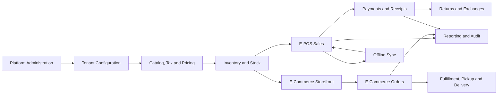

# Architecture Documentation Index

## Purpose

This folder explains the production architecture for the Unified Commerce platform.

The system is a multi-tenant Unified Commerce SaaS product that combines:

- E-POS operations.
- E-Commerce operations.
- Offline-first POS billing.
- Shared catalog and inventory.
- Payments, refunds, receipts, discounts, returns and exchanges.
- Tenant configuration, feature access, reporting and audit.

This folder must be read before writing backend code, frontend code, API contracts, database changes, or feature documentation.

## Source documents used

| Source | Used for |
|---|---|
| Unified Commerce Scope document | Production modules, business workflows and system boundaries |
| Unified Commerce Database Design document | Entity ownership, table groups, source-of-truth rules and data dependencies |
| Backend Architecture document | .NET Clean Architecture, Application/Domain/Infrastructure responsibilities |
| Frontend Architecture document | React structure, POS shells, state stores, offline and peripheral layers |

## Architecture folder map

| File | Purpose |
|---|---|
| [[02-architecture/system-overview]] | End-to-end system architecture and module map |
| [[02-architecture/architecture-principles]] | Non-negotiable architecture rules |
| [[02-architecture/tenancy-model]] | Tenant, outlet and tenant-owned data model |
| [[02-architecture/tenancy-architecture]] | Tenant context propagation and isolation rules |
| [[02-architecture/role-permission-capability-model]] | RBAC, feature entitlement and effective access model |
| [[02-architecture/backend-architecture]] | .NET Clean Architecture and backend layer rules |
| [[02-architecture/frontend-architecture]] | React frontend architecture and POS UI shell structure |
| [[02-architecture/offline-first-architecture]] | Offline POS storage, sync and conflict architecture |
| [[02-architecture/data-flow-diagrams]] | Mermaid diagrams for major system flows |
| [[02-architecture/integration-architecture]] | Payment, printer, scanner, courier and external integration boundaries |
| [[02-architecture/security-architecture]] | Security, audit and data protection architecture |
| [[02-architecture/scalability-considerations]] | Growth, performance, reporting and operational scalability rules |

## Must-read order

```text
1. system-overview
2. architecture-principles
3. tenancy-model
4. tenancy-architecture
5. role-permission-capability-model
6. backend-architecture
7. frontend-architecture
8. offline-first-architecture
9. security-architecture
10. scalability-considerations
```

## Related folders

| Folder | Relationship |
|---|---|
| [[01-product/project-scope]] | Defines what the architecture must support |
| [[03-data/database-overview]] | Defines the physical/logical data model behind the architecture |
| [[04-api/api-overview]] | Defines API boundaries that expose architecture behavior |
| [[05-backend/backend-overview]] | Converts architecture into backend implementation rules |
| [[06-frontend/frontend-overview]] | Converts architecture into frontend implementation rules |
| [[07-modules/README]] | Defines feature/module ownership |
| [[08-user-flows/README]] | Defines operational workflows that architecture must support |
| [[09-security-and-compliance/authorization-model]] | Expands security and authorization rules |
| [[10-testing-quality/test-strategy]] | Defines how architecture must be tested |
| [[14-ai-ide-rules/README]] | Defines how AI IDE tools must read this architecture before coding |

## Production architecture summary



## Architecture classification

This is not documented as a basic POS system.

This architecture is for a production-ready Unified Commerce SaaS product.

It must support:

- Multiple tenants.
- Multiple outlets per tenant.
- POS-only, E-Commerce-only and hybrid tenant operating modes.
- Platform-admin-controlled feature availability.
- Tenant-side feature configuration.
- Role and permission based access.
- Offline POS billing and later sync.
- Stock movement auditability.
- Payment and refund traceability.
- Receipt generation and reprint audit.
- Reporting read models.

## System boundary rule

The architecture should not introduce new business scope unless the product scope and database design also support it.

When a new feature is proposed, update this order:

1. [[01-product/project-scope]]
2. [[03-data/database-overview]] or related entity reference
3. Architecture file in this folder
4. [[04-api/api-overview]]
5. [[05-backend/backend-overview]]
6. [[06-frontend/frontend-overview]]
7. Module feature spec under [[07-modules/README]]
8. User flow under [[08-user-flows/README]]
9. Test cases under [[10-testing-quality/test-strategy]]

## Architecture ownership

| Area | Owner |
|---|---|
| Product architecture boundary | Product owner + architect |
| Database source-of-truth model | Backend architect + database owner |
| Backend Clean Architecture | Backend lead |
| Frontend architecture | Frontend lead |
| Offline architecture | Backend lead + frontend lead |
| Security architecture | Architect + security reviewer |
| Testing architecture | QA lead |
| AI IDE documentation rules | Documentation owner + tech leads |

## Ready-to-use checklist

Before implementing a feature, confirm:

- [ ] The feature exists in [[01-product/project-scope]].
- [ ] The owning module exists under [[07-modules/README]].
- [ ] The related tables exist in [[03-data/database-overview]] or a required schema extension is documented.
- [ ] The API behavior is documented under [[04-api/api-overview]].
- [ ] Backend layer ownership is clear in [[02-architecture/backend-architecture]].
- [ ] Frontend state ownership is clear in [[02-architecture/frontend-architecture]].
- [ ] Tenant isolation rules are clear in [[02-architecture/tenancy-architecture]].
- [ ] Access control is clear in [[02-architecture/role-permission-capability-model]].
- [ ] Offline behavior is clear if the feature touches POS.
- [ ] Audit behavior is clear for sensitive actions.

## AI IDE instruction

AI IDE tools must not infer architecture from file names alone.

They must read:

- [[02-architecture/system-overview]]
- [[02-architecture/architecture-principles]]
- [[02-architecture/backend-architecture]] for backend work
- [[02-architecture/frontend-architecture]] for frontend work
- [[02-architecture/role-permission-capability-model]] for access-controlled features
- [[02-architecture/offline-first-architecture]] for POS/offline features

## Final rule

Architecture documents are decision documents.

They must stay aligned with the uploaded production scope, database design, backend architecture, and frontend architecture.
