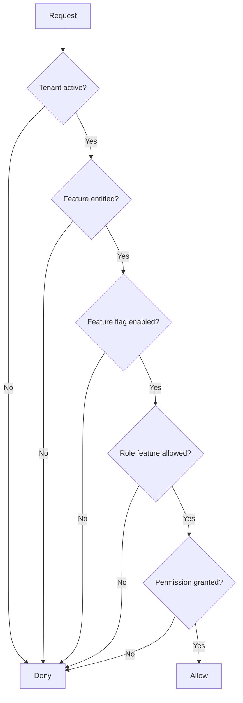

# Architecture Principles

## Purpose

This document defines the non-negotiable architecture principles for the Unified Commerce platform.

These principles apply to backend, frontend, APIs, database design, offline POS, testing and AI IDE implementation.

## Principle summary

| No. | Principle | Meaning |
|---:|---|---|
| 1 | Tenant isolation first | No tenant data must leak into another tenant |
| 2 | Backend is final authority | Frontend previews do not replace backend validation |
| 3 | Source-of-truth tables are protected | Staging, read models and caches must not become truth |
| 4 | Audit sensitive actions | Refunds, voids, stock changes, approvals and reprints must be traceable |
| 5 | Inventory is ledger-based | Stock changes must create movements, not silent quantity edits |
| 6 | Payments are idempotent | Duplicate requests must not create duplicate payment records |
| 7 | Offline sync is controlled | Offline data must be validated before acceptance |
| 8 | Feature access is layered | Entitlement, feature flag, role feature and permission all matter |
| 9 | Clean Architecture boundaries matter | Domain rules must not live in controllers |
| 10 | Documentation drives implementation | Feature work must update related docs |

## 1. Tenant isolation first

Every tenant-owned business record must be tenant-scoped directly or through a tenant-owned parent.

Examples:

- Users belong to tenants.
- Outlets belong to tenants.
- Products belong to tenants.
- Inventory balances belong to tenant, outlet and variant.
- Sales, orders, returns, receipts and reports are tenant-scoped.

Do not create global business records unless the database design explicitly defines them as platform-owned reference data.

Platform-owned examples:

- `permissions`
- `platform_features`
- `payment_method_types`
- `discount_types`
- `discount_scopes`
- `stock_movement_types`
- `cash_movement_types`
- `otp_channels`
- `otp_purposes`

See [[02-architecture/tenancy-model]].

## 2. Backend is final authority

The frontend may calculate:

- Cart previews.
- Display totals.
- Offline local totals.
- Receipt preview payloads.
- Tax or discount previews.

But backend must validate and confirm:

- Tenant context.
- Role and permission.
- Feature access.
- Product availability.
- Price and tax.
- Discount rules.
- Stock availability.
- Payment status.
- Receipt persistence.
- Offline sync acceptance.

This applies even when the frontend uses `shared-kernel` helpers such as `TaxCalculator`, `PriceResolver`, `DiscountEngine` or `ReceiptBuilder`.

## 3. Source-of-truth tables are protected

Do not treat queues, caches or summary tables as final truth.

| Data type | Source of truth |
|---|---|
| Products | `products`, `product_variants`, related catalog tables |
| Stock | `stock_movements` and `inventory_balances` |
| Sales | `sales`, `sale_lines` |
| Orders | `orders`, `order_items`, order status history |
| Payments | `payments`, `payment_transactions`, allocation tables |
| Refunds | `refunds` and refund allocation tables |
| Receipts | `receipts`, `receipt_print_logs` |
| Offline sync | Accepted records in business tables, not the staging queue |
| Reports | Source records plus read models, not manual totals |

## 4. Audit sensitive actions

Sensitive actions must include actor, tenant, affected entity, action and timestamp.

Examples:

- Discount approval.
- Refund approval.
- Sale void.
- Receipt reprint.
- Stock adjustment.
- Cash movement.
- Offline conflict resolution.
- Feature entitlement change.
- Role or permission change.
- Tenant setting change.

Use `audit_logs` for business audit.

Use `offline_sync_audit_logs` for sync diagnostics.

## 5. Inventory is ledger-based

Do not update stock silently.

Every stock change must create a `stock_movements` row.

Movement examples:

- `purchase_receipt`
- `sale_out`
- `return_in`
- `exchange_out`
- `exchange_in`
- `reservation_hold`
- `reservation_release`
- `adjustment_in`
- `adjustment_out`
- `transfer_out`
- `transfer_in`
- `stocktake_gain`
- `stocktake_loss`

See [[03-data/entities/inventory-entities]].

## 6. Payments are idempotent

Payment creation, capture, refund and offline payment sync can be retried.

Therefore they must use idempotency controls.

Database support includes:

- `payments.idempotency_key`
- `payments.client_payment_id`
- `payments.client_transaction_id`
- Offline device and client transaction fields

A retry must return the existing result when the same idempotency key already succeeded.

## 7. Offline sync is controlled

Offline sync is not blind upload.

The server must validate:

- Device identity.
- Tenant and outlet match.
- Till/session state.
- Duplicate transaction IDs.
- Product and variant validity.
- Stock impact.
- Payment data.
- Receipt data.
- Conflict conditions.

Conflicts must create `offline_sync_conflicts` instead of silently corrupting stock or payments.

See [[02-architecture/offline-first-architecture]].

## 8. Feature access is layered

A user does not get access because one flag is true.

Access requires combined checks:

See [[02-architecture/role-permission-capability-model]].

## 9. Clean Architecture boundaries matter

Controllers must not contain business workflow logic.

Application services orchestrate use cases.

Domain entities and domain services hold pure business rules.

Infrastructure implements persistence and external integration.

The API layer should only handle HTTP concerns, request mapping and response formatting.

See [[02-architecture/backend-architecture]].

## 10. Frontend state must be intentionally owned

Use TanStack Query for server state.

Use Zustand for local workflow state.

Examples:

| State type | Owner |
|---|---|
| Products from API | TanStack Query |
| Active cart | Zustand cart store |
| Offline queue | Offline store / IndexedDB service |
| Auth token/session | Core auth/session manager |
| Till session UI state | Till/session store |
| Theme config | Theme provider/config query |
| Printer connection state | Peripheral service/state |

See [[02-architecture/frontend-architecture]].

## 11. Status transitions must be explicit

Orders, payments, fulfillment, returns, refunds, sessions and sync items must not move through random statuses.

Use defined status sets from the database design and workflow docs.

Where a transition table exists, use it.

Example:

- `order_status_transitions`
- `order_status_history`

Invalid status movement must be blocked.

## 12. Configuration is not a substitute for relational data

Use `tenant_settings`, `feature_flags` and `ui_themes` for runtime configuration.

Do not store core transaction records in JSON configuration fields.

Examples that must stay relational:

- Sales.
- Orders.
- Payments.
- Refunds.
- Stock movements.
- Returns.
- Exchanges.
- Receipts.

## 13. Document sequences must be safe

Business document numbers must be generated with sequence safety.

Use `document_sequences` and row-level locking during number allocation.

Affected documents include:

- Sale.
- Order.
- Return.
- Exchange.
- Receipt.
- Transfer.
- Purchase receipt.
- Stock adjustment.
- Delivery.

## 14. Reporting read models are not source records

Read models exist for performance.

They must be regenerated from traceable transaction records if required.

Do not manually patch read model numbers without a controlled reconciliation process.

## 15. AI IDE must not guess missing architecture

If documentation is missing or unclear, AI IDE tools must stop and identify the gap.

They must not invent hidden requirements.

Relevant rule files:

- [[14-ai-ide-rules/production-scope-alignment-rule]]
- [[14-ai-ide-rules/database-alignment-rule]]
- [[14-ai-ide-rules/fullstack-feature-implementation-rule]]

## Architecture checklist

Before accepting a new architecture change:

- [ ] Scope impact is documented.
- [ ] Database impact is documented.
- [ ] Tenant isolation is preserved.
- [ ] Access control path is clear.
- [ ] Offline POS impact is reviewed.
- [ ] Payment/refund impact is reviewed.
- [ ] Inventory movement impact is reviewed.
- [ ] Reporting/audit impact is reviewed.
- [ ] Backend layer ownership is clear.
- [ ] Frontend state ownership is clear.
- [ ] Tests can be written from the documentation.

## Final rule

Architecture must protect business correctness before developer convenience.
