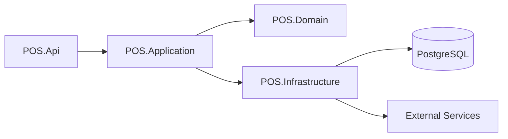

# Backend Architecture

## Purpose

This document defines the backend architecture for the Unified Commerce platform.

It is based on the uploaded backend architecture source and adapted to the production Unified Commerce scope.

## Backend stack

| Area | Decision |
|---|---|
| API framework | .NET Web API |
| Architecture style | Clean Architecture with feature-based modules |
| Database | PostgreSQL |
| ORM | Entity Framework Core |
| Main pattern | Service Pattern + Repository Pattern |
| Transactions | Unit of Work for multi-entity workflows |
| Validation | Application validators |
| External services | Infrastructure services |

## Corrected project structure

The uploaded backend architecture shows API, Application, Domain and Infrastructure responsibilities.

For production documentation, treat these as separate projects/layers, not nested inside the API project.

```text
src/
├── POS.Api/
├── POS.Application/
├── POS.Domain/
└── POS.Infrastructure/
```

## Layer overview



## POS.Api responsibility

The API project owns HTTP concerns.

It may contain:

```text
POS.Api/
├── Modules/
│   ├── Auth/
│   ├── Products/
│   ├── Orders/
│   ├── Payments/
│   └── Customers/
├── Middlewares/
├── Filters/
└── Extensions/
```

For production Unified Commerce, the module list expands beyond the example modules.

## API module examples

| API module | Controller responsibility |
|---|---|
| Auth | Staff/customer login, logout, token/session operations |
| Products/Catalog | Product, variant, category, attribute operations |
| Orders | Cart/order checkout and order management |
| Payments | Payment creation, status update, allocation and refund requests |
| Customers | Customer profile, address and auth account operations |
| Inventory | Stock receiving, adjustment, transfer, stocktake and reservation |
| POS Sales | Sales checkout, hold/recall, void/cancel |
| Till Sessions | Open/close session and cash movements |
| Offline Sync | Sync batch and item upload |
| Fulfillment | Delivery, pickup and tracking operations |
| Reporting | Report query endpoints |

## POS.Application responsibility

Application owns use cases and business orchestration.

Expected contents:

```text
POS.Application/
├── Modules/
│   ├── Products/
│   │   ├── ProductService.cs
│   │   ├── ProductDto.cs
│   │   ├── ProductValidator.cs
│   │   └── Interfaces/
│   ├── Orders/
│   │   ├── OrderService.cs
│   │   ├── OrderDto.cs
│   │   ├── OrderValidator.cs
│   │   ├── Strategies/
│   │   ├── Factories/
│   │   └── Interfaces/
│   ├── Payments/
│   ├── Customers/
│   ├── Inventory/
│   └── Auth/
└── Common/
    ├── Interfaces/
    └── Responses/
```

## Application service rules

Application services should:

- Validate use case input.
- Check tenant context.
- Check feature access and permission.
- Coordinate repositories.
- Call domain services where pure business rules are needed.
- Use Unit of Work for multi-table writes.
- Return DTOs or application results.

They should not:

- Contain EF Core query implementation details.
- Store HTTP response logic.
- Depend on controller classes.
- Directly call browser/device APIs.

## POS.Domain responsibility

Domain owns pure business concepts.

Expected contents:

```text
POS.Domain/
├── Modules/
│   ├── Products/
│   ├── Orders/
│   ├── Payments/
│   ├── Customers/
│   └── Inventory/
└── Common/
    └── BaseEntity.cs
```

For production Unified Commerce, domain modules include more than the uploaded example.

Examples:

- Catalog.
- Inventory.
- Sales.
- Orders.
- Payments.
- Discounts.
- Returns.
- Exchanges.
- Fulfillment.
- Receipts.
- Offline Sync.

## Domain service examples

Use domain services when business rules span multiple entities and should not depend on infrastructure.

Examples:

| Domain service | Reason |
|---|---|
| OrderDomainService | Order state and item rules |
| PaymentDomainService | Payment/refund status rules |
| InventoryDomainService | Stock movement validation |
| DiscountDomainService | Discount eligibility and stacking rules |
| ReturnExchangeDomainService | Return/exchange eligibility |

## POS.Infrastructure responsibility

Infrastructure owns persistence and external systems.

Expected contents:

```text
POS.Infrastructure/
├── Persistence/
├── Repositories/
│   ├── Products/
│   ├── Orders/
│   ├── Customers/
│   └── Payments/
├── Services/
└── UnitOfWork/
```

Infrastructure may implement:

- EF Core DbContext.
- Entity configurations.
- Repository implementations.
- Unit of Work.
- Payment provider adapters.
- Email/SMS/WhatsApp OTP sender adapters.
- Printer bridge or device integration services where backend-controlled.
- File/object storage references.

## Repository rules

Repositories must:

- Query by tenant for tenant-owned records.
- Use outlet filters where required.
- Avoid leaking IQueryable to controllers.
- Keep database-specific logic out of Application where possible.
- Support transaction boundaries through Unit of Work.

## Transaction boundary examples

Use one transaction for:

| Workflow | Writes |
|---|---|
| Complete POS sale | sale, sale lines, payment, allocation, stock movement, receipt |
| Complete return | return, lines, refund/allocation, stock movement, audit |
| Complete exchange | return/exchange, exchange lines, payment/refund allocation, stock movements |
| Post stock adjustment | adjustment, lines, stock movements, inventory balance update |
| Sync offline sale | sync item, sale, payment, stock, receipt, conflict/audit if needed |

## Validation architecture

Validation belongs mainly in Application validators.

Validation types:

- Input shape validation.
- Tenant ownership validation.
- Status transition validation.
- Stock availability validation.
- Payment/refund amount validation.
- Discount threshold validation.
- Feature/permission validation.
- Offline sync payload validation.

## Middleware architecture

API middlewares may include:

- Exception middleware.
- Authentication middleware.
- Tenant context middleware.
- Correlation/request ID middleware.
- Logging middleware.

Feature access should not be implemented only as middleware because many checks require business context.

## Strategy and factory usage

The uploaded backend architecture includes strategies and factories under Orders and Payments.

Use strategies for behavior variants such as:

- POS order versus online order behavior.
- Manual payment versus gateway payment.
- Pickup fulfillment versus delivery fulfillment.
- Tax-inclusive versus tax-exclusive calculation where configured.

Factories select the correct strategy based on runtime context.

## Backend module expansion

Production modules should include at least:

- Platform Administration.
- Tenant Management.
- Identity Access.
- Catalog.
- Tax.
- Pricing.
- Inventory.
- POS Devices.
- Till Sessions.
- POS Sales.
- Payments.
- Discounts.
- Customers.
- E-Commerce Orders.
- Order Workflow.
- Fulfillment.
- Returns and Exchanges.
- Receipts.
- Offline Sync.
- Reporting.
- Settings Configuration.
- Loyalty, Wishlist, Reviews and OTP where implemented.

## API response standard

Application results should be wrapped consistently by API response contracts.

The backend architecture source includes a common `ApiResponse.cs` concept.

See [[04-api/request-response-standard]].

## Backend anti-patterns

Avoid:

- Business logic in controllers.
- Tenant filtering only in frontend.
- Updating stock quantity without movement ledger.
- Creating payment without idempotency.
- Saving offline sync payload directly as accepted sale without validation.
- Returning EF entities directly to API.
- Using JSON settings for transaction records.

## Related docs

- [[05-backend/backend-overview]]
- [[05-backend/backend-folder-structure]]
- [[05-backend/clean-architecture-rules]]
- [[05-backend/feature-access-handling]]
- [[04-api/api-overview]]
- [[03-data/database-overview]]

## Backend readiness checklist

- [ ] Project layers are separated.
- [ ] API uses feature-based module grouping.
- [ ] Application services own use cases.
- [ ] Domain owns pure business rules.
- [ ] Infrastructure owns EF Core and external services.
- [ ] Repository queries are tenant-filtered.
- [ ] Unit of Work covers multi-table writes.
- [ ] Sensitive actions audit actor and reason.
- [ ] Payment and sync operations are idempotent.
- [ ] Tests cover tenant isolation and transaction behavior.

## Final rule

The backend must protect business correctness even when the frontend is offline, stale, tampered with or incomplete.
