# Data Flow Diagrams

## Purpose

This document contains practical data-flow diagrams for the production Unified Commerce platform.

Use these diagrams to understand how modules connect before writing feature specs, APIs, backend services, frontend screens or tests.

## 1. Tenant setup flow

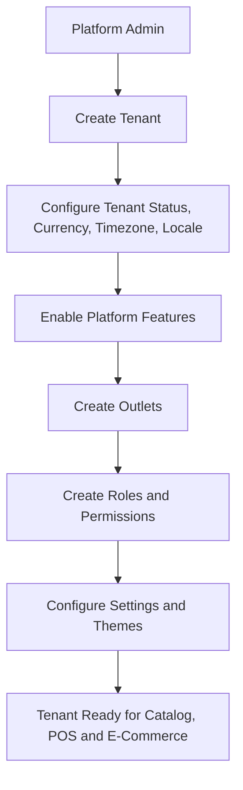

Related docs:

- [[02-architecture/tenancy-model]]
- [[02-architecture/role-permission-capability-model]]
- [[07-modules/tenant-management/README]]
- [[07-modules/platform-administration/README]]

## 2. Effective access flow

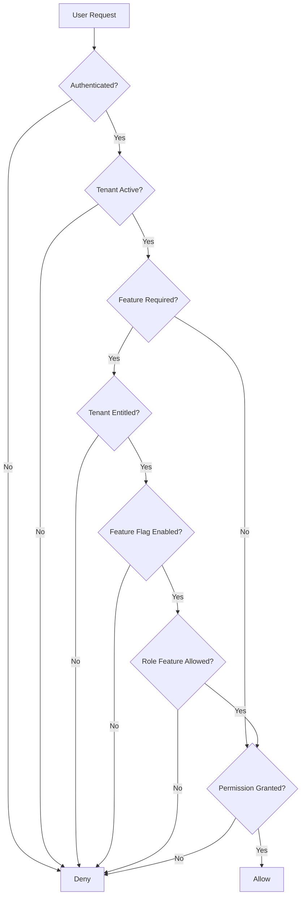

Related docs:

- [[02-architecture/role-permission-capability-model]]
- [[04-api/feature-access-api-rules]]
- [[05-backend/feature-access-handling]]

## 3. Product catalog setup flow

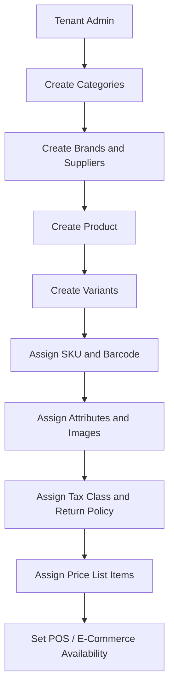

Related docs:

- [[03-data/entities/catalog-entities]]
- [[03-data/entities/pricing-tax-entities]]
- [[07-modules/catalog/README]]

## 4. POS sale flow

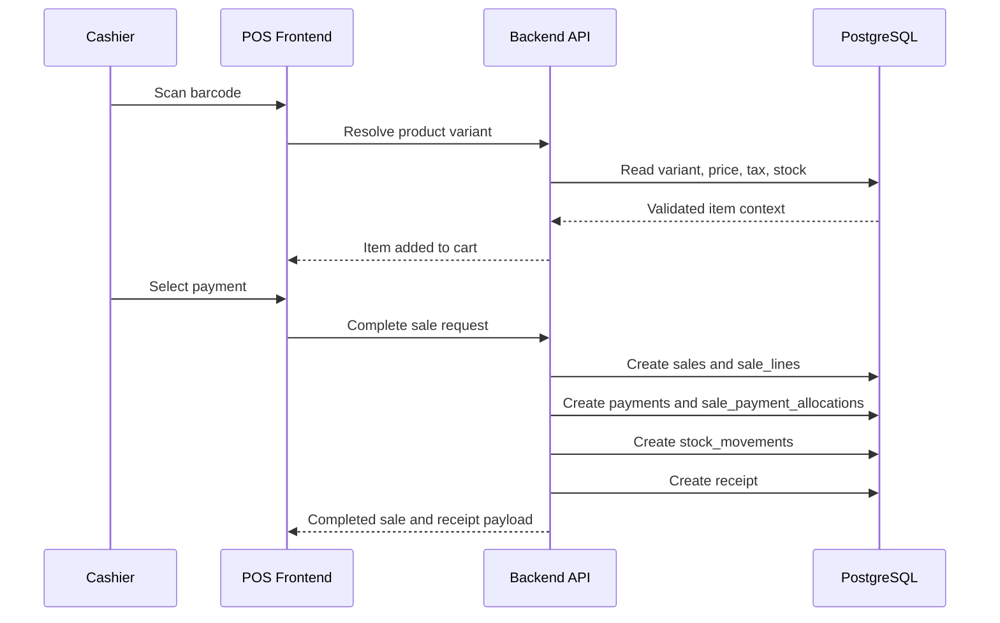

Related docs:

- [[07-modules/sales-pos/README]]
- [[07-modules/payments/README]]
- [[07-modules/receipts/README]]
- [[08-user-flows/cashier/scan-add-pay]]

## 5. Cash session flow

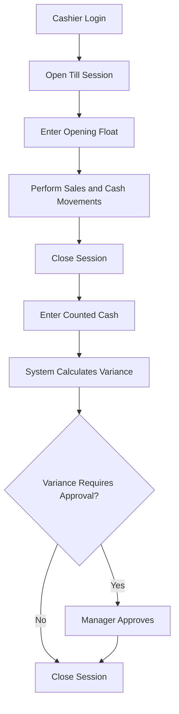

Related docs:

- [[07-modules/sales-pos/features/tills-sessions/feature-spec]]
- [[07-modules/sales-pos/features/cash-movements/feature-spec]]

## 6. E-Commerce checkout flow

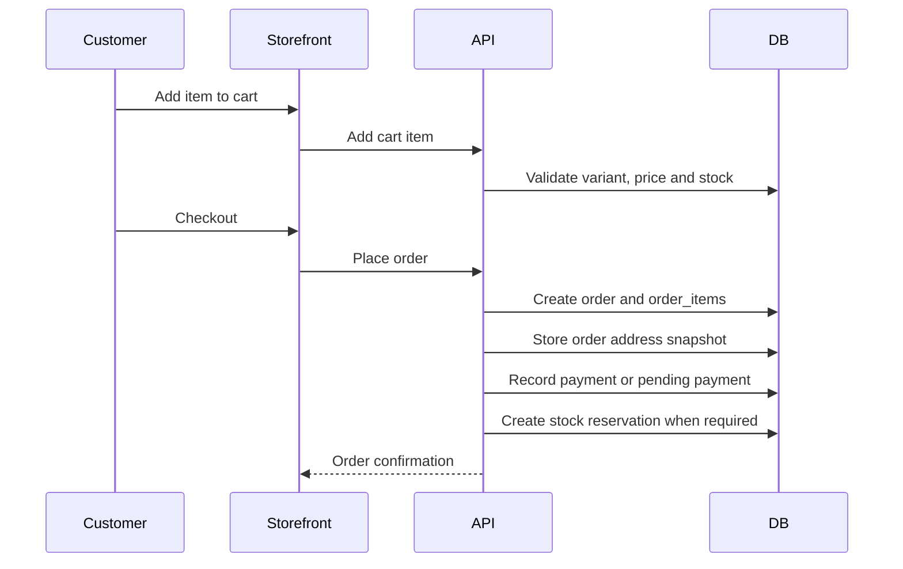

Related docs:

- [[07-modules/ecommerce-orders/README]]
- [[07-modules/order-workflow/README]]
- [[07-modules/fulfillment-logistics/README]]

## 7. Order fulfillment flow

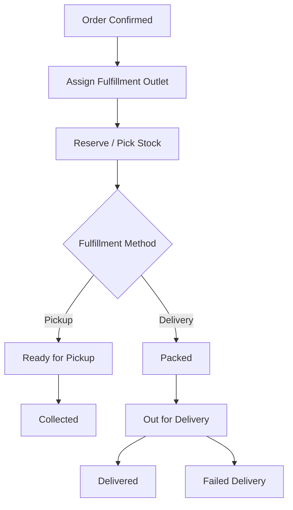

Related docs:

- [[07-modules/fulfillment-logistics/README]]
- [[04-api/order-workflow-api-rules]]

## 8. Payment and refund flow

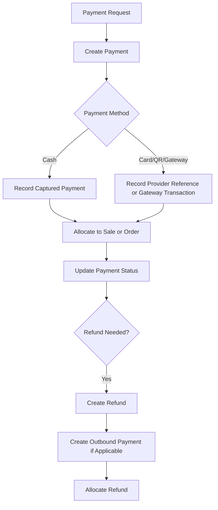

Related docs:

- [[07-modules/payments/README]]
- [[04-api/payment-refund-api-rules]]

## 9. Return and exchange flow

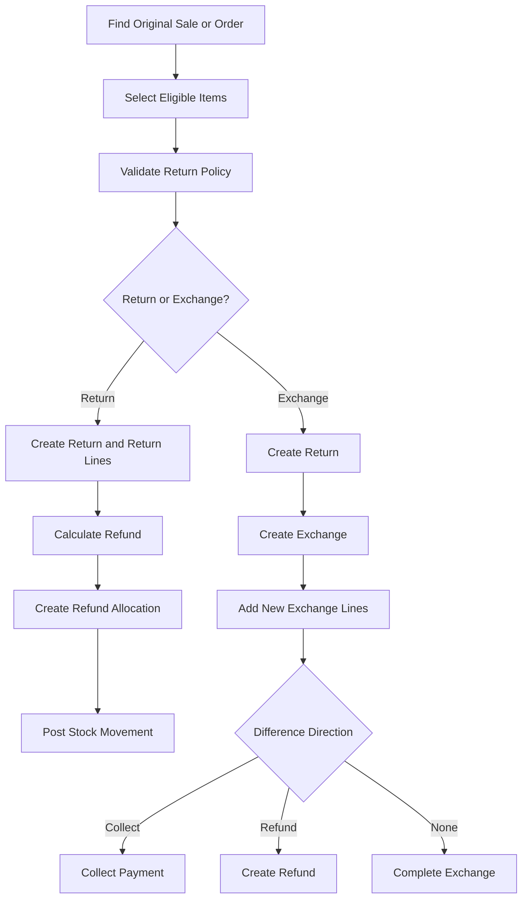

Related docs:

- [[07-modules/returns-exchanges/README]]
- [[08-user-flows/cashier/return-flow]]
- [[08-user-flows/cashier/exchange-flow]]

## 10. Offline sync flow

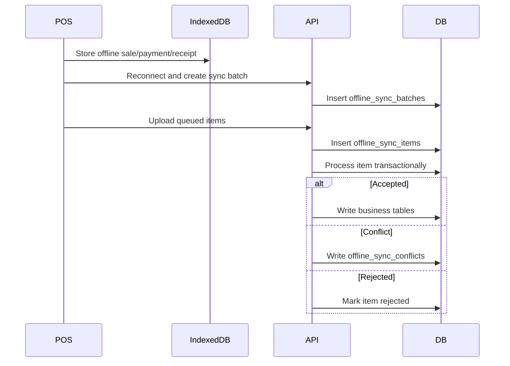

Related docs:

- [[02-architecture/offline-first-architecture]]
- [[03-data/offline-sync-data-model]]
- [[07-modules/offline-sync/README]]

## 11. Reporting data flow

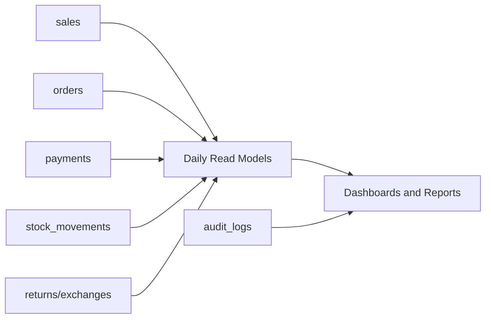

Read models include:

- `daily_sales_summaries`
- `daily_payment_summaries`
- `daily_inventory_summaries`
- `daily_discount_return_summaries`

Related docs:

- [[03-data/entities/reporting-entities]]
- [[07-modules/reporting/README]]

## 12. Receipt generation flow

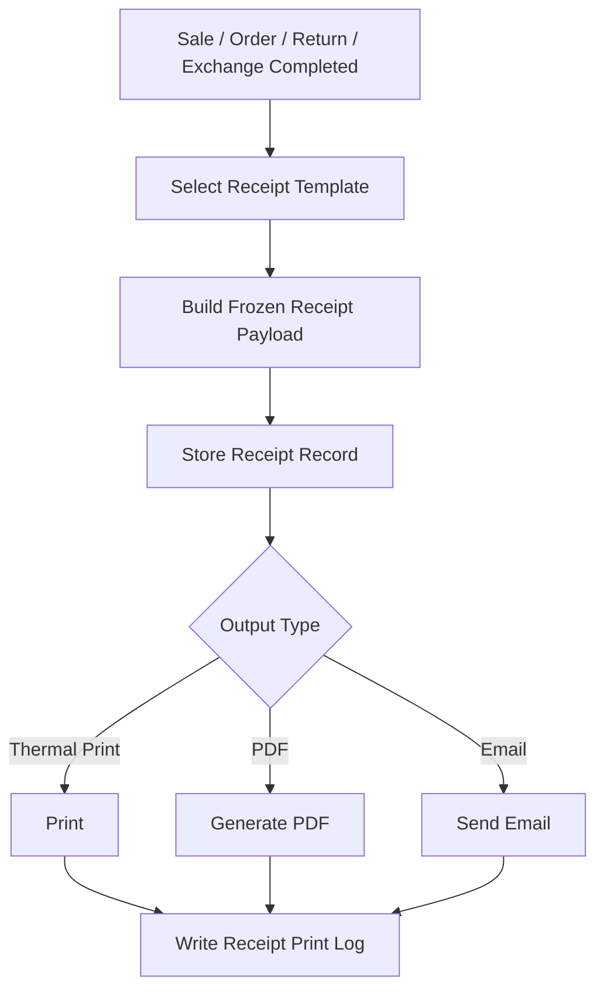

Related docs:

- [[07-modules/receipts/README]]
- [[03-data/entities/receipts-audit-offline-entities]]

## Diagram maintenance checklist

When a workflow changes:

- [ ] Update related feature spec.
- [ ] Update API documentation.
- [ ] Update data/entity documentation.
- [ ] Update this diagram file if flow changed.
- [ ] Update testing workflow cases.
- [ ] Update user flow file.

## Final rule

A diagram is not a replacement for business rules.

Use diagrams to understand workflow order, then read the related module and feature specs for details.
