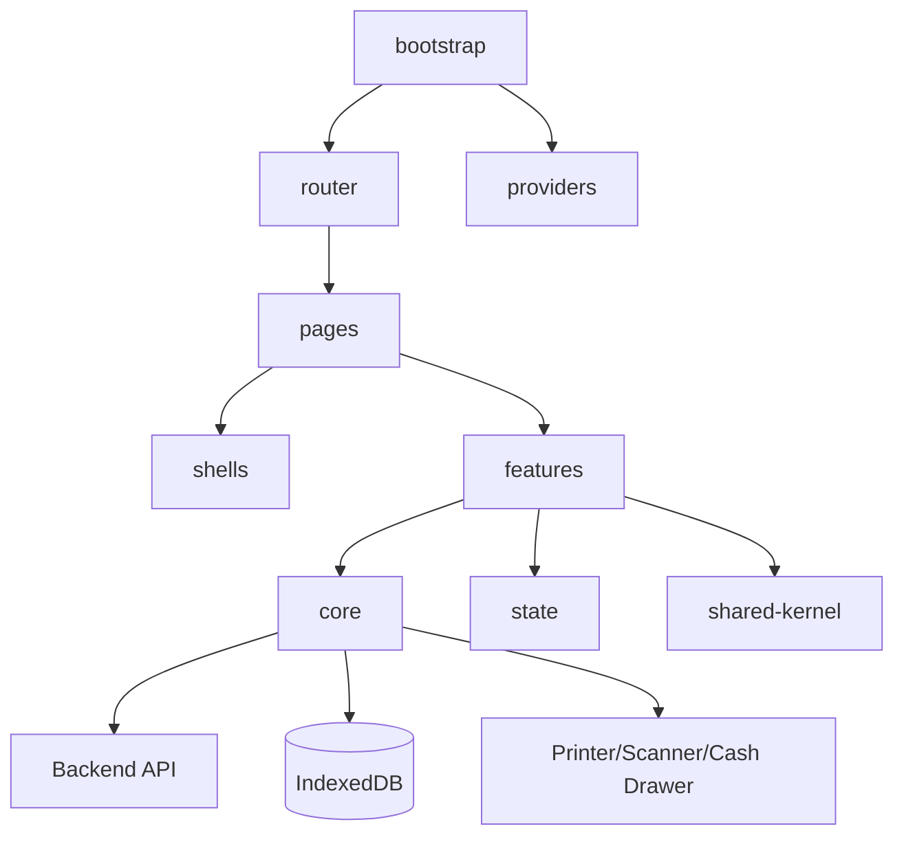

# Frontend Architecture

## Purpose

This document defines the frontend architecture for the Unified Commerce platform.

It is based on the uploaded frontend architecture source and adapted to the production E-POS + E-Commerce SaaS scope.

## Frontend stack

| Area | Decision |
|---|---|
| Framework | React |
| Language | TypeScript |
| Styling | Tailwind CSS |
| Server state | TanStack Query |
| Local workflow state | Zustand |
| Offline storage | IndexedDB through `core/offline` |
| POS peripherals | `core/peripherals` bridge/listener services |

## Source frontend structure

The uploaded frontend architecture defines this top-level structure:

```text
src/
├── bootstrap/
├── core/
├── features/
├── shells/
├── pages/
├── state/
└── shared-kernel/
```

This structure is correct for the POS/admin frontend foundation.

For full production Unified Commerce, e-commerce storefront and operations features must follow the same feature-based rules.

## Frontend architecture diagram



## bootstrap folder

`bootstrap/` owns app startup and composition.

Expected structure:

```text
bootstrap/
├── main.tsx
├── App.tsx
├── router/
│   ├── index.tsx
│   ├── routes.tsx
│   └── guards/
│       ├── AuthGuard.tsx
│       ├── TillSessionGuard.tsx
│       └── RoleGuard.tsx
├── providers/
│   ├── QueryProvider.tsx
│   ├── ThemeProvider.tsx
│   └── SessionProvider.tsx
└── layouts/
    ├── POSLayout.tsx
    ├── AdminLayout.tsx
    └── AuthLayout.tsx
```

## Router guards

| Guard | Purpose |
|---|---|
| `AuthGuard` | Blocks unauthenticated staff/customer access |
| `RoleGuard` | Applies role/permission-aware UI route protection |
| `TillSessionGuard` | Blocks POS billing when till/session is not active |

Frontend guards improve UX.

They do not replace backend authorization.

## Provider responsibilities

| Provider | Responsibility |
|---|---|
| QueryProvider | TanStack Query client and server state caching |
| ThemeProvider | Tenant UI theme tokens from configuration |
| SessionProvider | Auth/session context and active user context |

## Layout responsibilities

| Layout | Usage |
|---|---|
| POSLayout | Cashier terminal screens |
| AdminLayout | Admin/manager/back-office screens |
| AuthLayout | Login and authentication pages |

E-Commerce storefront may add a storefront layout when documented.

## core folder

`core/` owns platform-level frontend services.

Expected structure:

```text
core/
├── api/
├── auth/
├── offline/
├── peripherals/
├── config/
└── utils/
```

## core/api rules

`core/api` owns:

- HTTP client.
- Endpoint constants.
- Query client.
- Auth headers.
- Idempotency headers where required.
- API error mapping.

Feature components should not create raw fetch/axios logic directly.

## core/auth rules

`core/auth` owns:

- Token manager.
- Session manager.
- Login/logout client concerns.
- Session expiry behavior.

It does not decide final backend access.

## core/offline rules

`core/offline` owns:

- Connectivity monitor.
- Sync queue service.
- IndexedDB access wrapper.
- Offline transaction queue.
- Reconnect sync trigger.

It must align with backend tables:

- `offline_sync_batches`
- `offline_sync_items`
- `offline_sale_sync_queue`
- `offline_payment_sync_queue`
- `offline_sync_conflicts`
- `offline_sync_audit_logs`

See [[02-architecture/offline-first-architecture]].

## core/peripherals rules

The uploaded frontend architecture includes:

```text
core/peripherals/
├── printerBridge.ts
├── scannerListener.ts
└── cashDrawer.ts
```

Use these for frontend integration with:

- Receipt printer.
- Barcode scanner.
- Cash drawer kick where supported.

Printer failure must not corrupt a completed sale.

Scanner input should behave like keyboard input into the POS scan/search field unless advanced integration is required.

## features folder

`features/` owns feature-specific frontend modules.

The uploaded architecture includes:

- `auth`
- `till-session`
- `products`
- `cart`
- `sales`
- `payments`
- `customers`
- `discounts`
- `returns`
- `inventory`
- `receipts`
- `config`

Production expansion should align with [[01-product/production-module-catalog]].

## Feature folder pattern

Example:

```text
features/products/
├── api/
├── components/
├── hooks/
├── services/
├── types/
└── index.ts
```

Rules:

- API calls stay under feature `api/` using `core/api`.
- UI pieces stay under `components/`.
- Business UI helpers stay under `services/`.
- Query hooks stay under `hooks/`.
- DTO and view types stay under `types/`.

## shells folder

`shells/` owns large POS composition areas.

The uploaded architecture includes:

- `POSHeaderShell`
- `ProductGridShell`
- `CartShell`
- `PaymentShell`
- `CustomerShell`
- `DiscountShell`
- `ReturnShell`
- `TillSessionShell`
- `NotificationShell`
- `ReceiptShell`

These match the POS terminal UI requirement.

Shells compose features but should not become backend business logic containers.

## pages folder

Route pages from the uploaded architecture include:

- `LoginPage.tsx`
- `OutletSelectPage.tsx`
- `TillOpenPage.tsx`
- `POSPage.tsx`
- `PaymentPage.tsx`
- `ReturnPage.tsx`
- `TillClosePage.tsx`
- `CashManagementPage.tsx`
- `StocktakePage.tsx`
- `TransferPage.tsx`
- `EndOfDayPage.tsx`
- `ManagerDashboardPage.tsx`

These pages are suitable for production POS/admin flow.

E-Commerce storefront pages should be added under the same page/feature discipline when implemented.

## state folder

The uploaded architecture includes:

```text
state/
├── app.store.ts
├── session.store.ts
├── till.store.ts
├── cart.store.ts
├── ui.store.ts
├── offline.store.ts
└── cart.orchestrator.ts
```

## State ownership rules

| State | Owner |
|---|---|
| Server data | TanStack Query |
| POS cart draft | Zustand `cart.store` |
| Session/till workflow | `session.store` and `till.store` |
| Offline queue status | `offline.store` + IndexedDB service |
| UI drawers/modals | `ui.store` |
| Cart workflow orchestration | `cart.orchestrator` |

Do not duplicate server source-of-truth data in Zustand without a clear reason.

## shared-kernel folder

The uploaded architecture includes:

```text
shared-kernel/
├── money/
├── tax/
├── pricing-engine/
├── receipt-engine/
└── invoice-engine/
```

This is useful for UI-side calculation and preview.

But it must match backend behavior.

Backend remains final authority for:

- Price.
- Tax.
- Discount.
- Payment.
- Receipt persistence.
- Stock.

## POS UI architecture rules

The POS screen must be cashier-speed focused.

Required UX ideas from the scope:

- Barcode-first billing.
- Always-focused search/scan field.
- Touchscreen-first controls.
- Visible subtotal, tax, discount and payable amount.
- Hold/recall support.
- Payment trigger.
- Receipt trigger.
- Locked screen when till/session inactive.
- Offline indicator when disconnected.

See [[06-frontend/pos-ui-rules]].

## Offline frontend architecture

Offline frontend must:

- Cache essential product/pricing/tax/config data.
- Store offline sales and payments locally.
- Show visible offline status.
- Print receipt offline where supported.
- Queue sync after reconnection.
- Show conflict or failed sync status.

See [[06-frontend/offline-frontend-rules]].

## Feature access UI architecture

Frontend should hide or disable inaccessible actions.

But backend must still enforce access.

Frontend should use:

- Role context.
- Feature flags.
- Tenant configuration.
- Outlet/session state.

For example:

- Hide refund button if user lacks refund permission.
- Disable sale button if till session is closed.
- Show offline warning when sync is pending.

## Frontend anti-patterns

Avoid:

- Business-critical validation only in frontend.
- Duplicate pricing logic that diverges from backend.
- Local state as source of truth for completed transactions.
- Component-level raw HTTP clients.
- POS UI built like a marketing e-commerce catalog.
- Tiny critical buttons in cashier flows.
- Ignoring offline and peripheral failure states.

## Related docs

- [[06-frontend/frontend-overview]]
- [[06-frontend/frontend-folder-structure]]
- [[06-frontend/pos-ui-rules]]
- [[06-frontend/offline-frontend-rules]]
- [[06-frontend/scanner-printer-integration]]
- [[02-architecture/offline-first-architecture]]
- [[02-architecture/role-permission-capability-model]]

## Frontend checklist

- [ ] Route has correct guard.
- [ ] Server data uses TanStack Query.
- [ ] Local workflow state uses Zustand.
- [ ] POS page supports touch and scanning.
- [ ] Feature access is reflected in UI.
- [ ] Backend still validates sensitive action.
- [ ] Offline behavior is defined.
- [ ] Printer/scanner failure behavior is visible.
- [ ] Theme tokens are respected.
- [ ] Tests cover main workflow states.

## Final rule

Frontend architecture optimizes cashier speed and operator clarity, but must never bypass backend authority.
