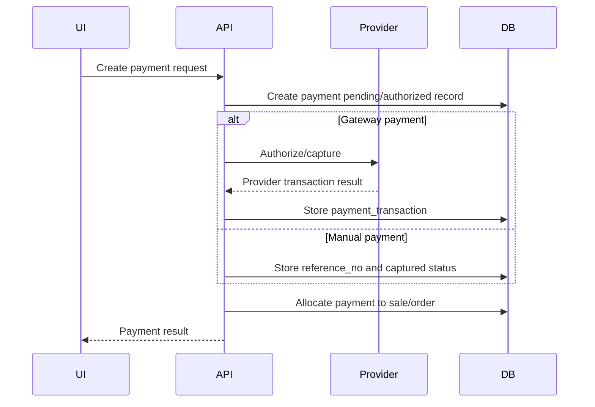

# Integration Architecture

## Purpose

This document defines how the Unified Commerce system connects to external systems and physical POS peripherals.

It covers integration boundaries, ownership and safety rules.

## Integration categories

| Category | Examples |
|---|---|
| POS peripherals | Barcode scanners, receipt printers, cash drawer |
| Payment providers | Card, QR, wallet, bank transfer gateway or manual references |
| Messaging providers | Email, SMS, WhatsApp OTP delivery |
| Fulfillment providers | Courier/tracking readiness |
| Storage providers | Product images, receipt/PDF storage references |
| AI/import tools | Product/customer import and AI-assisted extraction |

## Integration principle

External integrations must not become the source of truth for internal business records.

The internal database stores the business outcome.

External providers store external references and payload logs.

## Payment integration boundary

The database design supports both manual and provider-backed payment records.

Relevant tables:

- `payment_method_types`
- `tenant_payment_methods`
- `payment_provider_configs`
- `payments`
- `payment_transactions`
- allocation tables
- `refunds`

## Payment provider config rule

Provider secrets must not be stored directly in JSON config.

`payment_provider_configs.secret_ref` should point to a secret manager or vault reference.

`config` may contain non-secret provider settings.

## Manual payment versus gateway payment

| Payment type | Behavior |
|---|---|
| Cash | Recorded directly by POS |
| Manual card/QR | Store external reference where applicable |
| Gateway card/QR/wallet | Store provider transaction events in `payment_transactions` |
| Refund | Follow original payment method unless manager override is allowed |

## Payment integration flow

## POS scanner integration

The frontend architecture includes `core/peripherals/scannerListener.ts`.

Scanner rule:

- Default scanner behavior should act like keyboard input.
- Barcode input should go into the POS scan/search field.
- The scan/search field should remain focused by default during billing.
- Advanced scanner integration must not bypass product lookup validation.

## POS printer integration

The frontend architecture includes `core/peripherals/printerBridge.ts`.

Printer rules:

- Printer assignment must follow terminal/outlet configuration.
- Print failure must not reverse a completed sale.
- Failed print should create visible UI feedback.
- Reprint must be permission-controlled and logged.

Relevant receipt tables:

- `receipt_templates`
- `receipts`
- `receipt_print_logs`

## Cash drawer integration

The frontend architecture includes `core/peripherals/cashDrawer.ts`.

Cash drawer rules:

- Drawer open should be tied to payment/session workflow where supported.
- Cash drawer opening does not equal sale completion.
- Cash movement must be recorded in business tables.
- Cash variance is resolved during till close.

Relevant tables:

- `till_sessions`
- `cash_movements`
- `cash_count_denominations`

## POS device integration boundary

A POS terminal/device is represented by `pos_devices`.

Device assignment affects:

- Tenant.
- Outlet.
- Till.
- Offline sync.
- Receipt source device.
- Cash movement source device.

If separate printer/scanner assignment tables are documented in module scope, they must link back to device/outlet context.

## OTP provider integration

OTP delivery may use:

- Email.
- SMS.
- WhatsApp.

Relevant tables:

- `otp_channels`
- `otp_purposes`
- `otp_verifications`

OTP rules:

- Store hashed OTP only.
- Track attempt count.
- Track resend count.
- Use `blocked_until` for abuse control.
- Do not expose raw OTP in logs.

## Fulfillment/courier integration readiness

The scope includes delivery and tracking readiness.

Relevant tables:

- `delivery_methods`
- `delivery_zones`
- `delivery_zone_rates`
- `deliveries`
- `delivery_items`
- `delivery_tracking`

Courier integration can be added using provider payloads and tracking references.

Manual tracking remains supported.

## Storage integration

Product images use storage keys in `product_images.storage_key`.

Do not store large images directly in relational rows.

Receipt payloads may store structured JSON; generated files can be referenced by storage keys if future file output is implemented.

## Import and AI integration boundary

The scope supports CSV/Excel import first and AI-assisted extraction for PDF/image/camera flows.

AI extraction must remain review-based.

Low-confidence extraction must not save directly into catalog/customer tables without user review.

See [[07-modules/data-import-ai/README]].

## External integration error handling

Integrations must return controlled errors.

Examples:

| Integration | Error handling |
|---|---|
| Payment provider | Mark payment failed/pending, store provider event |
| Printer | Keep sale completed, log print failure |
| Scanner | Show product not found / invalid barcode |
| OTP provider | Mark OTP send failed or retry based on rules |
| Courier tracking | Store tracking event failure separately from order status |

## Integration security rules

- Do not store provider secrets in plain JSON.
- Do not log payment secrets.
- Do not store card data.
- Do not expose OTP codes.
- Validate webhook/provider payloads before updating state.
- Use tenant-scoped provider configuration.

## Integration testing checklist

- [ ] Payment retry is idempotent.
- [ ] Payment provider failure does not create completed sale incorrectly.
- [ ] Printer failure does not corrupt sale.
- [ ] Scanner unknown barcode shows safe error.
- [ ] OTP resend limits are enforced.
- [ ] Delivery tracking updates do not bypass allowed status transitions.
- [ ] Tenant provider config does not leak across tenants.

## Related docs

- [[02-architecture/backend-architecture]]
- [[02-architecture/frontend-architecture]]
- [[04-api/payment-refund-api-rules]]
- [[06-frontend/scanner-printer-integration]]
- [[07-modules/payments/README]]
- [[07-modules/pos-devices-hardware/README]]
- [[07-modules/fulfillment-logistics/README]]

## Final rule

External systems assist the platform.

They must not own internal business truth, tenant security or audit responsibility.
