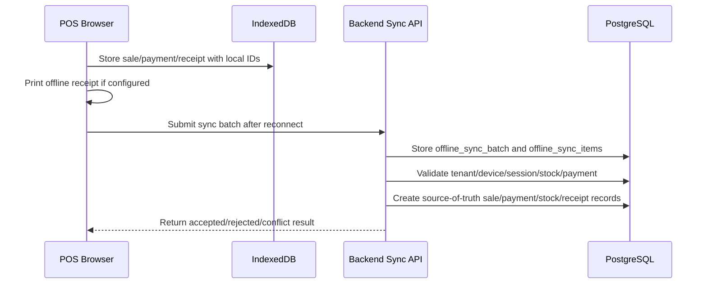

# Offline-First POS Architecture

## Purpose

This file explains the offline-first POS architecture for the Unified Commerce E-POS + E-Commerce SaaS system.

Offline POS allows core cashier billing to continue when the internet connection is unavailable, then syncs sales, payments, receipts and related records after reconnection.

Read with:

- [[06-frontend/offline-frontend-rules]]
- [[05-backend/offline-sync-backend-rules]]
- [[03-data/offline-sync-data-model]]
- [[04-api/offline-sync-api-rules]]
- [[05-backend/caching-strategy]]

---

## Offline flow

---

## Offline sync tables

The uploaded database design defines these offline sync tables:

- `offline_sync_batches`
- `offline_sync_items`
- `offline_sale_sync_queue`
- `offline_payment_sync_queue`
- `offline_sync_conflicts`
- `offline_sync_audit_logs`

These tables are not cache tables.

They are sync staging, conflict and diagnostics tables.

---

## Backend cache vs offline POS cache

Do not confuse backend caching with offline POS caching.

| Area | Meaning | Source |
|---|---|---|
| Frontend offline cache | IndexedDB product/pricing/tax/cart/payment/receipt data used while offline. | Browser/device. |
| Backend cache | Short-lived server-side read optimization for safe data. | Application/backend. |
| Offline sync queue | Server-side persisted sync staging and conflict tracking. | PostgreSQL tables. |
| Source of truth | Accepted sales, payments, stock movements, receipts. | PostgreSQL business tables. |

Offline POS cache exists so the cashier can continue working.

Backend cache exists only for performance.

Offline sync tables exist to validate and reconcile.

---

## Data allowed for offline device cache

The scope allows locally cached POS data where safe.

| Data | Offline cache allowed | Notes |
|---|---:|---|
| Product lookup data | Yes | Needed for scan/add flow. |
| SKU/barcode data | Yes | Needed for speed. |
| Price data | Yes, but revalidated on sync | May become stale. |
| Tax data | Yes, but revalidated on sync | Must follow configured tax rules. |
| Discount rules | Yes, where safe | Approval behavior may require online state. |
| Active cart | Yes | Stored locally during POS operation. |
| Offline sale/payment/receipt | Yes | Must use unique local IDs. |
| Payment gateway confirmation | No, unless external confirmation exists | Offline card/QR requires business/device rule. |

---

## Server validation after reconnect

The backend must validate offline submissions against PostgreSQL source data.

Validation includes:

- Tenant context.
- Outlet context.
- POS device registration.
- Till/session state.
- Duplicate client transaction IDs.
- Duplicate client payment IDs.
- Product and variant validity.
- Price/tax/discount consistency.
- Stock availability/conflict status.
- Payment allocation rules.
- Receipt generation rules.

Cached backend data must not be trusted for final sync acceptance.

---

## Conflict rules

- Duplicates are rejected through client IDs and idempotency keys.
- Stock mismatches create conflicts, not silent corrections.
- Closed sessions require explicit conflict handling.
- Payment conflicts must not create duplicate captured payments.
- Manager resolution must be audited.
- Conflict records must be linked to sync items.

---

## Common offline conflict types

| Conflict | Example |
|---|---|
| Duplicate transaction | Same local sale submitted twice. |
| Stock mismatch | Offline POS sold item already reserved online. |
| Price changed | Cached price differs from current configured price. |
| Closed session | Sale belongs to till session now closed. |
| Validation failed | Variant, payment method or tax rule invalid. |
| Payment duplicate | Same offline payment local ID repeated. |

---

## Unsafe behavior

Do not:

- Treat IndexedDB data as final truth after reconnect.
- Treat backend cache as final sync authority.
- Skip server validation because the sale was printed offline.
- Accept duplicate offline transactions silently.
- Update stock without ledger movement.
- Create payments without idempotency/duplicate checks.
- Hide conflicts from manager/back office.

---

## QA checklist

- [ ] Offline sale uses unique local transaction ID.
- [ ] Offline payment uses unique local payment ID.
- [ ] Sync creates `offline_sync_batches` and `offline_sync_items`.
- [ ] Accepted sync creates source records.
- [ ] Duplicate sync is rejected or returns original result safely.
- [ ] Stock mismatch creates conflict.
- [ ] Closed session conflict is visible.
- [ ] Payment duplicate does not create double payment.
- [ ] Cache is not used as final sync truth.

---

## Related files

- [[03-data/offline-sync-data-model]]
- [[04-api/offline-sync-api-rules]]
- [[05-backend/offline-sync-backend-rules]]
- [[06-frontend/offline-frontend-rules]]
- [[05-backend/caching-strategy]]
