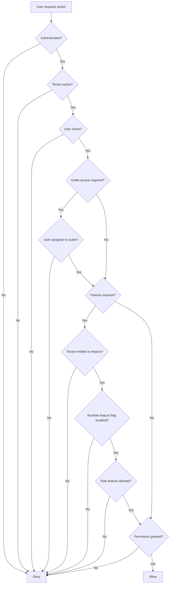

# Role, Permission and Capability Model

## Purpose

This document defines the architecture for role-based access, permission checks and feature capability access.

The platform uses configurable RBAC plus feature entitlement.

This is required because different tenants may enable different features and assign them to different roles.

## Core access decision

Effective access is not based on one role name.

Access is decided by:

```text
tenant status
+ user status
+ tenant/outlet assignment
+ platform feature entitlement
+ tenant feature flag
+ role feature assignment
+ permission assignment
+ backend business validation
```

## Access data model

| Table | Ownership | Purpose |
|---|---|---|
| `users` | Tenant-owned | Tenant staff and tenant administrators |
| `roles` | Tenant-owned | Tenant role definitions |
| `permissions` | Platform-owned | Permission catalog |
| `role_permissions` | Tenant-owned | Maps role to permission |
| `tenant_user_roles` | Tenant-owned | Tenant-scope role assignment |
| `outlet_user_roles` | Tenant-owned | Outlet-scope role assignment |
| `platform_features` | Platform-owned | Feature catalog |
| `tenant_feature_entitlements` | Platform-controlled tenant record | Enables feature for tenant |
| `role_feature_assignments` | Tenant-owned | Allows feature for a role |
| `feature_flags` | Tenant-owned config | Runtime feature configuration |

See [[03-data/entities/identity-access-entities]].

## Actor model

| Actor | Scope | Example access |
|---|---|---|
| Platform admin | Platform | Tenant creation, feature entitlement, platform support |
| Tenant admin | Tenant | Users, roles, outlets, tenant settings, catalog setup |
| Outlet manager | Outlet | Till sessions, approvals, returns, reports, cash variance |
| Cashier | Outlet/session | POS sale, hold/recall, payment, receipt |
| Inventory staff | Outlet/tenant | Receiving, transfers, stocktake, adjustments |
| E-Commerce operator | Tenant/outlet | Order processing, fulfillment, delivery status |
| Reporting user | Tenant/outlet | Reports and dashboards |
| Customer | Tenant storefront | Cart, checkout, address, order history |

## Role scope

Roles can have scope:

- Tenant.
- Outlet.

Tenant-level role examples:

- Tenant Admin.
- Reporting User.
- E-Commerce Operator.

Outlet-level role examples:

- Outlet Manager.
- Cashier.
- Inventory Staff.

## Permission examples

Permission code examples must be module-action oriented.

Examples:

| Module | Example permission |
|---|---|
| POS | `pos.sale.create` |
| POS | `pos.sale.void` |
| Payments | `payment.refund.approve` |
| Discounts | `discount.request.approve` |
| Inventory | `inventory.adjustment.post` |
| Catalog | `catalog.product.update` |
| Orders | `order.status.update` |
| Receipts | `receipt.reprint` |
| Settings | `settings.theme.update` |

Exact permissions must be managed in the permission catalog and related module docs.

## Feature entitlement model

A platform feature must be enabled for a tenant before tenant roles can use it.

Example:

```text
platform_features.feature_key = pos.billing
tenant_feature_entitlements.enabled = true for Tenant A
role_feature_assignments.allowed = true for Cashier role
role_permissions grants pos.sale.create
```

Only then can the cashier create POS sales.

## Feature flag model

`feature_flags` controls runtime behavior by scope.

Scopes:

- Tenant.
- Outlet.
- User.

Examples:

- Enable offline POS for a tenant.
- Enable a feature for one outlet.
- Enable a pilot feature for a user.

Feature flags do not replace permissions.

## Effective access flow



## Platform admin access

Platform admins are stored separately in `platform_users`.

They are not tenant staff.

Platform admin can:

- Create tenant.
- Suspend tenant.
- Enable platform features for tenant.
- Perform platform-level support actions.

Platform admin should not bypass tenant audit rules when performing tenant support actions.

## Tenant admin access

Tenant admin can configure only what the platform has enabled for that tenant.

Tenant admin cannot:

- Enable unavailable platform features.
- Modify another tenant.
- Access platform user management.
- Bypass payment/refund/stock audit rules.

## Outlet access

Outlet-scoped workflows must check outlet assignment.

Examples:

- POS billing.
- Cash session.
- Stocktake.
- Outlet transfer operation.
- Cash drawer report.

`outlet_user_roles` defines outlet-level assignment.

## Sensitive permission areas

The following should be separately controlled:

- Refund approval.
- Discount approval.
- Sale void.
- Receipt reprint.
- Stock adjustment approval/posting.
- Cash variance approval.
- Role/permission management.
- Feature flag change.
- Offline conflict resolution.

## Frontend access rule

The frontend may hide unavailable UI.

But frontend hiding is not security.

Backend must validate every sensitive operation.

See [[06-frontend/feature-access-ui-rules]].

## Backend access rule

The Application layer should call a central access/feature service before executing sensitive use cases.

Controllers must not duplicate permission logic.

See [[05-backend/feature-access-handling]].

## API access rule

API endpoints should document required:

- Auth type.
- Tenant context.
- Outlet context if required.
- Feature key if required.
- Permission code.

See [[04-api/feature-access-api-rules]].

## Offline access rule

Offline POS must use a pre-authorized cached access context.

On sync, backend must revalidate:

- Device.
- Tenant.
- Outlet.
- Session.
- Permission-sensitive actions.

Actions requiring live approval should either be blocked offline or synced as pending/approval-dependent records.

## Access testing checklist

- [ ] User from Tenant A cannot read Tenant B data.
- [ ] Cashier cannot approve own high discount unless permitted.
- [ ] Cashier cannot refund without permission.
- [ ] User without outlet assignment cannot access outlet POS.
- [ ] Tenant-disabled feature is not accessible through API.
- [ ] Frontend hidden action is still denied by backend when manually called.
- [ ] Suspended user cannot act.
- [ ] Suspended tenant cannot create new operational records.

## Related docs

- [[02-architecture/tenancy-architecture]]
- [[03-data/entities/identity-access-entities]]
- [[04-api/auth-and-authorization]]
- [[04-api/feature-access-api-rules]]
- [[05-backend/authentication-authorization]]
- [[09-security-and-compliance/authorization-model]]

## Final rule

Never document access as a fixed default role behavior.

The system must support tenant-specific configurable RBAC and feature access.
