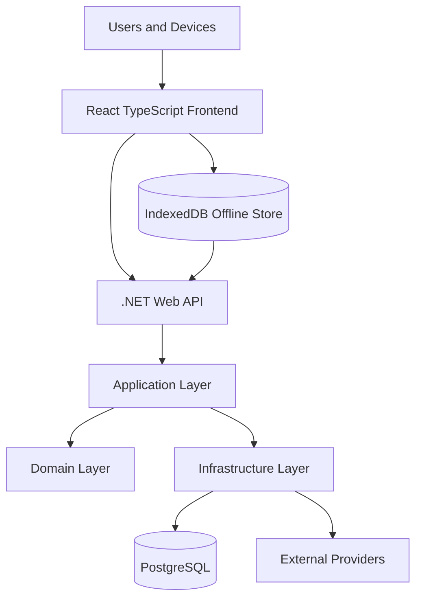
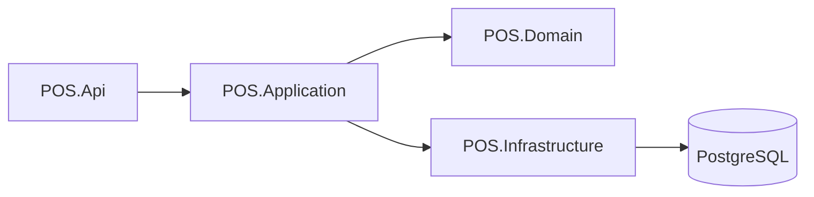
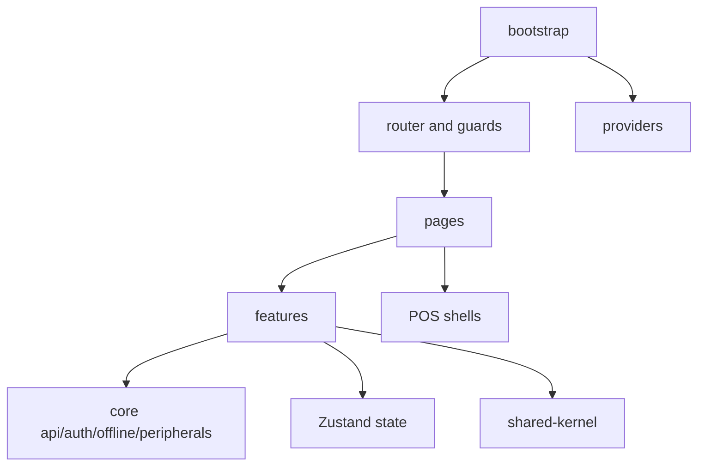
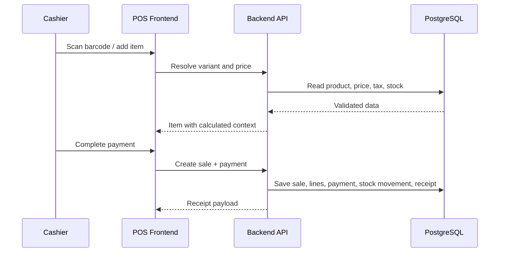
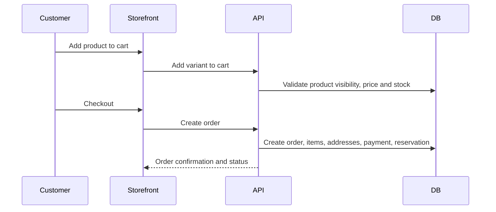

# System Overview

## Purpose

This document explains the full system architecture for the Unified Commerce E-POS + E-Commerce SaaS platform.

It connects the production scope, database design, backend architecture and frontend architecture into one system view.

Read this before writing module specs, backend services, frontend screens, APIs or tests.

## System classification

This system is a production-ready Unified Commerce platform.

It is not a basic POS project and not an MVP-only project.

It must support:

- Multi-tenant SaaS operation.
- Tenant-specific outlets and staff.
- E-POS sales and checkout.
- E-Commerce storefront, cart, checkout and orders.
- Shared catalog and inventory foundation.
- Offline-first POS billing and sync.
- Payments, refunds and receipts.
- Discounts, coupons and approvals.
- Returns and exchanges.
- Fulfillment, pickup and delivery.
- Reporting, audit and operational controls.
- Tenant configuration, themes and feature flags.

## High-level architecture

## Primary user channels

| Channel | Users | Main workflows |
|---|---|---|
| Platform administration | Platform admin | Tenant creation, feature entitlement, platform support |
| Tenant administration | Tenant admin | Outlets, roles, settings, themes, catalog, configuration |
| POS counter | Cashier, manager | Scan, add, pay, return, exchange, cash session, receipt |
| Inventory operations | Inventory staff, manager | Receiving, transfer, adjustment, stocktake, reservation review |
| E-Commerce storefront | Customer, guest customer | Browse, cart, checkout, account, order tracking |
| E-Commerce operations | E-commerce operator | Order processing, fulfillment, pickup, delivery status |
| Reporting | Admin, manager | Sales, payments, tax, stock, cash, discounts, returns |

## Production module map

| Module | Architecture responsibility |
|---|---|
| Platform and Tenant Management | Tenant lifecycle, operating mode, outlets and document sequences |
| Authentication and Access | Staff, customer auth, roles, permissions and feature access |
| Data Import and AI-Assisted Onboarding | Controlled import and review workflow |
| Catalog | Products, variants, categories, brands, suppliers, attributes and images |
| Tax and Pricing | Tax classes, rates, price lists, outlet overrides and tax calculation policy |
| Inventory | Stock balances, movements, reservations, transfers, adjustments and stocktakes |
| POS Devices and Hardware | Tills, POS devices, scanners, printers and cash drawer readiness |
| Cash Drawer and Session | Till sessions, cash movement, cash count and variance |
| POS Sales | Billing, sale lines, hold/recall, void/cancel and stock deduction |
| Payments and Receipts | Payment records, allocations, refunds, receipts and print logs |
| Discounts and Coupons | Discount policies, requests, applications and coupon redemptions |
| Returns and Exchanges | Return documents, exchange documents, refund and payment allocation |
| E-Commerce Orders | Cart, checkout, order, customer address snapshot and status history |
| Fulfillment | Delivery methods, zones, rates, deliveries, items and tracking |
| Customer | Tenant-scoped customers, auth accounts, identities, addresses and OTP |
| Loyalty, Wishlist and Reviews | Wishlist, product reviews, loyalty programs, memberships and points ledger |
| Offline Sync | Sync batches, items, typed queues, conflicts and audit logs |
| Reporting | Daily sales, payment, inventory and discount/return summaries |
| Configuration | Tenant settings, feature flags and UI themes |
| Audit and Security | Immutable audit logs and sensitive action traceability |

## Backend system view

The backend follows Clean Architecture.

Layer responsibility:

| Layer | Responsibility |
|---|---|
| API | Controllers, request/response contracts, middleware, filters and HTTP concerns |
| Application | Use cases, services, validators, DTOs, orchestration, strategies and interfaces |
| Domain | Entities, aggregates, value objects, domain rules and domain services |
| Infrastructure | EF Core, repositories, external integrations, Unit of Work and persistence |

See [[02-architecture/backend-architecture]].

## Frontend system view

The frontend follows a production React structure.

Main frontend responsibilities:

| Area | Responsibility |
|---|---|
| `bootstrap/` | Application entry, router, guards, providers and layouts |
| `core/` | API, auth, offline, peripherals, config and utilities |
| `features/` | Feature-specific frontend modules |
| `shells/` | POS screen composition shells |
| `pages/` | Route-level screens |
| `state/` | Zustand stores and POS orchestration state |
| `shared-kernel/` | Money, pricing, tax, receipt and invoice helpers |

See [[02-architecture/frontend-architecture]].

## Source-of-truth rule

The backend database remains the final source of truth for:

- Tenant isolation.
- Role and permission access.
- Feature entitlement.
- Product and variant data.
- Stock balances and movements.
- Prices, tax, discounts and totals.
- Payments and refunds.
- Receipts and audit logs.
- Offline sync acceptance.

The frontend may calculate previews, but backend confirmation is authoritative.

## Unified POS sale flow

## Unified e-commerce order flow

## Offline POS architecture summary

Offline POS supports billing when internet is unavailable.

The frontend stores local sales, payments and receipts in IndexedDB.

The backend accepts them through offline sync batches and items when the device reconnects.

The database includes:

- `offline_sync_batches`
- `offline_sync_items`
- `offline_sale_sync_queue`
- `offline_payment_sync_queue`
- `offline_sync_conflicts`
- `offline_sync_audit_logs`

See [[02-architecture/offline-first-architecture]].

## Access control architecture summary

Effective access requires all of these to pass:

1. Tenant is active.
2. User is active.
3. User belongs to tenant and, where required, outlet.
4. Platform feature is enabled for tenant.
5. Tenant feature flag allows runtime behavior.
6. Role has required feature assignment.
7. Role has required permission.
8. Backend validates the operation.

See [[02-architecture/role-permission-capability-model]].

## Reporting architecture summary

Reporting uses source transaction tables and reporting read models.

Database read models include:

- `daily_sales_summaries`
- `daily_payment_summaries`
- `daily_inventory_summaries`
- `daily_discount_return_summaries`

These are not financial source of truth.

They are read-optimized summaries generated from traceable transaction records.

## Related docs

- [[01-product/project-scope]]
- [[03-data/database-overview]]
- [[04-api/api-overview]]
- [[05-backend/backend-overview]]
- [[06-frontend/frontend-overview]]
- [[09-security-and-compliance/audit-requirements]]
- [[10-testing-quality/test-strategy]]

## Final architecture rule

Do not implement a workflow by touching only one layer.

Production features usually affect product scope, database, API, backend, frontend, user flows, testing and audit documentation.
