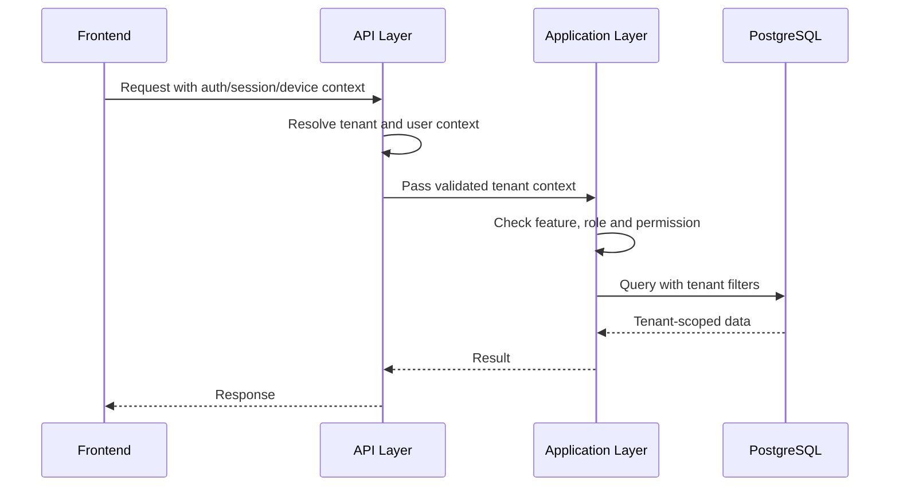

# Tenancy Architecture

## Purpose

This document explains how tenant context flows through frontend, API, backend, database and offline sync.

Read [[02-architecture/tenancy-model]] first.

## Tenancy architecture goal

The architecture must make it difficult for developers to accidentally mix tenant data.

Every workflow must know:

- Which tenant is active.
- Which outlet is active when outlet context matters.
- Which user is acting.
- Which device/session is acting in POS.
- Which feature is enabled and allowed.

## Tenant context flow



## Tenant context sources

| Workflow | Tenant context source |
|---|---|
| Platform admin tenant setup | Platform admin selected tenant |
| Tenant admin dashboard | Authenticated tenant staff user |
| POS cashier screen | User + assigned POS device + outlet + till session |
| E-Commerce storefront | Tenant storefront/domain/context |
| Offline sync | Device registration + sync batch tenant/outlet/device |
| Reporting | Authenticated user + selected allowed tenant/outlet/channel |

## Backend context rule

Backend must resolve tenant context before business logic runs.

Do not let each controller invent its own tenant lookup pattern.

Recommended backend concerns:

- Tenant context middleware.
- Authentication middleware.
- Feature access service.
- Permission service.
- Repository query filters or explicit tenant filters.
- Audit context provider.

## API layer responsibility

The API layer should:

- Authenticate the caller.
- Resolve request context.
- Validate route/body shape.
- Call application services.
- Return standard responses.

The API layer should not:

- Calculate stock changes.
- Approve discounts.
- Apply refund rules.
- Decide feature access alone.
- Execute cross-module business transactions.

## Application layer responsibility

The Application layer should orchestrate tenant-aware use cases.

Examples:

- Create sale.
- Complete payment.
- Create return.
- Sync offline sale.
- Create order.
- Assign role.
- Generate receipt.

Each use case must receive or resolve a trusted tenant context.

## Repository/data access rule

Every tenant-owned query must filter by tenant.

Wrong pattern:

```text
Find sale by sale_id only.
```

Correct pattern:

```text
Find sale by tenant_id and sale_id.
```

For outlet-owned data, also filter outlet where applicable.

## Outlet context architecture

Outlet context is mandatory for:

- POS sales.
- Tills.
- POS devices.
- Till sessions.
- Inventory balances.
- Stock movements.
- Cash movements.
- Transfers.
- Stocktakes.
- Outlet-level reports.
- Outlet-specific receipt templates.

Outlet context may be optional for tenant-wide admin configuration.

## POS device tenancy architecture

A POS device belongs to:

```text
tenant_id + outlet_id + till_id
```

The device controls:

- Active outlet for stock deduction.
- Active till for session control.
- Offline sync ownership.
- Printer/scanner context.
- Receipt source device.

A device must not sync data for another tenant or outlet.

## Offline tenant architecture

Offline POS data must carry:

- Tenant ID.
- Outlet ID.
- Device ID.
- Till session ID when applicable.
- Local client entity ID.
- Client transaction ID.
- Offline timestamp.

The server validates all of these during sync.

See [[02-architecture/offline-first-architecture]].

## Tenant feature architecture

Feature availability has multiple layers.

| Layer | Table / owner | Meaning |
|---|---|---|
| Feature catalog | `platform_features` | Platform defines available features |
| Tenant entitlement | `tenant_feature_entitlements` | Platform enables feature for a tenant |
| Runtime config | `feature_flags` | Tenant configures enabled behavior by scope |
| Role feature | `role_feature_assignments` | Role is allowed to use the feature |
| Permission | `role_permissions` | Role can perform specific action |

See [[02-architecture/role-permission-capability-model]].

## Configuration scope architecture

Runtime settings can be tenant, outlet or channel scoped.

| Scope | Example |
|---|---|
| Tenant | Default currency display, business settings |
| Outlet | POS receipt behavior for a store |
| Channel | POS vs E-Commerce checkout behavior |
| User | Feature flags can support user-level scope where defined |

Configuration priority must be documented in the owning feature spec.

## Tenant theme architecture

UI themes are tenant-owned.

`ui_themes.theme_tokens` stores validated tokens for:

- Colors.
- Spacing.
- Typography.

The frontend ThemeProvider consumes the active theme.

Backend or admin validation must prevent unreadable or invalid theme tokens.

## Tenant settings boundary

`tenant_settings` can store configuration.

It must not store:

- Sales.
- Orders.
- Payments.
- Stock movements.
- Returns.
- Audit records.
- Customer identity records.

Those must remain relational.

## Platform admin versus tenant admin

| Actor | Can do |
|---|---|
| Platform admin | Create tenants, enable features, suspend tenants, platform support |
| Tenant admin | Configure tenant-enabled features, roles, outlets, settings and theme |
| Outlet manager | Manage outlet workflows within assigned permissions |
| Cashier | Operate POS workflows within assigned outlet/session |

## Suspended tenant behavior

Suspended tenants should not create new sales or orders unless explicit platform policy allows it.

The architecture must check tenant status before operational writes.

Operational writes include:

- Sale completion.
- Order creation.
- Payment capture.
- Stock movement posting.
- Return/exchange completion.
- Offline sync acceptance.

## Tenant audit context

Audit logs must include tenant context for tenant business actions.

Platform-level actions may have `tenant_id` null only when they are truly platform-wide.

Feature entitlement changes should identify platform actor and affected tenant.

## Tenant architecture anti-patterns

Avoid:

- Passing `tenant_id` from the browser and trusting it blindly.
- Querying by entity ID only.
- Sharing customers globally across tenants.
- Using settings JSON as transactional storage.
- Letting offline sync create records without device/tenant validation.
- Treating frontend hidden buttons as security.

## Checklist for tenant-aware features

- [ ] Tenant context is resolved before business logic.
- [ ] User belongs to tenant.
- [ ] Outlet belongs to tenant when used.
- [ ] Device belongs to tenant/outlet when used.
- [ ] All database queries are tenant-filtered.
- [ ] Feature entitlement is checked where required.
- [ ] Role and permission are checked.
- [ ] Audit log includes tenant context.
- [ ] Tests include cross-tenant access denial.

## Related docs

- [[02-architecture/tenancy-model]]
- [[02-architecture/role-permission-capability-model]]
- [[03-data/tenant-consistency-rules]]
- [[04-api/tenant-context-api-rules]]
- [[05-backend/feature-access-handling]]
- [[09-security-and-compliance/data-isolation-controls]]

## Final rule

Tenant context is part of the architecture contract.

It must not be left to individual developers to interpret per feature.
