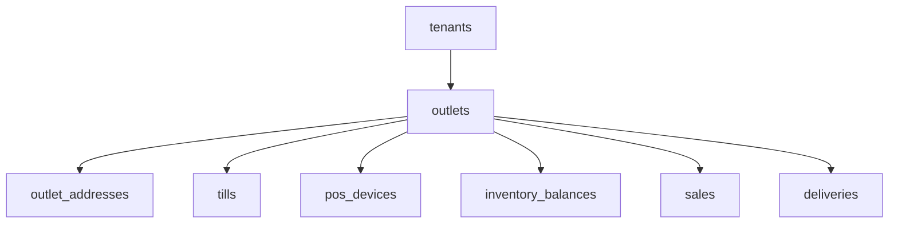

# Tenancy Model

## Purpose

This document defines how tenants, outlets, users, customers and tenant-owned data are modeled in the Unified Commerce platform.

The tenancy model is the foundation for every other module.

## Core tenancy decision

The platform is a multi-tenant SaaS system.

Each tenant represents a business customer using the platform.

Each tenant can operate as:

- POS-only.
- E-Commerce-only.
- Hybrid POS + E-Commerce.

The database design supports this using `tenants.operating_mode`.

## Tenant foundation tables

| Table | Purpose |
|---|---|
| `platform_users` | Platform-side administrators and support users |
| `tenants` | Root business account for each customer tenant |
| `outlets` | Physical or logical sales/stock locations under a tenant |
| `outlet_addresses` | Operational address for an outlet |
| `document_sequences` | Tenant/outlet-aware business number generator |

See [[03-data/entities/platform-tenant-entities]].

## Tenant entity

The `tenants` table represents the customer business.

Important fields:

| Field | Meaning |
|---|---|
| `code` | Human-readable tenant code |
| `name` | Tenant business name |
| `status` | Active, suspended or inactive |
| `base_currency` | Default currency |
| `default_timezone` | Tenant default timezone |
| `default_locale` | Tenant locale |
| `operating_mode` | POS-only, e-commerce-only or hybrid |

## Tenant status rules

| Status | Meaning | Architecture effect |
|---|---|---|
| `active` | Tenant can operate normally | Sales/orders allowed if feature and permissions allow |
| `suspended` | Tenant is blocked by platform policy | New sales/orders should be blocked unless explicitly allowed |
| `inactive` | Tenant is not operational | Operational workflows should be unavailable |

## Outlet model

An outlet is a tenant-owned sales, stock or fulfillment location.

Outlet types include:

- Store.
- Warehouse.
- Dark store.
- Fulfillment center.

Outlet rules:

- Outlet belongs to one tenant.
- Outlet code is unique inside tenant.
- POS device outlet must match till outlet.
- Stock balances are outlet-specific.
- Sales are outlet-specific.
- Fulfillment may be outlet-specific.

## Outlet ownership pattern



## Platform users versus tenant users

Platform users are not tenant staff.

| User type | Table | Scope |
|---|---|---|
| Platform admin/support | `platform_users` | Platform-level |
| Tenant staff/admin | `users` | Tenant-level |
| E-Commerce customer | `customers` + auth account tables | Tenant-level |

Do not store platform-admin flags inside tenant users.

## Tenant staff model

Tenant staff are stored in `users`.

They are tenant-scoped and may be assigned:

- Tenant-level roles through `tenant_user_roles`.
- Outlet-level roles through `outlet_user_roles`.

Examples:

- Tenant admin.
- Outlet manager.
- Cashier.
- Inventory staff.
- E-Commerce operator.
- Reporting user.

## Customer tenancy model

Customers are tenant-scoped.

The same email may exist under different tenants as different customer identities.

Customer-related tenant tables include:

- `customers`
- `customer_auth_accounts`
- `customer_auth_identities`
- `customer_addresses`
- `otp_verifications`
- `wishlists`
- `product_reviews`
- `customer_memberships`

See [[03-data/entities/customer-ecommerce-entities]].

## Platform-owned data

Some data is platform-owned and does not have `tenant_id`.

Examples:

| Table | Why platform-owned |
|---|---|
| `permissions` | Permission catalog shared by platform |
| `platform_features` | Feature catalog controlled by platform |
| `payment_method_types` | Global reference list |
| `discount_types` | Global calculation type reference |
| `discount_scopes` | Global discount scope reference |
| `stock_movement_types` | Global stock movement definitions |
| `cash_movement_types` | Global cash movement definitions |
| `otp_channels` | Global OTP channel reference |
| `otp_purposes` | Global OTP purpose reference |
| `attribute_templates` | Platform reusable attribute templates |
| `attribute_presets` | Platform attribute preset bundles |

## Tenant-owned data

Most business data is tenant-owned.

Examples:

- Roles.
- Users.
- Outlets.
- Products.
- Variants.
- Suppliers.
- Tax classes and rates.
- Price lists.
- Inventory balances.
- Sales.
- Orders.
- Payments.
- Returns.
- Exchanges.
- Receipts.
- Audit logs.
- Reports.

## Tenant isolation rule

A tenant-owned row must never reference a row from a different tenant.

Example:

A sale line must reference:

- A sale from the same tenant.
- A variant from the same tenant.
- A tax rate from the same tenant when populated.

The backend must enforce this even when the database has foreign keys.

## Tenant context in requests

Tenant context may be derived from:

- Authenticated staff user.
- Selected tenant context for platform support.
- Customer storefront tenant/domain.
- POS device assignment.
- Outlet selection.
- API route/subdomain depending on deployment choice.

The backend must not trust tenant identifiers blindly from the frontend.

## Tenant context in POS

POS workflow uses combined context:

```text
tenant_id + outlet_id + till_id + pos_device_id + till_session_id + user_id
```

This context affects:

- Product visibility.
- Stock outlet.
- Price list/outlet override.
- Tax calculation.
- Cash drawer session.
- Receipt template.
- Offline sync ownership.

## Tenant context in E-Commerce

E-Commerce workflow uses tenant context from the storefront.

It affects:

- Product listing.
- Published products.
- Customer account.
- Cart.
- Order.
- Payment methods.
- Delivery methods and zones.
- Theme and configuration.

## Document sequence tenancy

The `document_sequences` table generates business numbers by tenant and optionally by outlet.

Document types include:

- Sale.
- Order.
- Return.
- Exchange.
- Receipt.
- Transfer.
- Purchase receipt.
- Stock adjustment.
- Delivery.

Sequence allocation must be safe under concurrency.

## Tenant configuration model

Tenant configuration is stored in:

- `tenant_settings`
- `feature_flags`
- `ui_themes`

These tables must not replace relational business data.

See [[02-architecture/tenancy-architecture]].

## Tenant model checklist

When designing a table, ask:

- [ ] Is this platform-owned or tenant-owned?
- [ ] If tenant-owned, does it have `tenant_id` or a tenant-owned parent?
- [ ] Are all referenced rows from the same tenant?
- [ ] Does outlet context matter?
- [ ] Does channel context matter?
- [ ] Does POS device/session context matter?
- [ ] Does it need audit?
- [ ] Does it affect reporting?
- [ ] Does it affect offline sync?

## Related docs

- [[02-architecture/tenancy-architecture]]
- [[02-architecture/role-permission-capability-model]]
- [[03-data/tenant-consistency-rules]]
- [[03-data/entities/platform-tenant-entities]]
- [[09-security-and-compliance/data-isolation-controls]]

## Final rule

Tenant isolation is not a UI feature.

It must be enforced in API, application services, repositories, database constraints where possible, tests and audit logs.
