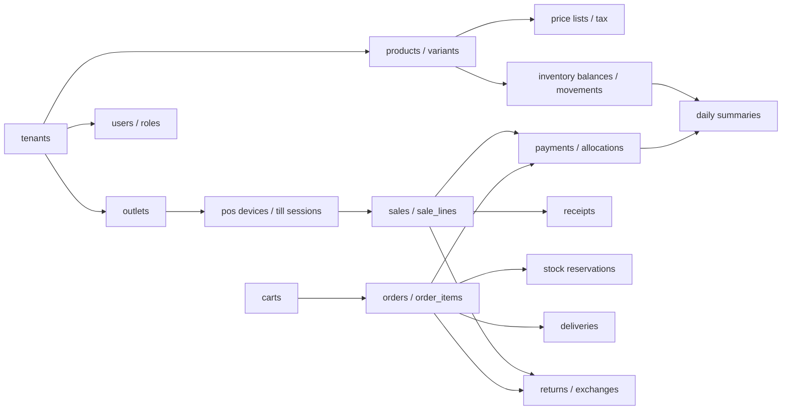

# Database Overview

The production database design supports a multi-tenant Unified Commerce SaaS system combining E-POS, E-Commerce, offline POS, inventory, payments, refunds, fulfillment, receipts, audit, and reporting.

The uploaded database design is the source of truth for table names and relationships in this folder. The uploaded production scope is the source of truth for business module coverage. When scope and schema do not align, the gap is recorded in [[required-schema-extensions]] instead of inventing ad-hoc implementation tables.

---

## Source-of-truth boundaries

| Business area | Source tables | Derived or staging tables |
|---|---|---|
| Tenant/account foundation | `tenants`, `outlets`, `document_sequences` | configuration caches |
| Identity and access | `users`, `roles`, `permissions`, feature assignment tables | access claims, UI menus |
| Catalog | `products`, `product_variants`, attributes, images | search indexes, POS cache |
| Pricing and tax | `price_lists`, `price_list_items`, `tax_classes`, `tax_rates` | frontend preview totals |
| Inventory | `stock_movements`, `inventory_balances` | inventory summaries |
| POS sales | `sales`, `sale_lines` | receipt payloads, reports |
| E-Commerce orders | `orders`, `order_items`, status history | customer tracking views |
| Payments/refunds | `payments`, allocations, `refunds` | payment summaries |
| Returns/exchanges | `returns`, `return_lines`, `exchanges`, `exchange_lines` | reports, receipt outputs |
| Offline sync | accepted source tables | sync queues and conflict tables |
| Reporting | source transactions | daily read models |

---

## Schema group inventory

| No. | Group | Entity reference |
|---:|---|---|
| 1 | Platform and Tenant Foundation | [[entities/platform-tenant-entities]] |
| 2 | Identity, RBAC, and Feature Access | [[entities/identity-access-entities]] |
| 3 | Tenant Runtime Configuration | [[entities/configuration-entities]] |
| 4 | Catalog | [[entities/catalog-entities]] |
| 5 | Pricing and Tax | [[entities/pricing-tax-entities]] |
| 6 | Inventory and Stock Control | [[entities/inventory-entities]] |
| 7 | POS Device, Session, and Sales | [[entities/pos-device-sales-entities]] |
| 8 | Customer and E-Commerce | [[entities/customer-ecommerce-entities]] |
| 9 | Fulfillment, Pickup, and Delivery | [[entities/fulfillment-entities]] |
| 10 | Payments, Refunds, and Allocations | [[entities/payments-entities]] |
| 11 | Discounts and Coupons | [[entities/discounts-coupons-entities]] |
| 12 | Returns and Exchanges | [[entities/returns-exchanges-entities]] |
| 13 | Receipts, Audit, and Offline Sync | [[entities/receipts-audit-offline-entities]] |
| 14 | Reporting Read Models | [[entities/reporting-entities]] |
| 15 | Data Import and AI-Assisted Onboarding | [[entities/data-import-ai-entities]] |

---

## High-level database flow

---

## Implementation notes

- Use PostgreSQL `uuid` primary keys for business entities unless the database design explicitly uses reference IDs such as `smallint` or `bigserial`.
- Use `citext` for email fields where specified.
- Use JSONB only for configuration, snapshots, provider payloads, and non-source-of-truth metadata.
- Do not use JSONB to replace relational transactions.
- Use row-level locking when allocating document sequence numbers and enforcing coupon usage.
- Use idempotency keys for duplicate-prone workflows: payment, order, offline sync, and POS offline transactions.

Related: [[schema-principles]], [[tenant-consistency-rules]], [[ef-core-implementation-notes]].
