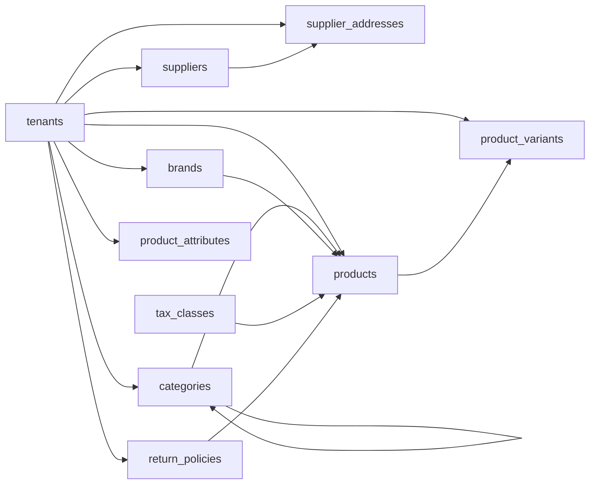

# Catalog Entities

These tables define the shared POS and E-Commerce product catalog, variant model, attributes, brands, suppliers, images, and return policy classification.

Based on the uploaded production scope, production database design, backend architecture, frontend architecture, and current Unified Commerce 2nd Brain structure.

---

## Table map

| Table | Purpose | PK | Foreign keys | Important attributes | Notes |
|---|---|---|---|---|---|
| `brands` | Optional tenant-owned brand master. | `id` | tenant_id -> tenants.id | name, code, status, created_at, updated_at | Unique brand name and optional code inside tenant. |
| `suppliers` | Tenant supplier master for stock receiving. | `id` | tenant_id -> tenants.id | name, contact_name, email, phone, status, created_at, updated_at | Used by purchase receipts and supplier-product mappings. |
| `supplier_addresses` | Supplier address records. | `id` | tenant_id -> tenants.id; supplier_id -> suppliers.id | line1, line2, city, state, postal_code, country_code, is_primary | At most one primary address per supplier. |
| `categories` | Hierarchical tenant product categories. | `id` | tenant_id -> tenants.id; parent_id -> categories.id nullable | name, slug, sort_order, is_active, created_at, updated_at | Slug unique inside tenant. Parent must belong to same tenant. |
| `return_policies` | Tenant return/exchange policy rules assigned to products. | `id` | tenant_id -> tenants.id | code, name, policy_type, return_window_days, exchange_window_days, requires_receipt, allow_damaged_return, requires_manager_override, is_active | Replaces weak enum-only returnability flags. |
| `products` | Product master shared by POS and E-Commerce. | `id` | tenant_id -> tenants.id; category_id -> categories.id nullable; brand_id -> brands.id nullable; tax_class_id -> tax_classes.id nullable; return_policy_id -> return_policies.id | product_type, name, slug, short_description, long_description, status, is_sellable_pos, is_sellable_online, track_inventory, created_at, updated_at | Do not store stock quantity here. |
| `product_variants` | Sellable SKU/barcode units under products. | `id` | tenant_id -> tenants.id; product_id -> products.id | sku, barcode, name, weight, purchase_limit_per_order, purchase_limit_per_customer, variant_signature, status, created_at, updated_at | SKU and barcode are tenant-unique. Variant is the sellable unit. |
| `product_attributes` | Tenant-defined product attributes. | `id` | tenant_id -> tenants.id | code, name, data_type, is_variant_defining, status, created_at | Final tenant-owned attributes live here. |
| `attribute_values` | Allowed values for selectable attributes. | `id` | tenant_id -> tenants.id; attribute_id -> product_attributes.id | value_code, value_text, sort_order, is_active | Unique tenant/attribute/value_code. |
| `attribute_templates` | Platform-level reusable attribute definitions. | `id` | None | code, name, data_type, is_variant_defining, status, created_at, updated_at | No tenant_id; template source only. |
| `attribute_template_values` | Default selectable values under a platform attribute template. | `id` | attribute_template_id -> attribute_templates.id | value_code, value_text, sort_order, is_active | Unique template/value_code. |
| `attribute_presets` | Platform-level attribute bundles for setup acceleration. | `id` | None | code, name, business_type, description, status, created_at, updated_at | Preset does not replace tenant-owned attributes. |
| `attribute_preset_items` | Maps platform attribute templates into a preset. | `id` | attribute_preset_id -> attribute_presets.id; attribute_template_id -> attribute_templates.id | is_required, sort_order | Unique preset/template. |
| `category_attributes` | Maps categories to relevant product attributes. | `id` | tenant_id -> tenants.id; category_id -> categories.id; attribute_id -> product_attributes.id | is_required, sort_order, is_active | Unique tenant/category/attribute. |
| `variant_attribute_values` | Selected attribute values per variant. | `id` | tenant_id -> tenants.id; variant_id -> product_variants.id; attribute_id -> product_attributes.id; attribute_value_id -> attribute_values.id | No extra business attributes | Unique tenant/variant/attribute. Value must belong to attribute. |
| `product_suppliers` | Supplier mapping for products or variants. | `id` | tenant_id -> tenants.id; product_id -> products.id; variant_id -> product_variants.id nullable; supplier_id -> suppliers.id | supplier_sku, purchase_price, lead_time_days, is_primary, status | At most one primary supplier per product/variant. |
| `product_images` | Product and optional variant images. | `id` | tenant_id -> tenants.id; product_id -> products.id; variant_id -> product_variants.id nullable | storage_key, alt_text, sort_order, is_primary, created_at | Object storage reference only; not binary image storage. |

---

## Relationship diagram

---

## Production data rules

- Variant is the sellable unit for POS, cart, order, stock, return, exchange, and price.
- Do not store stock quantity on `products` or `product_variants`.
- Online visibility uses product status and channel flags.
- Platform attribute templates are optional accelerators; tenant data is saved into tenant-owned attribute tables.
- Return policy is assigned at product level for return validation.

---

## Implementation checklist

- [ ] Tenant ownership and parent-child tenant consistency are enforced.
- [ ] All FK relationships are mapped in EF Core and validated at service boundary.
- [ ] Unique constraints and partial unique indexes are implemented where documented.
- [ ] Status values are validated before writes.
- [ ] Audit behavior is defined for sensitive changes.
- [ ] Offline sync impact is checked if POS/device/offline records are involved.
- [ ] Reporting impact is understood before changing source tables.
- [ ] Related API, backend, frontend, module, and test docs are updated.

---

## Related files

- [[pricing-tax-entities]]
- [[inventory-entities]]
- [[returns-exchanges-entities]]
- [[../../07-modules/catalog/README]]
