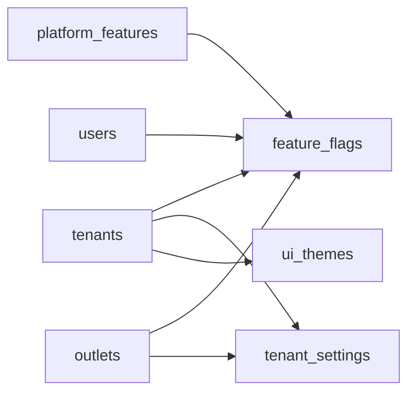

# Tenant Runtime Configuration Entities

These tables store tenant-side runtime configuration, scoped settings, feature flags, and UI theme tokens.

Based on the uploaded production scope, production database design, backend architecture, frontend architecture, and current Unified Commerce 2nd Brain structure.

---

## Table map

| Table | Purpose | PK | Foreign keys | Important attributes | Notes |
|---|---|---|---|---|---|
| `feature_flags` | Tenant-side runtime feature configuration by scope. | `id` | tenant_id -> tenants.id; feature_id -> platform_features.id; outlet_id -> outlets.id nullable; user_id -> users.id nullable | enabled, scope, config, created_at, updated_at | Exactly one target based on scope. Feature must be entitled to tenant. |
| `tenant_settings` | Generic setting store for tenant/outlet/channel settings. | `id` | tenant_id -> tenants.id; outlet_id -> outlets.id nullable | setting_key, setting_value, scope, channel, created_at, updated_at | Use partial unique indexes per scope. Not a replacement for transaction data. |
| `ui_themes` | Tenant UI theme tokens. | `id` | tenant_id -> tenants.id | name, theme_tokens, is_default, created_at, updated_at | At most one default theme per tenant. Tokens must be validated. |

---

## Relationship diagram

---

## Production data rules

- Configuration can change behavior only inside the tenant boundary.
- A feature flag cannot enable a platform-disabled feature.
- JSONB config must not store secrets or financial transactions.
- Theme token changes must not create unreadable POS screens.
- Configuration changes that affect sensitive behavior must be audited.

---

## Implementation checklist

- [ ] Tenant ownership and parent-child tenant consistency are enforced.
- [ ] All FK relationships are mapped in EF Core and validated at service boundary.
- [ ] Unique constraints and partial unique indexes are implemented where documented.
- [ ] Status values are validated before writes.
- [ ] Audit behavior is defined for sensitive changes.
- [ ] Offline sync impact is checked if POS/device/offline records are involved.
- [ ] Reporting impact is understood before changing source tables.
- [ ] Related API, backend, frontend, module, and test docs are updated.

---

## Related files

- [[identity-access-entities]]
- [[../schema-principles]]
- [[../../06-frontend/theme-and-configuration-rules]]
- [[../../04-api/feature-access-api-rules]]
