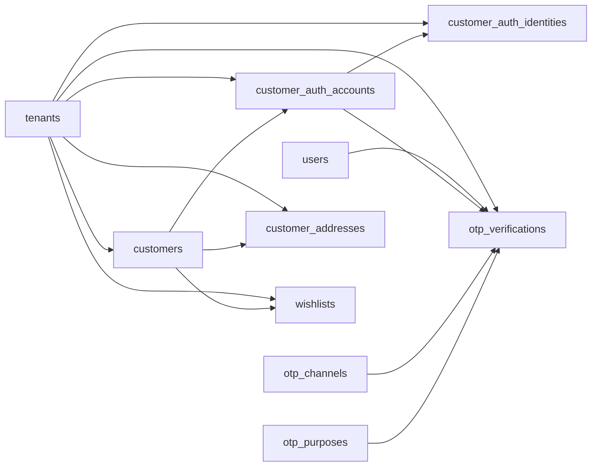

# Customer, Authentication, Loyalty, Cart, and Order Entities

These tables define tenant-scoped customers, customer online authentication, OTP, addresses, wishlists, reviews, loyalty, carts, orders, order lines, address snapshots, and order status history.

Based on the uploaded production scope, production database design, backend architecture, frontend architecture, and current Unified Commerce 2nd Brain structure.

---

## Table map

| Table | Purpose | PK | Foreign keys | Important attributes | Notes |
|---|---|---|---|---|---|
| `customers` | Tenant-scoped customer profile shared by POS and online channel. | `id` | tenant_id -> tenants.id | email, normalized_email, phone, normalized_phone, full_name, first_name, last_name, status, source, created_at, updated_at | Same email can exist under different tenants. |
| `customer_auth_accounts` | Customer account wrapper for online login. | `id` | tenant_id -> tenants.id; customer_id -> customers.id | status, last_login_at, created_at | Unique tenant/customer. Guest customers do not require auth account. |
| `customer_auth_identities` | Login identities for customer auth account. | `id` | tenant_id -> tenants.id; account_id -> customer_auth_accounts.id | provider, provider_subject, username, password_hash, is_email_verified, is_phone_verified, created_at | Supports local/google/apple provider identity. |
| `otp_channels` | Reference values for OTP delivery channels. | `id` | None | code, name | Seeded: email, sms, whatsapp. |
| `otp_purposes` | Reference values for OTP purpose. | `id` | None | code, name | Seeded: login, signup, reset_password, verify_phone, verify_email, mfa. |
| `otp_verifications` | OTP issuance, attempts, and verification history for staff or customers. | `id` | tenant_id -> tenants.id; user_id -> users.id nullable; customer_auth_account_id -> customer_auth_accounts.id nullable; otp_channel_id -> otp_channels.id; otp_purpose_id -> otp_purposes.id | destination, otp_code_hash, expires_at, verified_at, attempt_count, resend_count, last_attempt_at, blocked_until, ip, user_agent, status, created_at, updated_at | Exactly one of user_id/customer_auth_account_id. Store hashed OTP only. |
| `customer_addresses` | Reusable customer addresses. | `id` | tenant_id -> tenants.id; customer_id -> customers.id | address_type, line1, line2, city, state, postal_code, country_code, is_default, created_at | At most one default per customer/address_type. |
| `wishlists` | Customer wishlist header. | `id` | tenant_id -> tenants.id; customer_id -> customers.id | name, is_default, status, created_at, updated_at | Unique tenant/customer/name. At most one default wishlist. |
| `wishlist_items` | Variant items saved under a wishlist. | `id` | tenant_id -> tenants.id; wishlist_id -> wishlists.id; variant_id -> product_variants.id | added_at | Unique tenant/wishlist/variant. |
| `product_reviews` | Moderated customer product reviews. | `id` | tenant_id -> tenants.id; customer_id -> customers.id; product_id -> products.id; order_id -> orders.id nullable; approved_by -> users.id nullable | rating, title, body, status, approved_at, created_at, updated_at | Purchase-verified review should include order_id when available. |
| `loyalty_programs` | Tenant-owned loyalty program configuration. | `id` | tenant_id -> tenants.id | code, name, earn_rule, redeem_rule, status, starts_at, ends_at, created_at, updated_at | JSON rules are allowed; point movements must be in ledger. |
| `membership_tiers` | Tier definitions inside a loyalty program. | `id` | tenant_id -> tenants.id; loyalty_program_id -> loyalty_programs.id | code, name, min_points, points_multiplier, sort_order, status, created_at, updated_at | Unique tenant/program/code. |
| `customer_memberships` | Customer membership record and current points projection. | `id` | tenant_id -> tenants.id; customer_id -> customers.id; loyalty_program_id -> loyalty_programs.id; tier_id -> membership_tiers.id nullable | membership_no, points_balance, lifetime_points, join_date, expiry_date, status, created_at, updated_at | Points balance must update only from loyalty_transactions. |
| `loyalty_transactions` | Immutable loyalty points ledger. | `id` | tenant_id -> tenants.id; customer_membership_id -> customer_memberships.id; source_sale_id -> sales.id nullable; source_order_id -> orders.id nullable; source_return_id -> returns.id nullable; reversed_transaction_id -> loyalty_transactions.id nullable; created_by -> users.id nullable | transaction_type, points_delta, monetary_value, expires_at, reason, created_at | Ledger rows are immutable; reverse instead of editing. |
| `carts` | Shopping cart header. | `id` | tenant_id -> tenants.id; customer_id -> customers.id nullable | guest_token, channel, status, currency, subtotal, discount_total, tax_total, grand_total, expires_at, created_at, updated_at | Customer or guest token is required. |
| `cart_items` | Cart line items. | `id` | tenant_id -> tenants.id; cart_id -> carts.id; variant_id -> product_variants.id | qty, unit_price, discount_total, tax_total, line_total, pricing_snapshot | Unique tenant/cart/variant. |
| `orders` | E-Commerce order header. | `id` | tenant_id -> tenants.id; source_cart_id -> carts.id nullable; customer_id -> customers.id; fulfillment_outlet_id -> outlets.id nullable; cancelled_by -> users.id nullable | order_number, business_date, order_status, payment_status, fulfillment_status, currency, subtotal, discount_total, tax_total, shipping_total, grand_total, placed_at, cancelled_at, cancel_reason, created_at, updated_at | Separate order/payment/fulfillment status fields. |
| `order_items` | Order line items. | `id` | tenant_id -> tenants.id; order_id -> orders.id; variant_id -> product_variants.id; tax_rate_id -> tax_rates.id nullable | line_no, description, qty, reserved_qty, fulfilled_qty, returned_qty, unit_price, discount_total, tax_total, line_total, pricing_snapshot | Unique tenant/order/line_no. |
| `order_addresses` | Immutable order address snapshots. | `id` | tenant_id -> tenants.id; order_id -> orders.id | address_type, full_name, phone, line1, line2, city, state, postal_code, country_code | Unique tenant/order/address_type. |
| `order_status_transitions` | Allowed status transitions for order/payment/fulfillment workflows. | `id` | requires_permission_code -> permissions.code nullable | status_type, from_status, to_status, is_active | Unique status_type/from/to. Blocks invalid transitions. |
| `order_status_history` | Status change history for order/payment/fulfillment statuses. | `id` | tenant_id -> tenants.id; order_id -> orders.id; changed_by -> users.id nullable | status_type, from_status, to_status, changed_at, reason | Status_type removes ambiguity between status columns. |

---

## Relationship diagram

---

## Production data rules

- Customers are tenant-scoped, not global identities.
- Guest checkout creates tenant-scoped guest customer/order identity.
- Order status, payment status, and fulfillment status must not be collapsed into one field.
- OTP code must be hashed, rate-limited, and retained only as required.
- Loyalty points balance is a projection of immutable loyalty transactions.

---

## Implementation checklist

- [ ] Tenant ownership and parent-child tenant consistency are enforced.
- [ ] All FK relationships are mapped in EF Core and validated at service boundary.
- [ ] Unique constraints and partial unique indexes are implemented where documented.
- [ ] Status values are validated before writes.
- [ ] Audit behavior is defined for sensitive changes.
- [ ] Offline sync impact is checked if POS/device/offline records are involved.
- [ ] Reporting impact is understood before changing source tables.
- [ ] Related API, backend, frontend, module, and test docs are updated.

---

## Related files

- [[fulfillment-entities]]
- [[payments-entities]]
- [[discounts-coupons-entities]]
- [[returns-exchanges-entities]]
