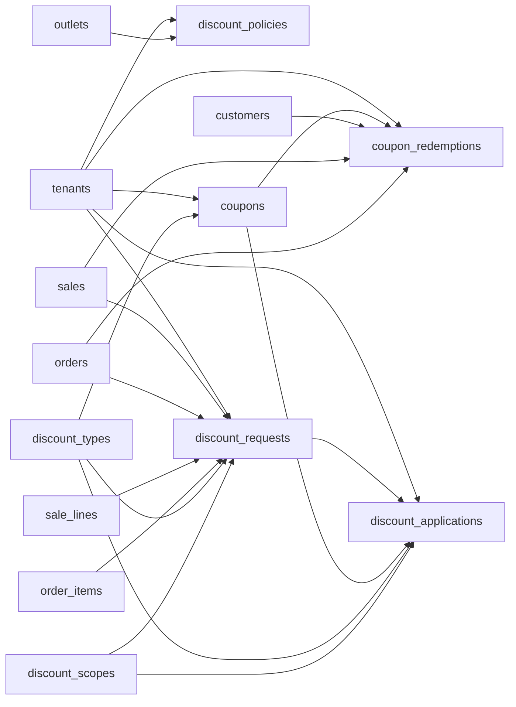

# Discount and Coupon Entities

These tables define discount type/scope references, tenant policies, approval requests, coupons, actual applied discounts, and coupon redemptions.

Based on the uploaded production scope, production database design, backend architecture, frontend architecture, and current Unified Commerce 2nd Brain structure.

---

## Table map

| Table | Purpose | PK | Foreign keys | Important attributes | Notes |
|---|---|---|---|---|---|
| `discount_types` | Discount calculation type reference. | `id` | None | code, name | Seeded: percentage, fixed_amount, price_override. |
| `discount_scopes` | Discount scope reference. | `id` | None | code, name | Seeded: line, sale, order. |
| `discount_policies` | Tenant discount approval and stacking rules. | `id` | tenant_id -> tenants.id; outlet_id -> outlets.id nullable | channel, max_cashier_discount_percent, max_cashier_discount_amount, approval_required_above_amount, approval_required_above_percent, allow_coupon_stacking, is_active, created_at, updated_at | Use partial unique indexes for tenant/outlet policies. |
| `discount_requests` | Approval workflow requests raised by cashier/operator. | `id` | tenant_id -> tenants.id; sale_id -> sales.id nullable; order_id -> orders.id nullable; sale_line_id -> sale_lines.id nullable; order_item_id -> order_items.id nullable; discount_type_id -> discount_types.id; discount_scope_id -> discount_scopes.id; requested_by/approved_by -> users.id nullable | source_domain, requested_value, reason, status, created_at, resolved_at | Exactly one document reference must match source_domain. |
| `coupons` | Tenant coupon master. | `id` | tenant_id -> tenants.id; discount_type_id -> discount_types.id | code, name, value, min_order_amount, max_discount_amount, allowed_channel, rule_payload, max_uses, max_uses_per_customer, used_count, status, starts_at, ends_at, created_at, updated_at | Coupon code unique inside tenant. |
| `discount_applications` | Actual discount applied to sale/order. | `id` | tenant_id -> tenants.id; sale_id/order_id/sale_line_id/order_item_id nullable; discount_request_id -> discount_requests.id nullable; coupon_id -> coupons.id nullable; discount_type_id -> discount_types.id; discount_scope_id -> discount_scopes.id; created_by/approved_by -> users.id nullable | source_domain, name, reason, value, amount_applied, created_at | Stores computed amount for audit/reporting. |
| `coupon_redemptions` | Actual coupon use against sale/order. | `id` | tenant_id -> tenants.id; coupon_id -> coupons.id; customer_id -> customers.id nullable; sale_id -> sales.id nullable; order_id -> orders.id nullable | source_domain, redeemed_at | Enforce max uses in service transaction with row lock. |

---

## Relationship diagram

---

## Production data rules

- Discounts above threshold require approval.
- Coupon validity checks status, date, channel, usage count, and customer limit.
- Discount stacking must follow discount policy.
- Refund calculations must consider original discount allocation.
- Discount applications are audit and reporting records, not temporary UI state.

---

## Implementation checklist

- [ ] Tenant ownership and parent-child tenant consistency are enforced.
- [ ] All FK relationships are mapped in EF Core and validated at service boundary.
- [ ] Unique constraints and partial unique indexes are implemented where documented.
- [ ] Status values are validated before writes.
- [ ] Audit behavior is defined for sensitive changes.
- [ ] Offline sync impact is checked if POS/device/offline records are involved.
- [ ] Reporting impact is understood before changing source tables.
- [ ] Related API, backend, frontend, module, and test docs are updated.

---

## Related files

- [[pricing-tax-entities]]
- [[payments-entities]]
- [[returns-exchanges-entities]]
- [[../../07-modules/discounts-promotions/README]]
