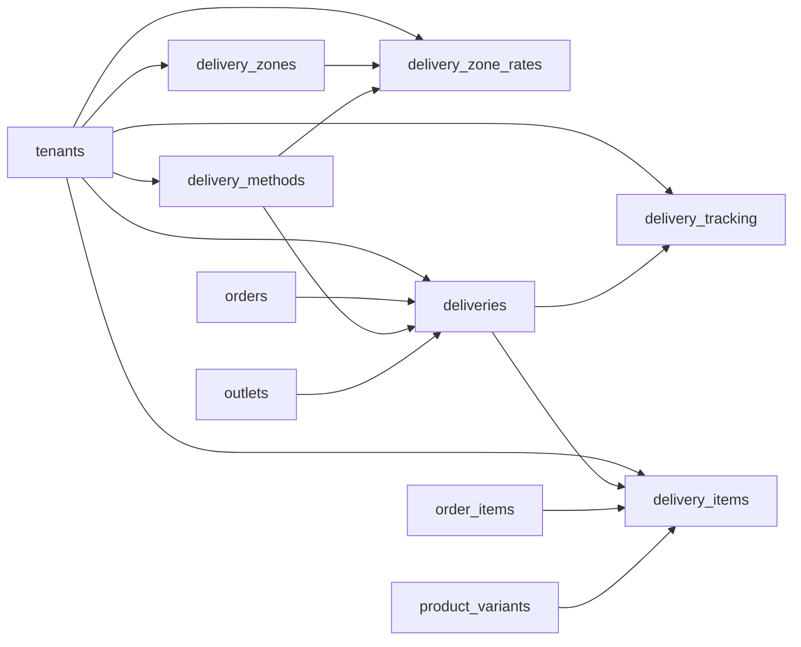

# Fulfillment, Pickup, and Delivery Entities

These tables support delivery and pickup methods, delivery zones, zone rates, fulfillment headers, delivery items, and tracking events.

Based on the uploaded production scope, production database design, backend architecture, frontend architecture, and current Unified Commerce 2nd Brain structure.

---

## Table map

| Table | Purpose | PK | Foreign keys | Important attributes | Notes |
|---|---|---|---|---|---|
| `delivery_methods` | Tenant delivery/pickup methods. | `id` | tenant_id -> tenants.id | code, name, method_type, is_active, created_at, updated_at | Method type is delivery or pickup. |
| `delivery_zones` | Tenant delivery zones. | `id` | tenant_id -> tenants.id | code, name, country_code, city, postal_pattern, is_active, created_at, updated_at | Zone matching may be service-layer logic. |
| `delivery_zone_rates` | Delivery fee rules per zone/method. | `id` | tenant_id -> tenants.id; delivery_zone_id -> delivery_zones.id; delivery_method_id -> delivery_methods.id | currency, base_fee, free_above_amount, is_active, created_at, updated_at | Unique tenant/zone/method/currency. |
| `deliveries` | Delivery or pickup fulfillment header. | `id` | tenant_id -> tenants.id; order_id -> orders.id; delivery_method_id -> delivery_methods.id; outlet_id -> outlets.id nullable | delivery_number, carrier_code, tracking_no, status, shipped_at, delivered_at, collected_at, created_at | Pickup uses collected, not delivered. |
| `delivery_items` | Line-level fulfilled quantities. | `id` | tenant_id -> tenants.id; delivery_id -> deliveries.id; order_item_id -> order_items.id; variant_id -> product_variants.id | qty | Unique tenant/delivery/order_item. |
| `delivery_tracking` | Delivery tracking event timeline. | `id` | tenant_id -> tenants.id; delivery_id -> deliveries.id | status, location_text, event_time, payload | Supports manual tracking and future courier payloads. |

---

## Relationship diagram

---

## Production data rules

- Every online order must follow a configured fulfillment method where required.
- Pickup and delivery statuses are different operational states.
- Fulfilled quantities must not exceed order item quantity.
- Delivery fee must be included in order totals where configured.
- Courier integration is optional; tracking reference readiness is in scope.

---

## Implementation checklist

- [ ] Tenant ownership and parent-child tenant consistency are enforced.
- [ ] All FK relationships are mapped in EF Core and validated at service boundary.
- [ ] Unique constraints and partial unique indexes are implemented where documented.
- [ ] Status values are validated before writes.
- [ ] Audit behavior is defined for sensitive changes.
- [ ] Offline sync impact is checked if POS/device/offline records are involved.
- [ ] Reporting impact is understood before changing source tables.
- [ ] Related API, backend, frontend, module, and test docs are updated.

---

## Related files

- [[customer-ecommerce-entities]]
- [[payments-entities]]
- [[reporting-entities]]
- [[../../07-modules/fulfillment-logistics/README]]
