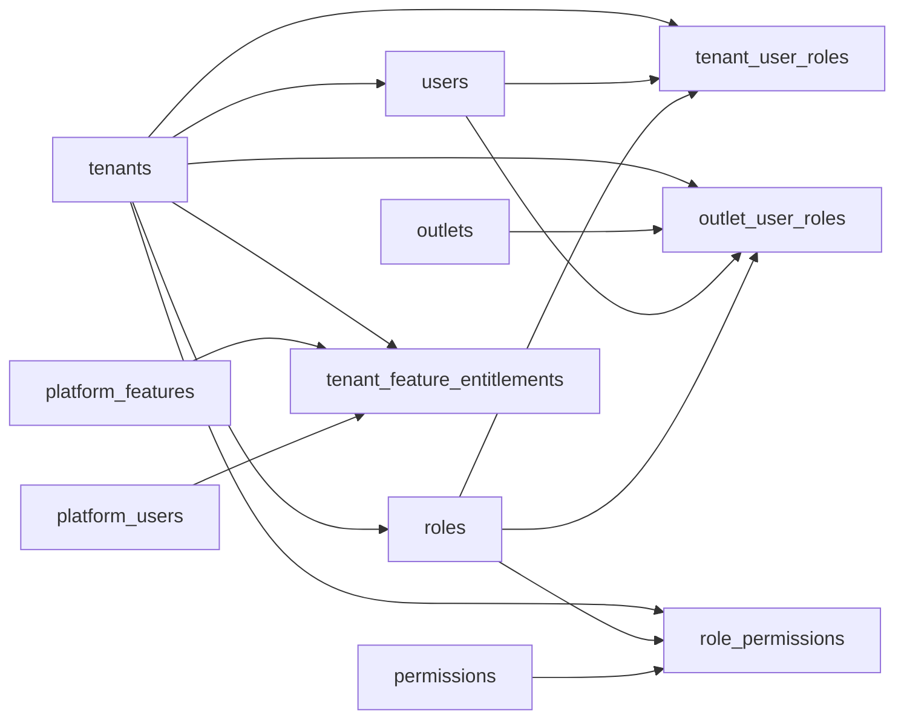

# Identity, RBAC, and Feature Access Entities

These tables implement tenant-bound staff identity, tenant and outlet role assignment, platform permission catalog, platform feature entitlements, and role-to-feature access.

Based on the uploaded production scope, production database design, backend architecture, frontend architecture, and current Unified Commerce 2nd Brain structure.

---

## Table map

| Table | Purpose | PK | Foreign keys | Important attributes | Notes |
|---|---|---|---|---|---|
| `users` | Tenant-bound staff and tenant administrators. | `id` | tenant_id -> tenants.id | email, normalized_email, phone, normalized_phone, password_hash, full_name, status, last_login_at, created_at, updated_at | Unique normalized email/phone inside tenant when present. |
| `roles` | Tenant-owned role definitions. | `id` | tenant_id -> tenants.id | code, name, scope, is_system, created_at, updated_at | `scope` is tenant or outlet. Role code is unique inside tenant. |
| `permissions` | Platform-owned permission catalog. | `id` | None | code, name, module, description, is_system, created_at | No `tenant_id`; permissions are reusable catalog values such as `pos.sale.create`. |
| `role_permissions` | Maps tenant roles to platform permissions. | `id` | tenant_id -> tenants.id; role_id -> roles.id; permission_id -> permissions.id | created_at | Role must belong to same tenant. Unique tenant/role/permission. |
| `tenant_user_roles` | Tenant-scope role assignment. | `id` | tenant_id -> tenants.id; user_id -> users.id; role_id -> roles.id; assigned_by -> users.id nullable | assigned_at | Role scope must be tenant. Unique active tenant/user/role. |
| `outlet_user_roles` | Outlet-scope role assignment. | `id` | tenant_id -> tenants.id; outlet_id -> outlets.id; user_id -> users.id; role_id -> roles.id | employee_code, assigned_at, relieved_at, is_primary_outlet | Role scope must be outlet. User/outlet/role active assignment is unique. |
| `platform_features` | Platform-level feature catalog. | `id` | None | feature_key, name, module, description, is_core, status, created_at | Platform-owned. Do not duplicate as free-text feature flags. |
| `tenant_feature_entitlements` | Platform admin enables platform features for a tenant. | `id` | tenant_id -> tenants.id; feature_id -> platform_features.id; enabled_by_platform_user_id -> platform_users.id nullable | enabled, enabled_at, config | Tenant cannot use a feature unless entitled here. |
| `role_feature_assignments` | Assigns tenant-enabled features to roles. | `id` | tenant_id -> tenants.id; role_id -> roles.id; feature_id -> platform_features.id; assigned_by -> users.id nullable | allowed, assigned_at | Feature must be enabled for the tenant before assignment. |

---

## Relationship diagram

---

## Production data rules

- Backend access requires tenant context, user status, role assignment, permission, feature entitlement, and role-feature permission.
- Frontend hiding is never security; backend must enforce access.
- Platform features are global catalog rows; tenant configuration is separate.
- Outlet operations such as POS billing require outlet user access.
- Sensitive actions need separate permission codes: refund, void, discount approval, stock adjustment, receipt reprint, offline conflict resolution.

---

## Implementation checklist

- [ ] Tenant ownership and parent-child tenant consistency are enforced.
- [ ] All FK relationships are mapped in EF Core and validated at service boundary.
- [ ] Unique constraints and partial unique indexes are implemented where documented.
- [ ] Status values are validated before writes.
- [ ] Audit behavior is defined for sensitive changes.
- [ ] Offline sync impact is checked if POS/device/offline records are involved.
- [ ] Reporting impact is understood before changing source tables.
- [ ] Related API, backend, frontend, module, and test docs are updated.

---

## Related files

- [[../seed-data-strategy]]
- [[configuration-entities]]
- [[../../02-architecture/role-permission-capability-model]]
- [[../../09-security-and-compliance/authorization-model]]
