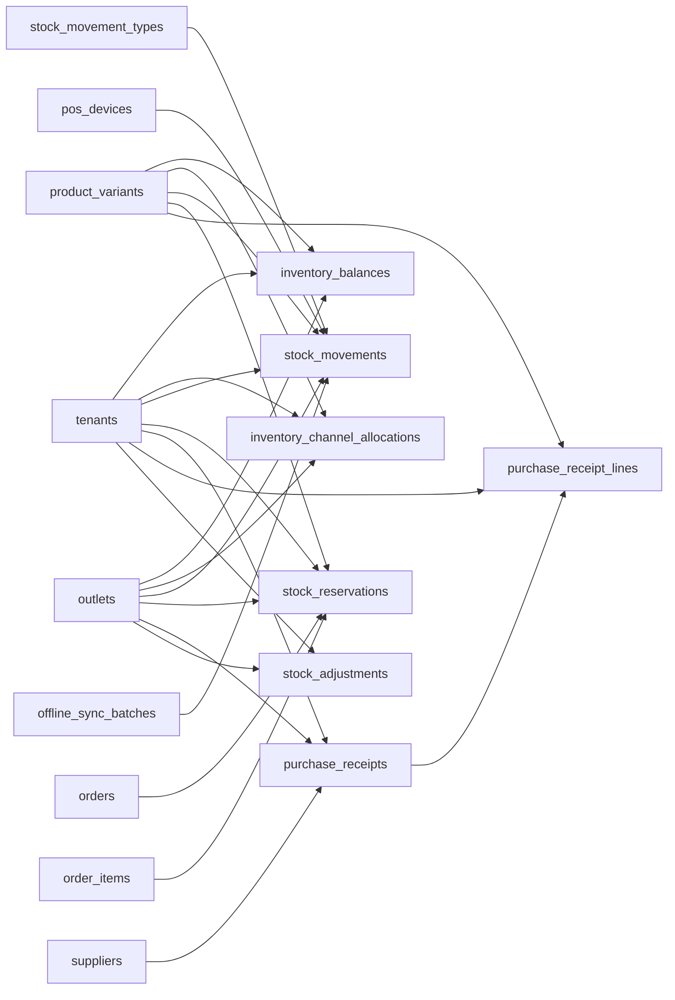

# Inventory and Stock Control Entities

These tables implement outlet-wise stock balances, stock ledger movements, reservations, supplier receiving, adjustments, transfers, and stocktakes.

Based on the uploaded production scope, production database design, backend architecture, frontend architecture, and current Unified Commerce 2nd Brain structure.

---

## Table map

| Table | Purpose | PK | Foreign keys | Important attributes | Notes |
|---|---|---|---|---|---|
| `inventory_balances` | Current stock projection by outlet and variant. | `id` | tenant_id -> tenants.id; outlet_id -> outlets.id; variant_id -> product_variants.id | on_hand_qty, reserved_qty, available_qty, reorder_level, updated_at | Unique tenant/outlet/variant. Available is on_hand minus reserved. |
| `inventory_channel_allocations` | Optional allocation of outlet stock between POS and E-Commerce. | `id` | tenant_id -> tenants.id; outlet_id -> outlets.id; variant_id -> product_variants.id; created_by -> users.id nullable; updated_by -> users.id nullable | channel, allocated_qty, is_active, created_at, updated_at | Sum of active allocations must not exceed on_hand_qty. |
| `stock_movement_types` | Reference movement types. Quantity is always positive. | `id` | None | code, direction, name | Seeded types include sale_out, return_in, reservation_hold, transfer_in/out, stocktake_gain/loss. |
| `stock_movements` | Immutable inventory ledger. | `id` | tenant_id -> tenants.id; outlet_id -> outlets.id; variant_id -> product_variants.id; movement_type_id -> stock_movement_types.id; sale_id/order_id/return_id/exchange_id/purchase_receipt_id/stock_transfer_id/stock_adjustment_id/stocktake_id/reservation_id nullable; source_device_id -> pos_devices.id nullable; sync_batch_id -> offline_sync_batches.id nullable; created_by -> users.id nullable | quantity, source_channel, client_movement_id, offline_occurred_at, occurred_at, metadata | Required reference depends on movement type. Do not store negative quantities. |
| `stock_reservations` | E-Commerce reservation rows before fulfillment. | `id` | tenant_id -> tenants.id; outlet_id -> outlets.id; variant_id -> product_variants.id; order_id -> orders.id; order_item_id -> order_items.id | reserved_qty, status, expires_at, created_at, updated_at | Active reservations increase reserved_qty and reduce available_qty. |
| `purchase_receipts` | Supplier stock receiving document. | `id` | tenant_id -> tenants.id; supplier_id -> suppliers.id nullable; outlet_id -> outlets.id; received_by -> users.id nullable | receipt_number, supplier_invoice_no, status, received_at, created_at, updated_at | Posted receipt creates purchase_receipt stock movements. |
| `purchase_receipt_lines` | Received stock lines. | `id` | tenant_id -> tenants.id; purchase_receipt_id -> purchase_receipts.id; variant_id -> product_variants.id | line_no, qty, unit_cost, line_total | Unique tenant/receipt/line_no. |
| `stock_adjustments` | Manual inventory adjustment document. | `id` | tenant_id -> tenants.id; outlet_id -> outlets.id; created_by -> users.id; approved_by -> users.id nullable | adjustment_number, status, reason, posted_at, created_at, updated_at | Posted adjustment creates adjustment_in/out movements. |
| `stock_adjustment_lines` | Manual adjustment line items. | `id` | tenant_id -> tenants.id; stock_adjustment_id -> stock_adjustments.id; variant_id -> product_variants.id | line_no, adjustment_type, qty, reason | Quantity positive; adjustment_type determines increase/decrease. |
| `stock_transfers` | Stock transfer header between outlets. | `id` | tenant_id -> tenants.id; from_outlet_id -> outlets.id; to_outlet_id -> outlets.id; requested_by -> users.id; approved_by -> users.id nullable | transfer_number, status, created_at, updated_at | Source and destination outlets must differ. |
| `stock_transfer_lines` | Lines under a stock transfer. | `id` | tenant_id -> tenants.id; transfer_id -> stock_transfers.id; variant_id -> product_variants.id | line_no, requested_qty, shipped_qty, received_qty | Unique tenant/transfer/line_no. |
| `stocktakes` | Stock count session header. | `id` | tenant_id -> tenants.id; outlet_id -> outlets.id; created_by -> users.id | stocktake_number, status, counted_at, posted_at, created_at | Posted stocktake creates gain/loss movements. |
| `stocktake_lines` | Count results by variant. | `id` | tenant_id -> tenants.id; stocktake_id -> stocktakes.id; variant_id -> product_variants.id | expected_qty, counted_qty, delta_qty | Unique tenant/stocktake/variant. |

---

## Relationship diagram

---

## Production data rules

- Every stock change must create a stock movement.
- Movement quantity is positive; movement type direction determines effect.
- `inventory_balances` is a projection and must reconcile with stock movements.
- Online orders reserve stock before fulfillment.
- Offline stock conflicts must create conflict records instead of silently corrupting stock.

---

## Implementation checklist

- [ ] Tenant ownership and parent-child tenant consistency are enforced.
- [ ] All FK relationships are mapped in EF Core and validated at service boundary.
- [ ] Unique constraints and partial unique indexes are implemented where documented.
- [ ] Status values are validated before writes.
- [ ] Audit behavior is defined for sensitive changes.
- [ ] Offline sync impact is checked if POS/device/offline records are involved.
- [ ] Reporting impact is understood before changing source tables.
- [ ] Related API, backend, frontend, module, and test docs are updated.

---

## Related files

- [[catalog-entities]]
- [[pos-device-sales-entities]]
- [[receipts-audit-offline-entities]]
- [[../offline-sync-data-model]]
