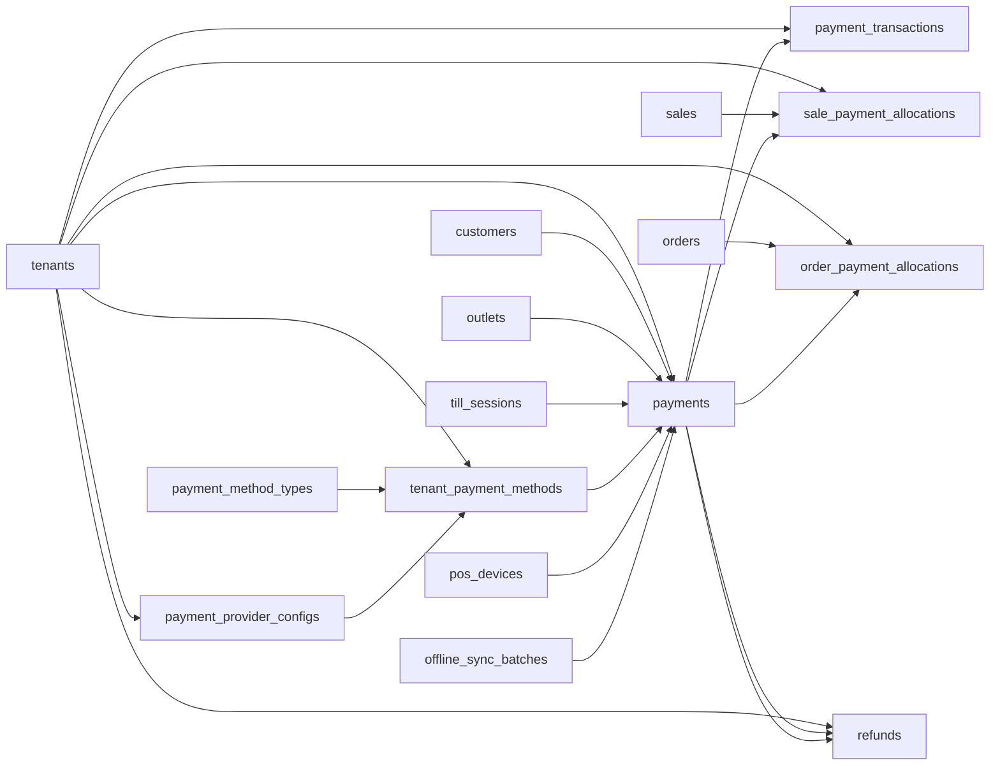

# Payments, Transactions, Allocations, and Refund Entities

These tables define payment method references, tenant payment methods, gateway configuration, unified payment records, provider event logs, allocations to sales/orders, and refunds.

Based on the uploaded production scope, production database design, backend architecture, frontend architecture, and current Unified Commerce 2nd Brain structure.

---

## Table map

| Table | Purpose | PK | Foreign keys | Important attributes | Notes |
|---|---|---|---|---|---|
| `payment_method_types` | Global payment method reference values. | `id` | None | code, name | Seeded: cash, card, qr, wallet, bank_transfer, gift_card. |
| `tenant_payment_methods` | Tenant-enabled payment methods and non-secret config. | `id` | tenant_id -> tenants.id; payment_method_type_id -> payment_method_types.id; payment_provider_config_id -> payment_provider_configs.id nullable | provider_code, enabled, config, created_at, updated_at | Gateway-backed methods require provider config. |
| `payment_provider_configs` | Provider configuration with secret references. | `id` | tenant_id -> tenants.id | provider_code, environment, config, secret_ref, status, created_at, updated_at | Never store gateway secrets directly in JSON. |
| `payments` | Unified payment and payout record. | `id` | tenant_id -> tenants.id; customer_id -> customers.id nullable; outlet_id -> outlets.id nullable; till_session_id -> till_sessions.id nullable; tenant_payment_method_id -> tenant_payment_methods.id nullable; source_device_id -> pos_devices.id nullable; sync_batch_id -> offline_sync_batches.id nullable | client_payment_id, client_transaction_id, payment_direction, payment_purpose, payment_status, method_type, provider_code, currency, amount, captured_amount, reference_no, idempotency_key, created_at, completed_at | Tenant-scoped idempotency key. Offline payment dedupe by device/client id. |
| `payment_transactions` | Gateway/provider event log per payment. | `id` | tenant_id -> tenants.id; payment_id -> payments.id | event_type, provider_transaction_id, amount, payment_status, raw_payload, created_at | Trace integration events; business totals come from payments and allocations. |
| `sale_payment_allocations` | Allocates payments to POS sales. | `id` | tenant_id -> tenants.id; sale_id -> sales.id; payment_id -> payments.id | amount, created_at | Only inbound sale-purpose payments can be allocated. |
| `order_payment_allocations` | Allocates payments to E-Commerce orders. | `id` | tenant_id -> tenants.id; order_id -> orders.id; payment_id -> payments.id | amount, created_at | Allocated totals must not exceed captured amount. |
| `refunds` | Business refund header linked to original captured payment and optional outbound payment. | `id` | tenant_id -> tenants.id; original_payment_id -> payments.id; refund_payment_id -> payments.id nullable; created_by/approved_by -> users.id nullable | reason, refund_status, amount, approved_at, created_at, completed_at, updated_at | Total refunds must not exceed original captured amount. |

---

## Relationship diagram

---

## Production data rules

- Payment recording and real gateway processing are separate concerns.
- Cash can be recorded directly by POS; card/QR/gateway methods require reference/provider trace where applicable.
- Refund should follow original payment method unless approved override exists.
- Split payments are represented by multiple payments and allocation rows.
- Payment/refund APIs must be idempotent.

---

## Implementation checklist

- [ ] Tenant ownership and parent-child tenant consistency are enforced.
- [ ] All FK relationships are mapped in EF Core and validated at service boundary.
- [ ] Unique constraints and partial unique indexes are implemented where documented.
- [ ] Status values are validated before writes.
- [ ] Audit behavior is defined for sensitive changes.
- [ ] Offline sync impact is checked if POS/device/offline records are involved.
- [ ] Reporting impact is understood before changing source tables.
- [ ] Related API, backend, frontend, module, and test docs are updated.

---

## Related files

- [[pos-device-sales-entities]]
- [[customer-ecommerce-entities]]
- [[returns-exchanges-entities]]
- [[../../04-api/payment-refund-api-rules]]
