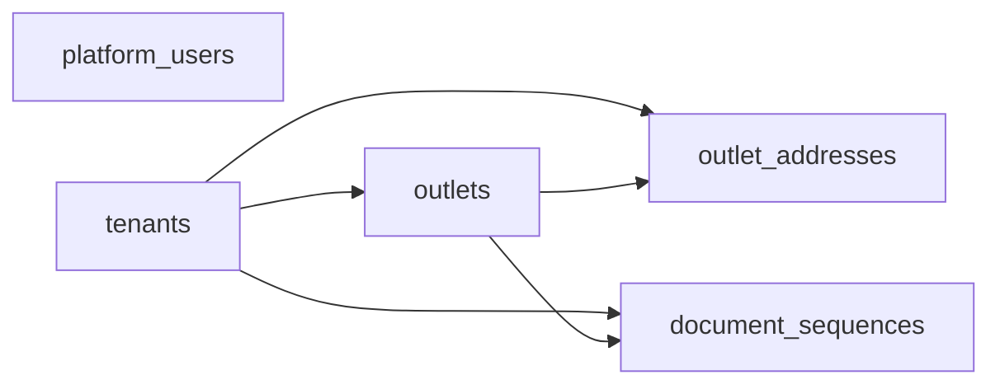

# Platform and Tenant Entities

These tables define the platform-side user boundary, tenant business account, outlet/location model, outlet address, and business document number generation.

Based on the uploaded production scope, production database design, backend architecture, frontend architecture, and current Unified Commerce 2nd Brain structure.

---

## Table map

| Table | Purpose | PK | Foreign keys | Important attributes | Notes |
|---|---|---|---|---|---|
| `platform_users` | Platform administrators who create tenants, manage entitlements, and support tenants. | `id` | None | email, password_hash, full_name, phone, status, last_login_at, created_at, updated_at | Not tenant staff. Do not store platform-admin flags in tenant `users`. |
| `tenants` | Root business account for each customer tenant. | `id` | None | code, name, status, base_currency, default_timezone, default_locale, operating_mode, created_at, updated_at | `operating_mode` controls POS-only, e-commerce-only, or hybrid behavior. |
| `outlets` | Physical or logical stock/sales location under a tenant. | `id` | tenant_id -> tenants.id | code, name, outlet_type, timezone, status, created_at, updated_at | Unique outlet `code` inside tenant. Outlet rows must never be shared across tenants. |
| `outlet_addresses` | Single operational address per outlet. | `id` | tenant_id -> tenants.id; outlet_id -> outlets.id | line1, line2, city, state, postal_code, country_code, created_at | Unique per tenant/outlet. Outlet must belong to the same tenant. |
| `document_sequences` | Tenant/outlet-aware business document number generator. | `id` | tenant_id -> tenants.id; outlet_id -> outlets.id nullable | document_type, prefix, current_value, reset_policy, last_reset_at, created_at, updated_at | Use row-level locking when allocating sale/order/return/exchange/receipt/transfer numbers. |

---

## Relationship diagram

---

## Production data rules

- Platform users and tenant staff are separate identity boundaries.
- Every tenant-owned business record must either carry `tenant_id` or be linked to a tenant-scoped parent.
- Suspended tenants must not create new sales/orders unless a documented platform policy allows it.
- Outlet timezone matters for business date, session close, and reports.
- Document sequence numbers are business references, not primary keys.

---

## Implementation checklist

- [ ] Tenant ownership and parent-child tenant consistency are enforced.
- [ ] All FK relationships are mapped in EF Core and validated at service boundary.
- [ ] Unique constraints and partial unique indexes are implemented where documented.
- [ ] Status values are validated before writes.
- [ ] Audit behavior is defined for sensitive changes.
- [ ] Offline sync impact is checked if POS/device/offline records are involved.
- [ ] Reporting impact is understood before changing source tables.
- [ ] Related API, backend, frontend, module, and test docs are updated.

---

## Related files

- [[identity-access-entities]]
- [[configuration-entities]]
- [[pos-device-sales-entities]]
- [[../tenant-consistency-rules]]
