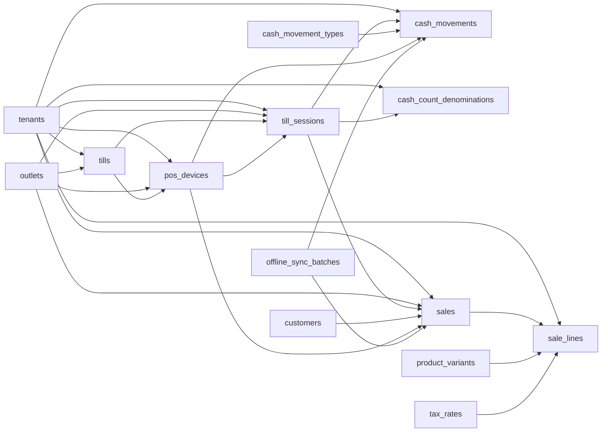

# POS Device, Session, and Sales Entities

These tables define tills, registered POS devices, cashier/till sessions, cash movements, denomination counts, POS sales, and POS sale lines.

Based on the uploaded production scope, production database design, backend architecture, frontend architecture, and current Unified Commerce 2nd Brain structure.

---

## Table map

| Table | Purpose | PK | Foreign keys | Important attributes | Notes |
|---|---|---|---|---|---|
| `tills` | Cash register / till master. | `id` | tenant_id -> tenants.id; outlet_id -> outlets.id | code, name, status, created_at, updated_at | Unique tenant/outlet/code. |
| `pos_devices` | Registered POS terminal/browser/device for online/offline POS. | `id` | tenant_id -> tenants.id; outlet_id -> outlets.id; till_id -> tills.id | device_code, device_name, device_fingerprint, app_version, last_seen_at, status, created_at, updated_at | Device outlet must match till outlet. |
| `till_sessions` | Open/close session per till. | `id` | tenant_id -> tenants.id; outlet_id -> outlets.id; till_id -> tills.id; opened_by/closed_by/variance_approved_by -> users.id; opened_device_id/closed_device_id -> pos_devices.id | business_date, opening_float, expected_cash, counted_cash, variance, status, opened_at, closed_at, close_note | Only one open session per tenant/till. |
| `cash_movement_types` | Reference values for non-sale cash movement. | `id` | None | code, name, direction | Seeded: cash_in, cash_out, safe_drop, float_add, paid_out. |
| `cash_movements` | Non-sale cash movement within a till session. | `id` | tenant_id -> tenants.id; till_session_id -> till_sessions.id; cash_movement_type_id -> cash_movement_types.id; performed_by/approved_by -> users.id; source_device_id -> pos_devices.id nullable; sync_batch_id -> offline_sync_batches.id nullable | amount, reason, status, client_cash_movement_id, offline_created_at, synced_at, created_at, updated_at | Offline dedupe by tenant/source_device/client_cash_movement_id. |
| `cash_count_denominations` | Denomination-level cash count for till close. | `id` | tenant_id -> tenants.id; till_session_id -> till_sessions.id | denomination, quantity, amount, created_at | Unique tenant/session/denomination. |
| `sales` | POS sale header. | `id` | tenant_id -> tenants.id; outlet_id -> outlets.id; till_session_id -> till_sessions.id; customer_id -> customers.id nullable; source_device_id -> pos_devices.id nullable; sync_batch_id -> offline_sync_batches.id nullable; completed_by/voided_by -> users.id nullable | sale_number, business_date, status, currency, subtotal, discount_total, tax_total, grand_total, paid_total, change_total, client_transaction_id, sync_status, completed_at, voided_at, void_reason, created_at, updated_at | Status: draft, held, completed, voided, cancelled. Offline transaction id must dedupe. |
| `sale_lines` | POS sale line items. | `id` | tenant_id -> tenants.id; sale_id -> sales.id; variant_id -> product_variants.id; tax_rate_id -> tax_rates.id nullable | line_no, description, qty, returned_qty, unit_price, discount_total, tax_total, line_total, pricing_snapshot | Frozen item, price, discount, and tax context per line. |

---

## Relationship diagram

---

## Production data rules

- Cashier cannot complete sale when required till/session is inactive.
- Sale completion must create sale lines, payment allocation, stock movement, and receipt.
- Void/cancel/price override/reprint are permission-controlled and audited.
- Offline POS uses device, client transaction id, and sync batch for idempotency.
- Printer/scanner hardware assignment beyond `pos_devices` is a current schema gap if server-managed peripherals are required.

---

## Implementation checklist

- [ ] Tenant ownership and parent-child tenant consistency are enforced.
- [ ] All FK relationships are mapped in EF Core and validated at service boundary.
- [ ] Unique constraints and partial unique indexes are implemented where documented.
- [ ] Status values are validated before writes.
- [ ] Audit behavior is defined for sensitive changes.
- [ ] Offline sync impact is checked if POS/device/offline records are involved.
- [ ] Reporting impact is understood before changing source tables.
- [ ] Related API, backend, frontend, module, and test docs are updated.

---

## Related files

- [[platform-tenant-entities]]
- [[inventory-entities]]
- [[payments-entities]]
- [[../required-schema-extensions]]
