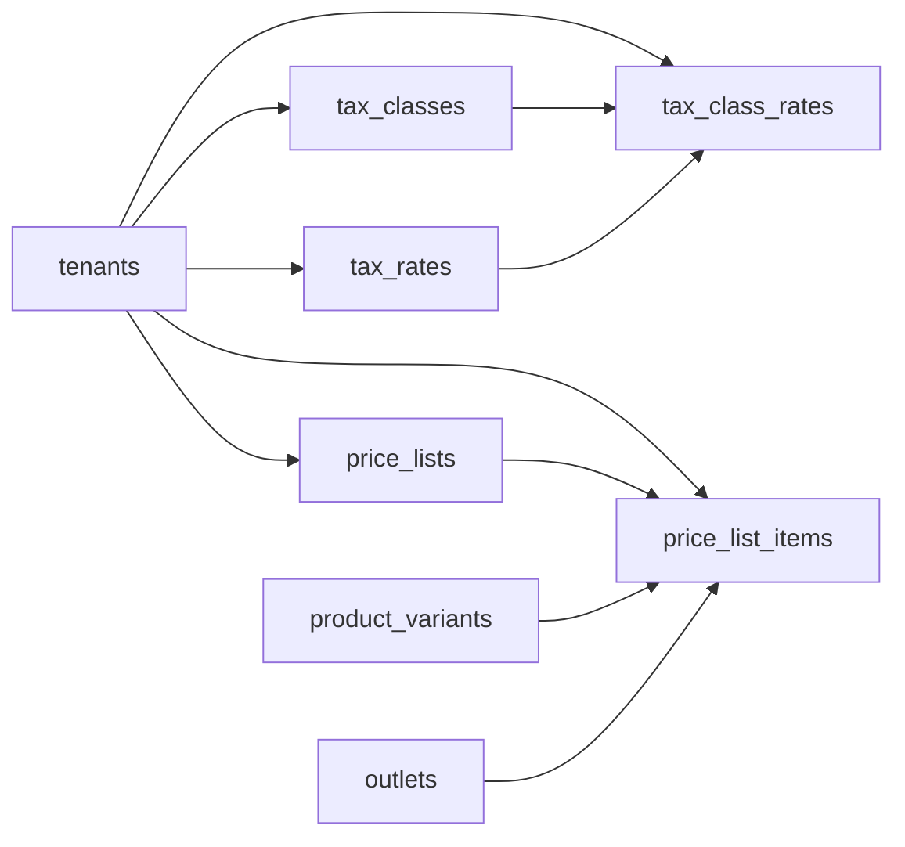

# Pricing and Tax Entities

These tables define tax classes, effective tax rates, class-rate mappings, channel price lists, and variant price rows.

Based on the uploaded production scope, production database design, backend architecture, frontend architecture, and current Unified Commerce 2nd Brain structure.

---

## Table map

| Table | Purpose | PK | Foreign keys | Important attributes | Notes |
|---|---|---|---|---|---|
| `tax_classes` | Tenant tax classification assigned to products. | `id` | tenant_id -> tenants.id | code, name, applies_to, is_active, created_at, updated_at | Unique tenant/code. Assigned from `products.tax_class_id`. |
| `tax_rates` | Effective tax/VAT/GST/sales tax rates. | `id` | tenant_id -> tenants.id | code, name, rate, tax_type, country_code, starts_at, ends_at, is_active | Unique tenant/code/starts_at. Do not overwrite historical rate rows. |
| `tax_class_rates` | Maps tax classes to effective rates. | `id` | tenant_id -> tenants.id; tax_class_id -> tax_classes.id; tax_rate_id -> tax_rates.id | starts_at, ends_at, is_active | No overlapping active periods per tax class. |
| `price_lists` | Named channel price lists. | `id` | tenant_id -> tenants.id | name, channel, currency, starts_at, ends_at, priority, is_active, created_at, updated_at | If multiple active lists match, highest priority wins or service rule resolves. |
| `price_list_items` | Variant prices inside a price list. | `id` | tenant_id -> tenants.id; price_list_id -> price_lists.id; variant_id -> product_variants.id; outlet_id -> outlets.id nullable | list_price, sale_price, created_at, updated_at | Use partial unique indexes for outlet null/non-null overrides. |

---

## Relationship diagram

---

## Production data rules

- Tax and pricing must produce identical totals across POS, E-Commerce, receipts, payments, returns, and reports.
- Backend is final authority for final price, tax, and discount calculation.
- Frontend pricing helpers can preview but must not override backend totals.
- Historical sale/order lines freeze pricing and tax snapshots.
- Tax inclusive/exclusive and rounding behavior must be documented in settings or a future approved tax policy extension.

---

## Implementation checklist

- [ ] Tenant ownership and parent-child tenant consistency are enforced.
- [ ] All FK relationships are mapped in EF Core and validated at service boundary.
- [ ] Unique constraints and partial unique indexes are implemented where documented.
- [ ] Status values are validated before writes.
- [ ] Audit behavior is defined for sensitive changes.
- [ ] Offline sync impact is checked if POS/device/offline records are involved.
- [ ] Reporting impact is understood before changing source tables.
- [ ] Related API, backend, frontend, module, and test docs are updated.

---

## Related files

- [[catalog-entities]]
- [[payments-entities]]
- [[discounts-coupons-entities]]
- [[../required-schema-extensions]]
