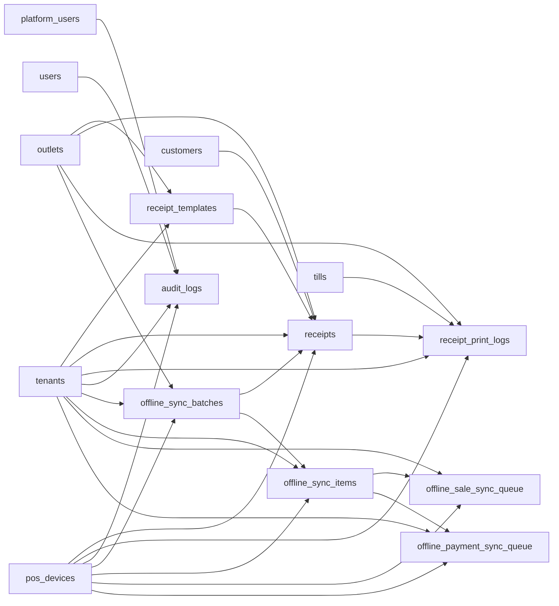

# Receipts, Audit, and Offline Sync Entities

These tables store receipt templates and outputs, print logs, immutable business audit logs, offline sync batches/items, typed sale/payment staging queues, conflicts, and technical sync audit logs.

Based on the uploaded production scope, production database design, backend architecture, frontend architecture, and current Unified Commerce 2nd Brain structure.

---

## Table map

| Table | Purpose | PK | Foreign keys | Important attributes | Notes |
|---|---|---|---|---|---|
| `receipt_templates` | Tenant/outlet-specific receipt/invoice templates. | `id` | tenant_id -> tenants.id; outlet_id -> outlets.id nullable | name, document_type, format_type, paper_width, template_payload, barcode_enabled, barcode_type, is_default, is_active, created_at, updated_at | One default active template per scope/document/format. |
| `receipts` | Stored receipt/invoice output with frozen payload and barcode. | `id` | tenant_id -> tenants.id; outlet_id -> outlets.id nullable; customer_id -> customers.id nullable; template_id -> receipt_templates.id nullable; sale_id/order_id/return_id/exchange_id nullable; source_device_id -> pos_devices.id nullable; sync_batch_id -> offline_sync_batches.id nullable; printed_by -> users.id nullable | document_type, receipt_number, barcode_value, barcode_type, format_type, print_status, client_receipt_id, offline_generated_at, synced_at, issued_at, printed_at, reprint_count, payload | Exactly one source document FK. Payload is frozen. |
| `receipt_print_logs` | Print/reprint/email/download history. | `id` | tenant_id -> tenants.id; receipt_id -> receipts.id; outlet_id -> outlets.id nullable; till_id -> tills.id nullable; device_id -> pos_devices.id nullable; printed_by -> users.id nullable | print_action, status, error_message, printed_at | Reprint must be permission-controlled and audited. |
| `audit_logs` | Immutable business audit trail for platform and tenant actions. | `id` | tenant_id -> tenants.id nullable; actor_platform_user_id -> platform_users.id nullable; actor_user_id -> users.id nullable; actor_device_id -> pos_devices.id nullable | actor_type, entity_type, entity_id, action, old_values, new_values, ip, user_agent, created_at | Tenant_id required for tenant business actions; platform actions may be null. |
| `offline_sync_batches` | One reconnect/sync attempt from a POS device. | `id` | tenant_id -> tenants.id; outlet_id -> outlets.id; device_id -> pos_devices.id | sync_started_at, sync_completed_at, status, total_items, success_count, failed_count, error_message | Device, outlet, and tenant must match. |
| `offline_sync_items` | Generic sync item queue for offline-created records. | `id` | tenant_id -> tenants.id; sync_batch_id -> offline_sync_batches.id; device_id -> pos_devices.id | client_entity_id, client_transaction_id, entity_type, payload, sync_status, server_entity_id, error_code, error_message, created_at, processed_at | Unique tenant/device/entity_type/client_entity_id. |
| `offline_sale_sync_queue` | Typed offline sale staging queue. | `id` | tenant_id -> tenants.id; sync_item_id -> offline_sync_items.id; device_id -> pos_devices.id | client_transaction_id, client_sale_id, sale_payload, queue_status, received_at, processed_at | Not source of truth; accepted sale lands in sales/sale_lines/payments/stock/receipts. |
| `offline_payment_sync_queue` | Typed offline payment staging queue. | `id` | tenant_id -> tenants.id; sync_item_id -> offline_sync_items.id; device_id -> pos_devices.id | client_transaction_id, client_payment_id, payment_payload, queue_status, received_at, processed_at | Not source of truth; accepted payment lands in payments/allocation tables. |
| `offline_sync_conflicts` | Conflict record when offline sync cannot be accepted cleanly. | `id` | tenant_id -> tenants.id; sync_item_id -> offline_sync_items.id; device_id -> pos_devices.id; resolved_by -> users.id nullable | conflict_type, client_payload, server_payload, resolution_status, resolved_at, created_at | Conflicts require explicit resolution. |
| `offline_sync_audit_logs` | Technical audit trail for sync lifecycle events. | `id` | tenant_id -> tenants.id; sync_batch_id -> offline_sync_batches.id nullable; sync_item_id -> offline_sync_items.id nullable; device_id -> pos_devices.id nullable | event_type, message, payload, created_at | Technical diagnostics only; business actions still use audit_logs. |

---

## Relationship diagram

---

## Production data rules

- Receipts are generated artifacts with frozen payloads.
- Receipt reprint, refund receipt, and duplicate receipt actions are permission-controlled.
- Offline sync queues are staging, not source-of-truth transaction tables.
- Offline conflicts must not silently change stock, payment, or receipt records.
- Business audit logs and technical sync logs serve different purposes.

---

## Implementation checklist

- [ ] Tenant ownership and parent-child tenant consistency are enforced.
- [ ] All FK relationships are mapped in EF Core and validated at service boundary.
- [ ] Unique constraints and partial unique indexes are implemented where documented.
- [ ] Status values are validated before writes.
- [ ] Audit behavior is defined for sensitive changes.
- [ ] Offline sync impact is checked if POS/device/offline records are involved.
- [ ] Reporting impact is understood before changing source tables.
- [ ] Related API, backend, frontend, module, and test docs are updated.

---

## Related files

- [[../offline-sync-data-model]]
- [[pos-device-sales-entities]]
- [[payments-entities]]
- [[reporting-entities]]
