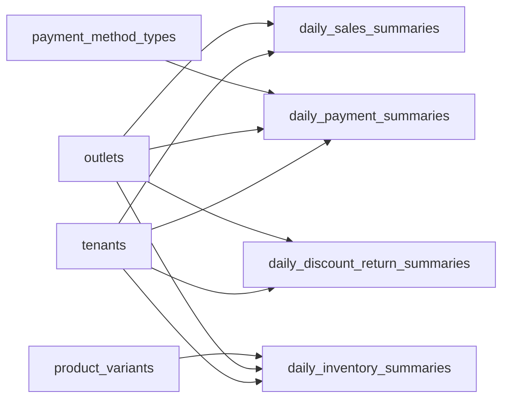

# Reporting Read Model Entities

These tables are pre-aggregated read models for daily sales, payment, inventory, discount, return, and exchange reporting.

Based on the uploaded production scope, production database design, backend architecture, frontend architecture, and current Unified Commerce 2nd Brain structure.

---

## Table map

| Table | Purpose | PK | Foreign keys | Important attributes | Notes |
|---|---|---|---|---|---|
| `daily_sales_summaries` | Daily sales dashboard summary by tenant/outlet/channel. | `id` | tenant_id -> tenants.id; outlet_id -> outlets.id nullable | scope_type, scope_key, channel, business_date, gross_sales, discount_total, tax_total, net_sales, return_total, transaction_count, created_at, updated_at | Read model only; not financial source of truth. |
| `daily_payment_summaries` | Daily payment totals by method. | `id` | tenant_id -> tenants.id; outlet_id -> outlets.id nullable; payment_method_type_id -> payment_method_types.id | scope_type, scope_key, business_date, payment_count, total_amount, created_at, updated_at | Unique tenant/scope/date/method. |
| `daily_inventory_summaries` | Daily inventory movement summary. | `id` | tenant_id -> tenants.id; outlet_id -> outlets.id; variant_id -> product_variants.id | business_date, opening_qty, in_qty, out_qty, closing_qty, created_at, updated_at | Unique tenant/outlet/variant/date. |
| `daily_discount_return_summaries` | Daily discount, return, and exchange summary. | `id` | tenant_id -> tenants.id; outlet_id -> outlets.id nullable | scope_type, scope_key, channel, business_date, discount_count, discount_total, return_count, return_total, exchange_count, exchange_difference_total, created_at, updated_at | Read model for manager dashboards. |

---

## Relationship diagram

---

## Production data rules

- Reporting tables are rebuildable projections, not source of truth.
- If source transactions and reporting summaries disagree, source tables win.
- Summaries must include tenant and scope keys to avoid nullable unique problems.
- Reports requiring tax/product/category/cash/offline details may need future approved read models or source-table queries.
- Report access must be permission-controlled.

---

## Implementation checklist

- [ ] Tenant ownership and parent-child tenant consistency are enforced.
- [ ] All FK relationships are mapped in EF Core and validated at service boundary.
- [ ] Unique constraints and partial unique indexes are implemented where documented.
- [ ] Status values are validated before writes.
- [ ] Audit behavior is defined for sensitive changes.
- [ ] Offline sync impact is checked if POS/device/offline records are involved.
- [ ] Reporting impact is understood before changing source tables.
- [ ] Related API, backend, frontend, module, and test docs are updated.

---

## Related files

- [[pos-device-sales-entities]]
- [[payments-entities]]
- [[inventory-entities]]
- [[../required-schema-extensions]]
