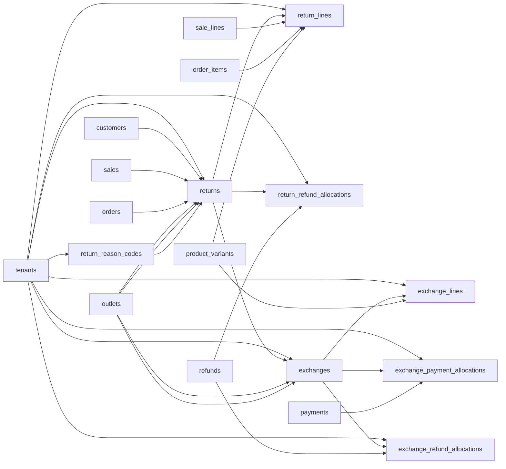

# Returns and Exchanges Entities

These tables support POS and E-Commerce returns, return lines, refund allocation, exchange headers, exchange lines, and exchange payment/refund allocations.

Based on the uploaded production scope, production database design, backend architecture, frontend architecture, and current Unified Commerce 2nd Brain structure.

---

## Table map

| Table | Purpose | PK | Foreign keys | Important attributes | Notes |
|---|---|---|---|---|---|
| `return_reason_codes` | Tenant-owned return reasons. | `id` | tenant_id -> tenants.id | code, name, is_active | Unique tenant/code. |
| `returns` | Return header for POS sale or E-Commerce order. | `id` | tenant_id -> tenants.id; customer_id -> customers.id nullable; source_sale_id -> sales.id nullable; source_order_id -> orders.id nullable; original_outlet_id -> outlets.id nullable; return_outlet_id -> outlets.id nullable; reason_code_id -> return_reason_codes.id nullable; created_by/approved_by -> users.id nullable | return_number, status, refund_total, approved_at, received_at, refunded_at, created_at, updated_at | Exactly one source sale or source order. |
| `return_lines` | Returned line items. | `id` | tenant_id -> tenants.id; return_id -> returns.id; source_sale_line_id -> sale_lines.id nullable; source_order_item_id -> order_items.id nullable; variant_id -> product_variants.id | line_no, qty, received_qty, condition_status, unit_refund, tax_refund, line_refund_total, restock_action | Exactly one source line. Qty must not exceed eligible sold qty. |
| `return_refund_allocations` | Allocates refunds to return documents. | `id` | tenant_id -> tenants.id; return_id -> returns.id; refund_id -> refunds.id | amount | Unique tenant/return/refund. |
| `exchanges` | Exchange header created from a return. | `id` | tenant_id -> tenants.id; source_return_id -> returns.id; original_outlet_id -> outlets.id nullable; exchange_outlet_id -> outlets.id nullable; created_by -> users.id nullable | exchange_number, status, old_value_total, new_value_total, difference_total, difference_direction, created_at, completed_at, updated_at | One exchange per return in core design. |
| `exchange_lines` | New items issued in exchange. | `id` | tenant_id -> tenants.id; exchange_id -> exchanges.id; variant_id -> product_variants.id | line_no, qty, unit_price, tax_total, line_total, pricing_snapshot | Creates exchange_out stock movement when completed. |
| `exchange_payment_allocations` | Additional collection payment for exchange difference. | `id` | tenant_id -> tenants.id; exchange_id -> exchanges.id; payment_id -> payments.id | amount | Only inbound exchange_difference payments are allowed. |
| `exchange_refund_allocations` | Refund allocation for exchange difference. | `id` | tenant_id -> tenants.id; exchange_id -> exchanges.id; refund_id -> refunds.id | amount | Only refund records related to exchange difference are allowed. |

---

## Relationship diagram

---

## Production data rules

- Return/exchange documents must reference the original sale/order where required.
- Return quantity cannot exceed eligible remaining sold quantity.
- Damaged/opened/expired return follows restock_action and must not silently become sellable stock.
- Exchange difference direction is collect, refund, or none.
- Refund and payment allocation rules must be handled through payment/refund tables.

---

## Implementation checklist

- [ ] Tenant ownership and parent-child tenant consistency are enforced.
- [ ] All FK relationships are mapped in EF Core and validated at service boundary.
- [ ] Unique constraints and partial unique indexes are implemented where documented.
- [ ] Status values are validated before writes.
- [ ] Audit behavior is defined for sensitive changes.
- [ ] Offline sync impact is checked if POS/device/offline records are involved.
- [ ] Reporting impact is understood before changing source tables.
- [ ] Related API, backend, frontend, module, and test docs are updated.

---

## Related files

- [[payments-entities]]
- [[inventory-entities]]
- [[receipts-audit-offline-entities]]
- [[../../08-user-flows/cashier/return-flow]]
