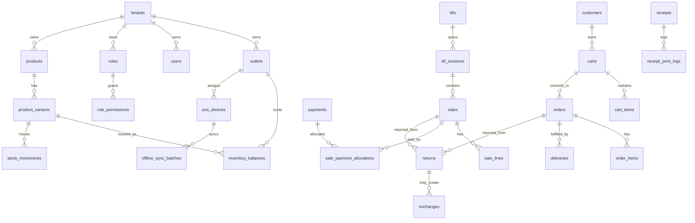

# Entity Relationship Map

This file shows the main cross-module entity relationships. Detailed PK/FK information lives under `entities/*`.

---

## Main operational ER flow

---

## Relationship hotspots

| Hotspot | Why it matters |
|---|---|
| Product → variant → stock/price/sale/order | Variant is the sellable unit. |
| Sale → payment → receipt → stock movement | POS completion must be transactional. |
| Order → reservation → fulfillment → payment | E-Commerce workflow needs separate stock/payment/fulfillment states. |
| Return/exchange → refund/payment → stock movement | Post-sale workflows affect money and inventory. |
| Device → sync batch → sync item → accepted source tables | Offline POS requires dedupe and conflict handling. |
| Tenant feature entitlement → role feature assignment → permission | Feature access is not a simple role check. |

---

## Rules for AI IDE tools

- Do not create new relationships without checking the owning entity file.
- Do not infer a direct relationship when a mapping/allocation table exists.
- Do not combine sale and order payment allocations.
- Do not treat offline queues as completed transactions.
- Do not read reporting summaries as source-of-truth financial records.

Related: [[data-dictionary-index]], [[schema-principles]], [[offline-sync-data-model]].
