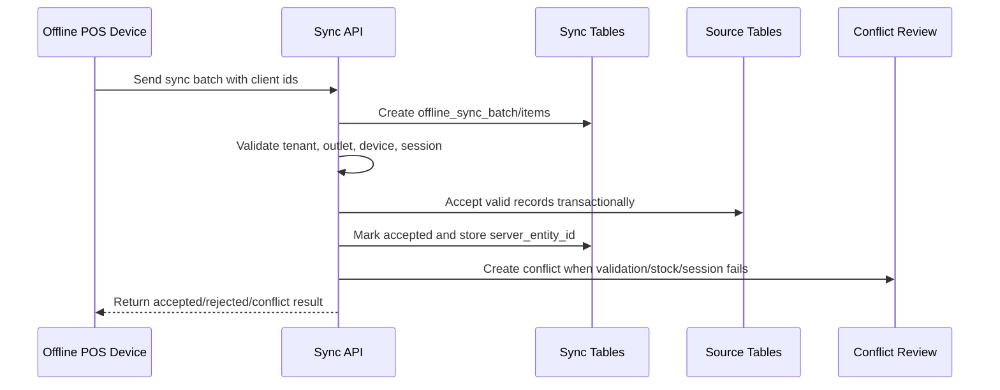

# Offline Sync Data Model

Offline POS lets cashier billing continue when connectivity is unavailable. The uploaded database design defines server-side sync batch, item, typed queue, conflict, and technical audit tables.

---

## Server-side sync tables

| Table | Role |
|---|---|
| `offline_sync_batches` | One reconnect/sync attempt from a POS device. |
| `offline_sync_items` | Generic received item with entity type, payload, client id, and status. |
| `offline_sale_sync_queue` | Typed sale staging row linked one-to-one with a sync item. |
| `offline_payment_sync_queue` | Typed payment staging row linked one-to-one with a sync item. |
| `offline_sync_conflicts` | Explicit conflict requiring resolution. |
| `offline_sync_audit_logs` | Technical lifecycle log. |

---

## Accepted source tables

| Offline entity | Final accepted tables |
|---|---|
| Sale | `sales`, `sale_lines` |
| Payment | `payments`, `sale_payment_allocations` |
| Receipt | `receipts`, `receipt_print_logs` |
| Stock movement | `stock_movements`, `inventory_balances` |
| Cash movement | `cash_movements` |
| Return/exchange | `returns`, `return_lines`, `exchanges`, `exchange_lines`, allocation tables |

---

## Sync flow

---

## Conflict rules

| Conflict type | Meaning |
|---|---|
| duplicate | Client entity was already synced. |
| stock_mismatch | Server stock state conflicts with offline transaction. |
| price_changed | Cached price differs from current accepted policy. |
| closed_session | Till/session is no longer valid for acceptance. |
| validation_failed | Payload violates server business rules. |

---

## Non-negotiable rules

- Client transaction IDs must be unique per device and entity where documented.
- Server validates offline transactions after reconnect.
- Offline sync cannot bypass tenant, role, feature, stock, payment, tax, or session rules.
- Sync queues are not source of truth after acceptance.
- Conflicts must be visible to manager/support workflows.

Related: [[entities/receipts-audit-offline-entities]], [[entities/pos-device-sales-entities]], [[../02-architecture/offline-first-architecture]].
