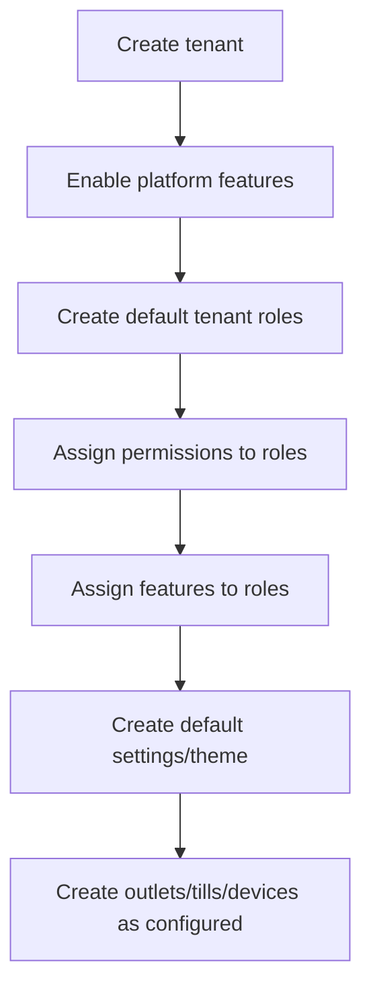

# Seed Data Strategy

Seed data is required for platform-owned catalogs, reference types, and default operational behavior.

---

## Required seed data

| Area | Seed tables |
|---|---|
| Access | `permissions`, `platform_features` |
| Inventory | `stock_movement_types` |
| POS cash | `cash_movement_types` |
| Payments | `payment_method_types` |
| Discounts | `discount_types`, `discount_scopes` |
| OTP | `otp_channels`, `otp_purposes` |
| Order workflow | `order_status_transitions` |
| Attribute acceleration | `attribute_templates`, `attribute_template_values`, `attribute_presets`, `attribute_preset_items` |

---

## Tenant initialization seed flow

---

## Seed rules

- Platform reference seed data should be stable and repeatable.
- Tenant-specific roles and settings are generated during tenant onboarding.
- Seed scripts must be idempotent.
- Do not hard-delete seeded reference rows that may be referenced historically.
- Permission and feature keys must be stable because AI IDE, frontend guards, backend authorization, and docs will reference them.

Related: [[enum-and-reference-data-policy]], [[entities/identity-access-entities]], [[entities/configuration-entities]].
