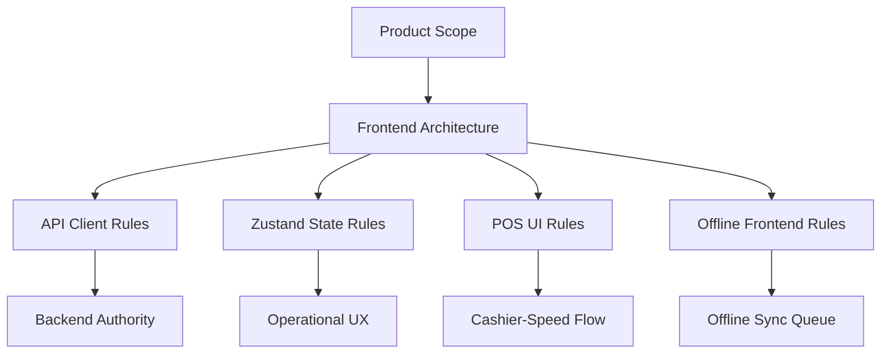

# Frontend Documentation Index

This folder defines the frontend rules for the production-ready Unified Commerce E-POS + E-Commerce SaaS system.
It is written for frontend developers, architects, QA engineers, UI/UX designers, backend developers, product owners and AI IDE tools.

The frontend stack is:

| Area | Decision |
|---|---|
| Framework | React |
| Language | TypeScript |
| Styling | Tailwind CSS |
| Server state | TanStack Query |
| Client workflow state | Zustand |
| Offline POS storage | IndexedDB through `core/offline` |
| Peripheral integration | `core/peripherals` for scanner, printer and cash drawer bridge |
| Routing | `bootstrap/router` with guards |
| Layouts | `POSLayout`, `AdminLayout`, `AuthLayout` |
| Backend authority | Final authority for access, totals, stock, payment and sync acceptance |

## Required reading

- [[00-start-here/README]] — entry point for the Unified Commerce 2nd Brain.
- [[01-product/project-scope]] — production scope and system boundary.
- [[01-product/production-module-catalog]] — product-level module map.
- [[02-architecture/frontend-architecture]] — source architecture for React frontend structure.
- [[02-architecture/offline-first-architecture]] — offline-first POS design.
- [[03-data/database-overview]] — source data model and table ownership.
- [[04-api/api-overview]] — API design and `/api/v1` rules.
- [[05-backend/backend-overview]] — backend authority, service, repository and transaction rules.
- [[09-security-and-compliance/authorization-model]] — RBAC, feature access and tenant isolation rules.

## Folder responsibility

`06-frontend` does not define database tables or backend services.
It defines how the React application should be organized and how frontend behavior must respect the production scope, API rules and backend authority.

## File map

| File | Purpose |
|---|---|
| [[06-frontend/frontend-overview]] | Explains the frontend role in the Unified Commerce system. |
| [[06-frontend/frontend-folder-structure]] | Maps the React folder structure to the uploaded frontend architecture. |
| [[06-frontend/react-architecture-rules]] | Defines React + TypeScript rules for modules, pages and shells. |
| [[06-frontend/api-client-and-query-rules]] | Defines API client and TanStack Query usage. |
| [[06-frontend/state-management-rules]] | Defines Zustand and workflow state boundaries. |
| [[06-frontend/routing-and-guards]] | Defines route protection, role guards and till session guards. |
| [[06-frontend/feature-access-ui-rules]] | Explains feature-aware UI behavior without treating UI as security. |
| [[06-frontend/pos-ui-rules]] | Defines cashier-first POS screen rules. |
| [[06-frontend/epos-ui-ux-implementation-guide]] | Provides implementation guidance for POS page composition. |
| [[06-frontend/offline-frontend-rules]] | Defines offline indicators, local queues and sync UI behavior. |
| [[06-frontend/scanner-printer-integration]] | Defines frontend scanner, printer and cash drawer handling. |
| [[06-frontend/theme-and-configuration-rules]] | Defines runtime tenant theme and configuration usage. |
| [[06-frontend/component-design-rules]] | Defines reusable component boundaries. |
| [[06-frontend/form-validation-rules]] | Defines frontend validation rules and backend validation boundary. |
| [[06-frontend/frontend-caching-rules]] | Defines caching rules for products, pricing, tax and offline POS data. |
| [[06-frontend/frontend-coding-standards]] | Defines frontend code standards. |
| [[06-frontend/frontend-naming-conventions]] | Defines naming rules. |
| [[06-frontend/frontend-implementation-checklist]] | Checklist before implementing or changing frontend features. |
| [[06-frontend/pos-terminal-state-rules]] | Defines outlet, till, session and device state. |
| [[06-frontend/ecommerce-storefront-rules]] | Defines online storefront, cart and checkout frontend behavior. |
| [[06-frontend/fulfillment-ops-ui-rules]] | Defines fulfillment and pickup/delivery operations UI. |
| [[06-frontend/reporting-dashboard-rules]] | Defines dashboard and report UI behavior. |
| [[06-frontend/ui-ux-page-design-rules]] | Defines page design rules for production UI. |

## Non-negotiable frontend principles

| Rule | Explanation |
|---|---|
| Backend is final authority | Frontend can preview totals, but backend confirms totals, permission, stock, payment and sync acceptance. |
| POS is operational UI | POS must behave like a fast cashier terminal, not a marketing website. |
| Offline mode is visible | Cashier must know when the system is offline, pending sync, synced or in conflict. |
| Feature access is reflected in UI | Hide or disable unavailable actions, but never rely on UI hiding as security. |
| State ownership must be clear | TanStack Query owns server state. Zustand owns active workflow state. |
| Tenant context is mandatory | Every frontend request must carry correct tenant/outlet/session/device context through the API layer. |

## Frontend implementation sequence

1. Read [[01-product/project-scope]].
2. Read [[02-architecture/frontend-architecture]].
3. Read [[04-api/api-overview]] and module API rules.
4. Read [[05-backend/backend-overview]] to understand backend authority.
5. Read this folder's relevant rule files.
6. Read the target module in [[07-modules/README]].
7. Confirm user flow in [[08-user-flows/README]].
8. Implement frontend only within the correct feature boundary.
9. Update feature history and test references after change.

## Frontend must not do these

- Do not calculate final financial truth without backend confirmation.
- Do not bypass tenant, outlet, role, feature or session checks.
- Do not store secrets in browser storage.
- Do not silently accept offline sync conflicts.
- Do not mix POS operational screens with normal e-commerce browsing UI.
- Do not create new modules, entities or workflows not present in scope/database docs.
- Do not use frontend validation as the only validation.

## Production readiness checklist

- [ ] Route is protected by correct guard.
- [ ] API calls use `/api/v1` rules from [[04-api/api-overview]].
- [ ] Tenant and outlet context are handled through approved client rules.
- [ ] Server state uses TanStack Query.
- [ ] Workflow state uses Zustand only when needed.
- [ ] POS screens are touchscreen-friendly and cashier-speed focused.
- [ ] Offline state is visible where applicable.
- [ ] Feature access is reflected in UI.
- [ ] Backend validation/error responses are displayed clearly.
- [ ] Tests cover success, permission denied, feature disabled and offline/error states.
