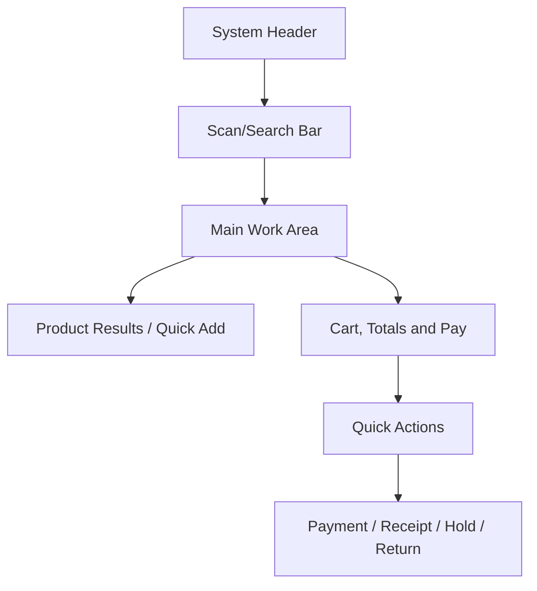

# E-POS UI/UX Implementation Guide

This guide explains how to implement the operational POS screens defined in the scope and frontend architecture.
It is written for frontend developers and UI/UX designers working on cashier-facing screens.

## Required reading

- [[00-start-here/README]] — entry point for the Unified Commerce 2nd Brain.
- [[01-product/project-scope]] — production scope and system boundary.
- [[01-product/production-module-catalog]] — product-level module map.
- [[02-architecture/frontend-architecture]] — source architecture for React frontend structure.
- [[02-architecture/offline-first-architecture]] — offline-first POS design.
- [[03-data/database-overview]] — source data model and table ownership.
- [[04-api/api-overview]] — API design and `/api/v1` rules.
- [[05-backend/backend-overview]] — backend authority, service, repository and transaction rules.
- [[09-security-and-compliance/authorization-model]] — RBAC, feature access and tenant isolation rules.

## POS implementation objective

Build a terminal-style cashier experience that supports:

- barcode-first product entry;
- touchscreen operation;
- low typing;
- fast payment;
- receipt printing;
- returns/exchanges;
- cash drawer/session control;
- offline-aware billing.

## Main POS page composition

Use the uploaded frontend architecture composition:

```text
POSPage.tsx
├── POSHeaderShell
├── ProductGridShell
├── CartShell
├── PaymentShell
├── CustomerShell
├── DiscountShell
├── NotificationShell
└── ReceiptShell
```

## Recommended POS screen regions



## Header shell

`POSHeaderShell` should show:

| Item | Reason |
|---|---|
| Outlet | Confirms stock/sale location. |
| Cashier | Operational accountability. |
| Till/session | Billing readiness. |
| Time/business date | Cashier/session context. |
| Connectivity | Offline/online status. |
| Pending sync count | Offline visibility. |

## Scan/search implementation

The scan/search area must be built as the fastest route to add a product.

Rules:

- keep field easy to focus after item add;
- support barcode scanner input as keyboard input;
- show not-found feedback without disrupting flow;
- support typed product/SKU search if needed;
- use cached product data in offline mode where allowed;
- prevent duplicate accidental item add from scanner double-fire where possible.

## Product grid/list implementation

For POS, prefer compact operational display.

| Use | Recommendation |
|---|---|
| Barcode-heavy store | Compact list or quick result rows. |
| Mixed browsing/scanning | Dense tiles with small image if useful. |
| Touch-only setup | Larger tap targets, still keep cart visible. |
| Offline mode | Mark stale/last-synced data where needed. |

## Cart shell implementation

`CartShell` is the heart of POS.
It must support:

- item quantity increase/decrease;
- item removal;
- line-level discount indicator;
- returned/voided state where applicable;
- subtotal, tax, discount and grand total;
- dominant payment action;
- hold, recall, clear/void and discount actions.

## Payment page/shell implementation

Payment UI must distinguish:

| Payment situation | UI behavior |
|---|---|
| Cash | Amount tendered, change due, expected cash effect. |
| Card/QR manual reference | Method, amount, reference number. |
| Split payment | Multiple payment entries until payable balance is covered. |
| Offline cash | Queue payment with sale if allowed. |
| Offline card/QR | Follow configured rule; do not assume gateway capture. |

## Receipt shell implementation

Receipt UI should show:

- generated/printed/failed/reprinted state;
- default printer status where available;
- reprint action only if allowed;
- duplicate/reprint label when applicable;
- receipt barcode/lookup value if available.

Printer failure must not corrupt the completed sale transaction.

## Return page implementation

`ReturnPage` must support:

- receipt barcode or sale/order lookup;
- eligible item display;
- partial return quantity;
- reason selection;
- condition status;
- refund method display;
- exchange difference if exchange flow is used;
- manager override state where required.

## Cash management UI

`CashManagementPage` and till session screens must support:

- opening cash;
- cash in/out;
- counted cash;
- expected cash;
- variance;
- manager approval where required;
- close session result.

## Offline UX states

| State | UI meaning |
|---|---|
| Online | Server-confirmed operations available. |
| Offline | Only offline-safe POS actions available. |
| Pending sync | Local transactions exist and await server acceptance. |
| Syncing | Queue is being submitted. |
| Conflict | Server rejected or flagged one or more items. |
| Synced | Server accepted queued items. |

## Error message rules

Error messages should say what happened and what the cashier can do next.
Avoid raw technical errors in POS screens.

Good example:

```text
This sale cannot be completed because the till session is closed. Open a new session or call a manager.
```

Bad example:

```text
500: Invalid Operation Exception
```

## Implementation checklist

- [ ] Main flow supports scan → add → pay → print.
- [ ] Cart and payable amount are visible before payment.
- [ ] Till/session lock state is implemented.
- [ ] Payment methods follow payment API/backend rules.
- [ ] Offline state is visible and understandable.
- [ ] Printer/scanner failures are recoverable.
- [ ] Return/exchange flow uses original transaction lookup.
- [ ] Permission and feature states are reflected in UI.
