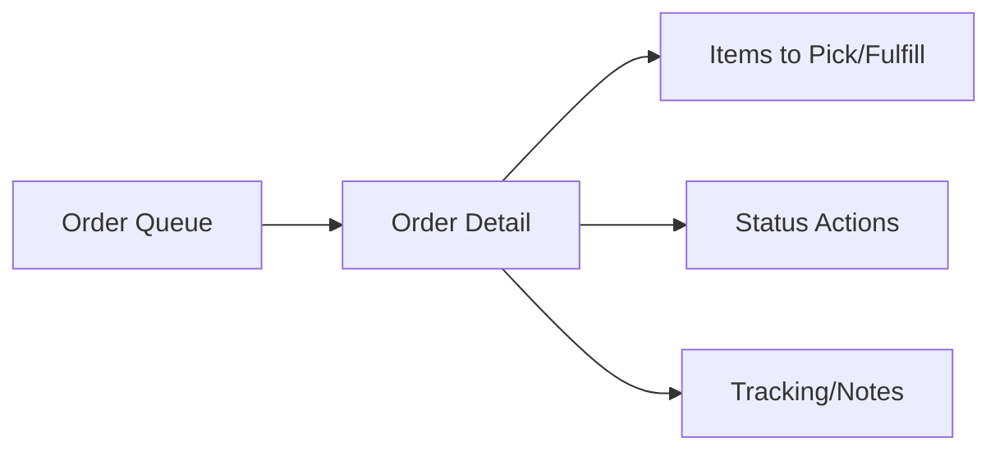

# Fulfillment Operations UI Rules

This document defines frontend rules for e-commerce fulfillment, pickup and delivery operations.
It aligns with the production scope and database entities for deliveries, delivery items and delivery tracking.

## Required reading

- [[00-start-here/README]] — entry point for the Unified Commerce 2nd Brain.
- [[01-product/project-scope]] — production scope and system boundary.
- [[01-product/production-module-catalog]] — product-level module map.
- [[02-architecture/frontend-architecture]] — source architecture for React frontend structure.
- [[02-architecture/offline-first-architecture]] — offline-first POS design.
- [[03-data/database-overview]] — source data model and table ownership.
- [[04-api/api-overview]] — API design and `/api/v1` rules.
- [[05-backend/backend-overview]] — backend authority, service, repository and transaction rules.
- [[09-security-and-compliance/authorization-model]] — RBAC, feature access and tenant isolation rules.

## Fulfillment UI purpose

Fulfillment screens support operations staff in preparing and updating online orders for pickup or delivery.
They are not customer browsing screens and should be optimized for order processing clarity.

## Database alignment

| Table | UI relevance |
|---|---|
| `orders` | Order header and status context. |
| `order_items` | Items to fulfill. |
| `delivery_methods` | Pickup/delivery method configuration. |
| `delivery_zones` | Delivery coverage/rate context. |
| `delivery_zone_rates` | Delivery charge rules via backend/API. |
| `deliveries` | Fulfillment header. |
| `delivery_items` | Fulfilled line quantities. |
| `delivery_tracking` | Tracking event timeline. |

## Fulfillment states

Frontend should respect backend-provided order/payment/fulfillment statuses.

Typical fulfillment display states include:

- unfulfilled;
- reserved;
- picking;
- ready for pickup;
- out for delivery;
- delivered;
- collected;
- failed;
- cancelled.

Do not invent new status values locally.

## Operations screen layout

Recommended fulfillment operations screen areas:

## Order queue rules

Order queue should support:

- status filter;
- fulfillment method filter;
- outlet/fulfillment outlet filter where applicable;
- date/business date filter;
- search by order number/customer where API supports;
- clear empty/error states.

## Order detail rules

Order detail must show:

- order number;
- customer summary where permitted;
- fulfillment method;
- fulfillment outlet;
- item lines and quantities;
- payment status indicator;
- fulfillment status;
- delivery/pickup address or location where available;
- status history/tracking where available.

## Status action rules

Frontend status actions must:

- show only allowed transitions;
- require confirmation where operation is sensitive;
- call backend transition API;
- refresh order detail after change;
- display backend rejection if transition is invalid;
- not update status as final before backend confirms.

See [[04-api/order-workflow-api-rules]].

## Pickup rules

Pickup flow should distinguish:

| State | UI behavior |
|---|---|
| Ready for pickup | Notify/show ready state. |
| Collected | Mark collected after authorized action. |
| Cancelled/failed | Show reason if provided. |

Pickup orders should not be labeled as delivered.

## Delivery rules

Delivery flow should show:

- delivery method;
- carrier/tracking reference where available;
- out-for-delivery state;
- delivered state;
- failed delivery reason where available;
- tracking events if present.

## Payment dependency

Operations UI must show payment status clearly.
If backend rules block fulfillment before payment status is acceptable, frontend must show why action is unavailable.

## Checklist

- [ ] Order queue filters are clear.
- [ ] Detail page separates order/payment/fulfillment states.
- [ ] Status actions come from documented transitions.
- [ ] Backend confirms every status change.
- [ ] Pickup uses collected, not delivered.
- [ ] Delivery tracking display is optional but supported when API data exists.
- [ ] Permission/feature access is reflected in UI.
