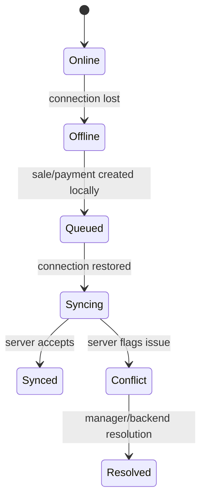

# Offline Frontend Rules

This document defines how the React frontend must behave when POS connectivity is unavailable.
It aligns with the offline-first scope, database offline sync tables and API sync rules.

## Required reading

- [[00-start-here/README]] — entry point for the Unified Commerce 2nd Brain.
- [[01-product/project-scope]] — production scope and system boundary.
- [[01-product/production-module-catalog]] — product-level module map.
- [[02-architecture/frontend-architecture]] — source architecture for React frontend structure.
- [[02-architecture/offline-first-architecture]] — offline-first POS design.
- [[03-data/database-overview]] — source data model and table ownership.
- [[04-api/api-overview]] — API design and `/api/v1` rules.
- [[05-backend/backend-overview]] — backend authority, service, repository and transaction rules.
- [[09-security-and-compliance/authorization-model]] — RBAC, feature access and tenant isolation rules.

## Offline purpose

Offline mode exists to allow core POS billing to continue when internet connectivity is poor or unavailable, where the tenant/system has enabled offline POS.

## Source database alignment

The uploaded database design includes these offline sync tables:

| Table | Frontend relevance |
|---|---|
| `offline_sync_batches` | One reconnect/sync attempt from a POS device. |
| `offline_sync_items` | Generic queued payload records. |
| `offline_sale_sync_queue` | Typed sale staging queue linked to sync item. |
| `offline_payment_sync_queue` | Typed payment staging queue linked to sync item. |
| `offline_sync_conflicts` | Conflicts requiring resolution. |
| `offline_sync_audit_logs` | Technical sync lifecycle audit. |

Frontend does not write these tables directly.
It sends queued payloads to the backend sync API.

## Frontend offline components

| Component/file | Responsibility |
|---|---|
| `core/offline/connectivityMonitor.ts` | Detect online/offline connectivity state. |
| `core/offline/syncQueue.ts` | Manage local queued items and sync submission. |
| `state/offline.store.ts` | Expose UI status such as pending count and conflicts. |
| IndexedDB | Persist offline POS transaction payloads. |
| NotificationShell | Show visible offline/sync status to cashier. |

## Offline-safe actions

Offline actions must follow the uploaded scope and backend sync acceptance rules.

| Action | Offline behavior |
|---|---|
| Scan/add cached product | Allowed if product/pricing cache exists and offline POS enabled. |
| Cash sale | Allowed where offline cash billing is enabled. |
| Receipt print | Allowed using local receipt payload with pending-sync marker. |
| Card/QR payment | Must follow configured rule; do not assume gateway capture. |
| Stock adjustment | Should require online unless specifically designed for offline. |
| Refund/return | Should be cautious; must follow documented flow and backend acceptance. |
| Feature configuration | Online-only. |
| Reports | Online or cached read-only where documented. |

## Offline data cache

Offline POS may cache:

- product variant lookup data;
- SKU/barcode index;
- active price list data needed for POS;
- tax/rule data safe for offline preview;
- payment method availability;
- receipt template payload;
- current tenant/outlet/device/session context.

Do not cache unnecessary sensitive customer or payment data.

## Local transaction identity

Offline transactions must have stable local IDs so the backend can deduplicate.

Frontend must generate and persist:

- local sale id;
- local payment id;
- client transaction id;
- offline created timestamp;
- device id/context;
- related local receipt id where needed.

These map to database fields such as `client_transaction_id`, `client_payment_id`, `client_sale_id`, `client_receipt_id` and sync item identity.

## Offline UI states

## Sync submission rules

When connectivity returns:

1. Read pending queue from IndexedDB.
2. Group items by client transaction where required.
3. Submit to `/api/v1` offline sync API according to [[04-api/offline-sync-api-rules]].
4. Mark accepted items as synced only after backend confirms.
5. Mark rejected/conflict items clearly.
6. Do not delete conflict payloads until resolution rules allow.

## Conflict UI rules

Conflict states must be visible to manager/operator.

Examples:

| Conflict | UI message direction |
|---|---|
| Duplicate transaction | Sale may already exist; show reference if backend provides it. |
| Stock mismatch | Sale queued but stock validation requires review. |
| Closed session | Transaction belongs to invalid/closed session. |
| Validation failed | Show specific item/payment validation issue. |
| Price changed | Backend accepted/rejected according to rule; show result. |

## Offline security rules

- Do not store plain passwords, OTPs or secrets offline.
- Do not store payment gateway private keys or card data.
- Clear offline tenant/session data on logout or device reassignment when safe.
- Avoid sharing offline data across tenants/outlets.

See [[09-security-and-compliance/offline-data-protection]].

## Checklist

- [ ] Offline status is visible.
- [ ] Offline queue persists in IndexedDB.
- [ ] Each queued transaction has local unique identifiers.
- [ ] Offline-safe actions are clearly limited.
- [ ] Sync acceptance comes from backend.
- [ ] Conflicts are visible and not silently ignored.
- [ ] Sensitive data is not stored unnecessarily.
- [ ] Tenant/outlet/device context is preserved correctly.
