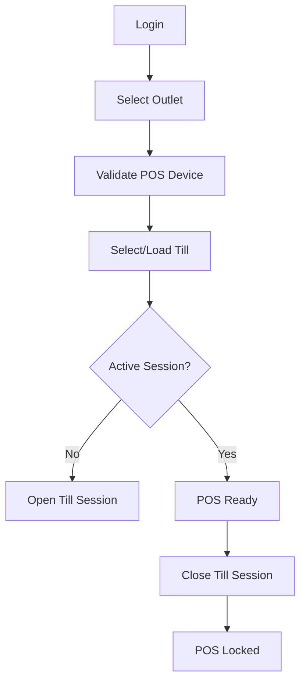

# POS Terminal State Rules

This document defines frontend rules for POS terminal, outlet, till, cashier, session and device state.
It aligns with the production database design for `tills`, `pos_devices`, `till_sessions`, sales, payments and offline sync.

## Required reading

- [[00-start-here/README]] — entry point for the Unified Commerce 2nd Brain.
- [[01-product/project-scope]] — production scope and system boundary.
- [[01-product/production-module-catalog]] — product-level module map.
- [[02-architecture/frontend-architecture]] — source architecture for React frontend structure.
- [[02-architecture/offline-first-architecture]] — offline-first POS design.
- [[03-data/database-overview]] — source data model and table ownership.
- [[04-api/api-overview]] — API design and `/api/v1` rules.
- [[05-backend/backend-overview]] — backend authority, service, repository and transaction rules.
- [[09-security-and-compliance/authorization-model]] — RBAC, feature access and tenant isolation rules.

## Why terminal state matters

POS actions are not generic browser actions.
They affect outlet stock, till cash, cashier audit, receipts and offline sync records.
The frontend must always know the active operational context.

## Required POS context

| Context | Why required |
|---|---|
| Tenant | Prevent cross-tenant data leakage. |
| Outlet | Determines stock and sales location. |
| POS device | Tracks registered terminal and offline sync origin. |
| Till | Connects cashier actions to register/drawer. |
| Till session | Required for cashier sales/cash reconciliation. |
| Cashier/user | Audit and permission. |
| Business date | Reporting and session reconciliation. |
| Connectivity | Online/offline behavior. |

## Database alignment

| Table | Frontend state relevance |
|---|---|
| `outlets` | Active selling/stock location. |
| `tills` | Cash register/till master. |
| `pos_devices` | Registered POS terminal/browser/device. |
| `till_sessions` | Open/close session state. |
| `cash_movements` | Cash drawer operations. |
| `sales` | Completed/held/voided sale context. |
| `offline_sync_batches` | Device sync lifecycle. |

## State lifecycle

## Session store responsibility

`session.store.ts` should expose:

- current user summary;
- tenant context;
- outlet context;
- access context;
- session validity state.

It must not store final backend secrets beyond approved token/session handling.

## Till store responsibility

`till.store.ts` should expose:

- current till id/code/name;
- current till session id;
- opened/closed state;
- opening float if returned/needed;
- expected/count/variance state where UI needs it;
- lock reason;
- close workflow state.

## Device state responsibility

Frontend should show device assignment issues clearly:

| Device condition | UI behavior |
|---|---|
| Active and assigned | POS can proceed if session is valid. |
| Inactive | Block POS and show device inactive message. |
| Blocked | Block POS and require admin/manager action. |
| Wrong outlet | Block or require reassignment. |
| Unknown device | Show registration/setup flow where allowed. |

## POS ready rule

The POS page is ready only when:

- user is authenticated;
- tenant context exists;
- outlet context exists;
- device is valid;
- till is valid;
- till session is open where required;
- POS feature and permissions allow billing.

## Locked state rule

If POS is not ready, show a locked screen/panel.
Do not show a usable cart that can create invalid sale state.

Locked reasons include:

- no active session;
- session closed;
- device inactive;
- outlet inactive;
- feature disabled;
- permission denied;
- offline mode not allowed;
- tenant suspended/inactive.

## Session close behavior

When session closes:

- block new sales;
- clear active cart unless saved/held according to rules;
- refresh reports/session summary;
- show close result;
- prevent payment screen from completing stale cart;
- reset cash movement draft state.

## Offline session behavior

Offline POS must preserve local session context if offline mode allows billing.
However, backend may reject sync later if session is invalid/closed.
Frontend must show pending sync and conflict state accurately.

## Checklist

- [ ] POS page requires tenant/outlet/device/till/session context.
- [ ] Locked state is clear and actionable.
- [ ] Session close clears unsafe workflow state.
- [ ] Device assignment issues are visible.
- [ ] Offline mode does not hide session risk.
- [ ] Backend validates final POS actions.
