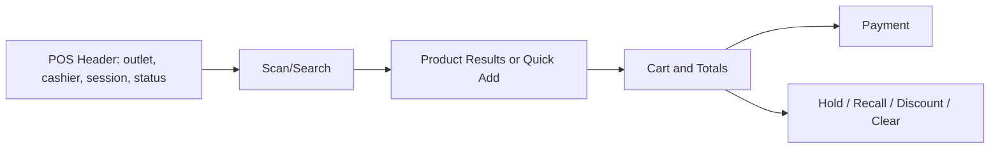

# POS UI Rules

This document defines the cashier-first POS user interface rules for the production Unified Commerce system.
The POS screen must behave like an operational terminal, not a normal website product catalogue.

## Required reading

- [[00-start-here/README]] — entry point for the Unified Commerce 2nd Brain.
- [[01-product/project-scope]] — production scope and system boundary.
- [[01-product/production-module-catalog]] — product-level module map.
- [[02-architecture/frontend-architecture]] — source architecture for React frontend structure.
- [[02-architecture/offline-first-architecture]] — offline-first POS design.
- [[03-data/database-overview]] — source data model and table ownership.
- [[04-api/api-overview]] — API design and `/api/v1` rules.
- [[05-backend/backend-overview]] — backend authority, service, repository and transaction rules.
- [[09-security-and-compliance/authorization-model]] — RBAC, feature access and tenant isolation rules.

## POS design goal

The POS UI must support fast retail counter workflows:

```text
scan → add → pay → print
```

It must minimize typing, keep totals visible and allow the cashier to operate confidently under queue pressure.

## Screen priority

| Priority | UI area | Reason |
|---|---|---|
| 1 | Scan/search input | Main cashier action. |
| 2 | Basket/cart panel | Operator must always see what is being sold. |
| 3 | Payable total | Final amount must be visible before payment. |
| 4 | Payment action | Checkout must be dominant and easy. |
| 5 | Hold/recall/discount/return actions | Common POS operations. |
| 6 | Product browsing | Secondary to scan/search. |

## POS layout rule



## Required visible context

The POS UI must show:

- tenant or store identity where needed;
- outlet name;
- cashier name/session;
- till/session status;
- connectivity/offline status;
- pending sync/conflict indicator where applicable;
- current cart total;
- payable amount;
- payment readiness.

## Search and scan rules

The scan/search field must:

- be prominent;
- be easy to focus;
- accept barcode scanner keyboard input;
- allow product name/SKU lookup where supported;
- show immediate feedback when product is found/not found;
- avoid unnecessary modal flow for common scanning;
- remain operational during offline mode using cached data where allowed.

## Product result rules

Product result UI should prioritize operational information:

| Field | Purpose |
|---|---|
| Product/variant name | Cashier recognition. |
| SKU/barcode | Confirm scanned item. |
| Price | Confirm selling price. |
| Stock indicator | Avoid selling unavailable item where visible. |
| Quick add action | Fast item entry. |

Large marketing images should not dominate POS billing.

## Cart rules

The cart must show:

- line item description;
- quantity controls;
- unit price;
- discount indicator;
- line total;
- remove action;
- subtotal;
- discount total;
- tax total;
- grand total/payable total.

Cart actions must be touch-friendly and not hidden behind unnecessary menus.

## Payment action rules

The payment action must be visually dominant when the cart is payable.
It must be disabled with a reason when:

- cart is empty;
- no active till/session exists;
- product validation fails;
- backend recalculation is required;
- offline payment method is not allowed;
- feature/permission blocks payment.

## Hold and recall rules

Hold/recall must respect tenant, outlet and session context.
Held sales should not silently move across tenants/outlets.
Manager access may be required depending on business rule.

## Discount rules

Discount UI must support:

- line-level discount;
- sale-level discount;
- coupon entry where enabled;
- approval required state;
- approved/rejected response;
- recalculated totals after backend confirmation where required.

Do not silently apply a discount that backend rejects.

## Return/exchange entry

POS UI may link to return/exchange workflows through `ReturnPage` or `ReturnShell`.
Return/exchange must use original sale/order lookup and policy validation from backend.

## Locked POS state

When till/session is not active, the POS screen must show a locked state instead of a broken cart.

Locked state should explain:

- no active till/session;
- device/outlet problem;
- permission problem;
- tenant/feature unavailable state;
- action needed to continue.

## Offline UI rules

When offline:

- show clear offline banner/status;
- show which actions are still allowed;
- mark sale/payment/receipt as pending sync;
- do not show false success as server-confirmed;
- show conflict indicators after sync response.

## Visual style rules

- Use strong contrast.
- Use one dominant payment/action color.
- Avoid excessive whitespace that slows scanning/cart operations.
- Avoid tiny critical buttons.
- Avoid decorative product-card styling on the main POS flow.
- Use clear disabled states and error messages.

## POS checklist

- [ ] Scan/search is prominent and easy to focus.
- [ ] Cart and payable total are always visible.
- [ ] Touch targets are suitable for cashier use.
- [ ] Till/session status is visible.
- [ ] Offline state is visible.
- [ ] Payment action is dominant.
- [ ] Errors are operationally clear.
- [ ] Backend remains final authority for completion.
