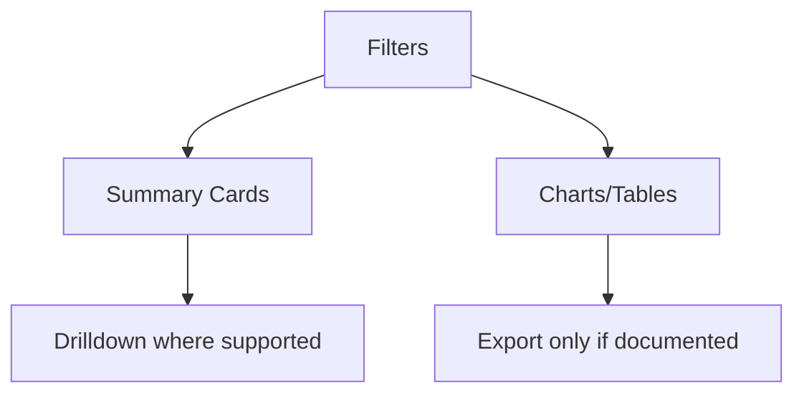

# Reporting Dashboard Rules

This document defines frontend rules for dashboards and reporting screens.
It aligns with the production scope and database reporting read models.

## Required reading

- [[00-start-here/README]] — entry point for the Unified Commerce 2nd Brain.
- [[01-product/project-scope]] — production scope and system boundary.
- [[01-product/production-module-catalog]] — product-level module map.
- [[02-architecture/frontend-architecture]] — source architecture for React frontend structure.
- [[02-architecture/offline-first-architecture]] — offline-first POS design.
- [[03-data/database-overview]] — source data model and table ownership.
- [[04-api/api-overview]] — API design and `/api/v1` rules.
- [[05-backend/backend-overview]] — backend authority, service, repository and transaction rules.
- [[09-security-and-compliance/authorization-model]] — RBAC, feature access and tenant isolation rules.

## Reporting purpose

Reports give managers and admins operational visibility across:

- sales;
- payments;
- inventory;
- discounts;
- returns;
- exchanges;
- cash drawer/session;
- offline sync;
- tax where data/API supports;
- audit-sensitive activity.

## Source data rule

Frontend dashboards display backend-provided report data.
They must not calculate official business reports from raw browser cache.

Relevant database read models include:

| Table | Report use |
|---|---|
| `daily_sales_summaries` | Sales dashboard. |
| `daily_payment_summaries` | Payment totals. |
| `daily_inventory_summaries` | Inventory movement summaries. |
| `daily_discount_return_summaries` | Discount, return and exchange summary. |

Other reports may be generated by backend from transaction tables where no read model exists.

## Report filters

Standard filters should include where supported by API:

- tenant context;
- outlet;
- channel;
- business date/date range;
- payment method;
- product/category;
- cashier/user;
- status;
- sync status.

Frontend must not expose filters unsupported by API contract.

## Dashboard state rules

Report screens must handle:

- loading;
- empty result;
- permission denied;
- feature disabled;
- API validation error;
- date range too large if backend rejects;
- stale data indicator if applicable.

## Dashboard layout

## Summary card rules

Summary cards should show business terms:

- gross sales;
- net sales;
- tax total;
- discount total;
- return total;
- transaction count;
- payment total;
- stock movement summary;
- exchange difference total.

Use backend response labels/values.

## Table rules

Report tables must:

- show clear columns;
- show currency/quantity formatting;
- support pagination where API supports;
- retain filters when navigating;
- avoid hidden calculations that contradict backend totals.

## Chart rules

Charts are allowed where useful, but must not replace tables needed for operational verification.
Do not use charts to invent metrics not in backend/report API.

## Cash and shift reporting

Cash drawer/shift reports must reflect backend session/cash movement data.
Frontend may display:

- opening float;
- expected cash;
- counted cash;
- variance;
- manager approval state;
- cash movement list.

## Offline sync reporting

Offline sync reporting should display:

- pending sync count;
- accepted count;
- failed count;
- conflict count;
- device/outlet context;
- last sync time.

This supports operations and support troubleshooting.

## Access rules

Reports are permission-controlled.
Frontend must not show report navigation or data where backend access context denies it.

## Checklist

- [ ] Report uses backend/API data.
- [ ] Filters are supported by API.
- [ ] Permission and feature states are handled.
- [ ] Loading/empty/error states exist.
- [ ] Currency/quantity formatting is clear.
- [ ] POS/cash/offline reports do not rely on local browser truth.
