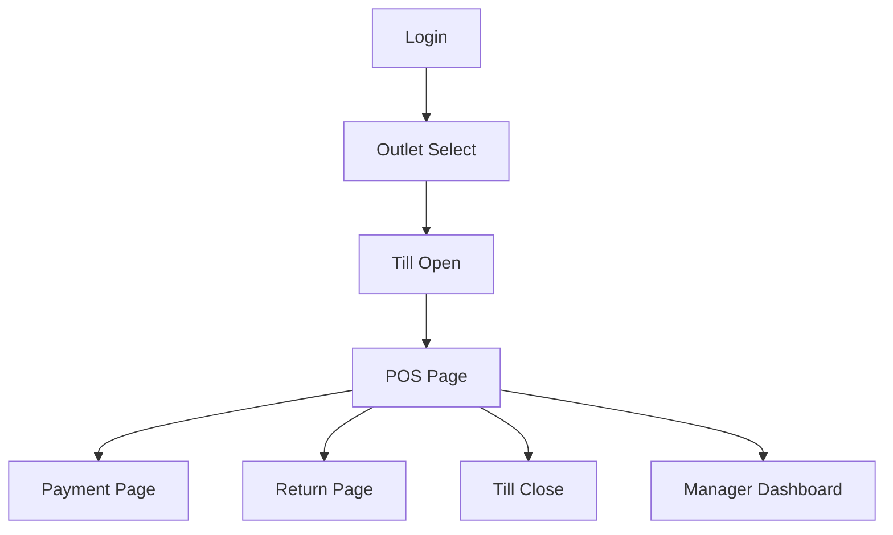

# Routing and Guards

This document defines frontend routing and guard rules for the Unified Commerce application.
It aligns with the uploaded frontend architecture and the security/access rules.

## Required reading

- [[00-start-here/README]] — entry point for the Unified Commerce 2nd Brain.
- [[01-product/project-scope]] — production scope and system boundary.
- [[01-product/production-module-catalog]] — product-level module map.
- [[02-architecture/frontend-architecture]] — source architecture for React frontend structure.
- [[02-architecture/offline-first-architecture]] — offline-first POS design.
- [[03-data/database-overview]] — source data model and table ownership.
- [[04-api/api-overview]] — API design and `/api/v1` rules.
- [[05-backend/backend-overview]] — backend authority, service, repository and transaction rules.
- [[09-security-and-compliance/authorization-model]] — RBAC, feature access and tenant isolation rules.

## Approved routing location

```text
bootstrap/router/
├── index.tsx
├── routes.tsx
└── guards/
    ├── AuthGuard.tsx
    ├── TillSessionGuard.tsx
    └── RoleGuard.tsx
```

## Guard responsibilities

| Guard | Responsibility |
|---|---|
| `AuthGuard` | Ensures user/customer session is available before protected routes. |
| `RoleGuard` | Ensures route is visible only to allowed role/permission context. |
| `TillSessionGuard` | Ensures POS billing/payment routes have required till/session state. |

Frontend guards improve UX.
They do not replace backend authorization.

## Route groups

| Route group | Layout | Example pages |
|---|---|---|
| Auth | `AuthLayout` | `LoginPage` |
| POS | `POSLayout` | `POSPage`, `PaymentPage`, `ReturnPage`, `TillOpenPage`, `TillClosePage` |
| Admin/manager | `AdminLayout` | `CashManagementPage`, `StocktakePage`, `TransferPage`, `EndOfDayPage`, `ManagerDashboardPage` |

## Route context requirements

| Page | Required context |
|---|---|
| `LoginPage` | No authenticated session. |
| `OutletSelectPage` | Authenticated user, available outlet list. |
| `TillOpenPage` | Authenticated cashier/manager, selected outlet/device. |
| `POSPage` | Active tenant, outlet, device and till session. |
| `PaymentPage` | Active cart/sale draft and till session. |
| `ReturnPage` | Authenticated user with return/exchange access. |
| `TillClosePage` | Active till session. |
| `CashManagementPage` | Till session and cash movement permission. |
| `StocktakePage` | Inventory permission and outlet context. |
| `TransferPage` | Inventory transfer permission. |
| `ManagerDashboardPage` | Reporting/dashboard permission. |

## Routing flow



## Auth guard rule

`AuthGuard` must check frontend session availability and token/session validity state.
If invalid:

- redirect to login;
- clear unsafe local workflow state;
- do not leave POS sale/payment screen half-active;
- do not preserve another tenant/outlet context.

## Role guard rule

`RoleGuard` must read access context returned by backend/session APIs.
It may hide or redirect from unauthorized routes.
Backend still enforces final access with permissions and feature checks.

Related docs:

- [[09-security-and-compliance/authorization-model]]
- [[04-api/auth-and-authorization]]
- [[05-backend/feature-access-handling]]

## Till session guard rule

`TillSessionGuard` is required for cashier operations that need an active till/session.

Guarded operations include:

- scan/add/pay flow;
- payment capture;
- cash movement;
- till close;
- receipt printing tied to POS session;
- offline POS billing where session control is enabled.

If no session is active, show locked POS state and route to `TillOpenPage` where allowed.

## Outlet/device context rule

POS routes must not run without outlet and device context because the database design includes outlet-scoped stock, till sessions and POS devices.

Frontend must show a clear setup/assignment issue when:

- user has no allowed outlet;
- current device is not registered/active;
- device is assigned to another outlet;
- till is inactive or unavailable;
- session is already open/closed unexpectedly.

## Route naming rules

- Use clear business route names.
- Avoid implementation-only names in public route paths.
- Route modules should match documented feature modules.
- Do not create routes for undocumented workflows.

## Error route behavior

| Situation | UI behavior |
|---|---|
| Not authenticated | Redirect to login. |
| Forbidden | Show permission-denied page or panel. |
| Feature disabled | Show feature unavailable message. |
| Missing till session | Show locked POS/session required screen. |
| Offline route not supported | Show online required message. |
| Unknown route | Show not-found route. |

## Checklist

- [ ] Route belongs to a documented module.
- [ ] Route has correct layout.
- [ ] Route has required guards.
- [ ] Route handles feature-disabled state.
- [ ] Route handles permission denied state.
- [ ] POS route handles missing till/session/device state.
- [ ] Route does not bypass backend authority.
