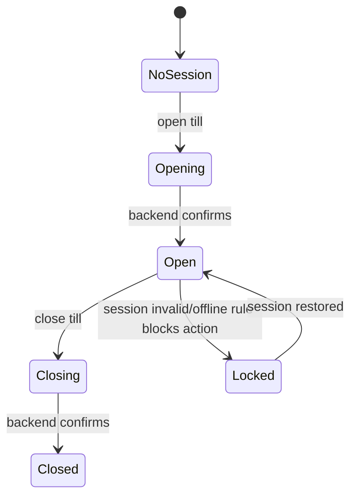

# State Management Rules

This document defines how Zustand and local component state must be used in the Unified Commerce frontend.
It also defines what must remain in TanStack Query.

## Required reading

- [[00-start-here/README]] — entry point for the Unified Commerce 2nd Brain.
- [[01-product/project-scope]] — production scope and system boundary.
- [[01-product/production-module-catalog]] — product-level module map.
- [[02-architecture/frontend-architecture]] — source architecture for React frontend structure.
- [[02-architecture/offline-first-architecture]] — offline-first POS design.
- [[03-data/database-overview]] — source data model and table ownership.
- [[04-api/api-overview]] — API design and `/api/v1` rules.
- [[05-backend/backend-overview]] — backend authority, service, repository and transaction rules.
- [[09-security-and-compliance/authorization-model]] — RBAC, feature access and tenant isolation rules.

## State ownership rule

| State type | Owner |
|---|---|
| Backend/server data | TanStack Query |
| Active POS cart | Zustand |
| Current till/session workflow | Zustand |
| UI drawer/modal state | Zustand or component state |
| Offline connectivity and queue status | Zustand + IndexedDB queue service |
| Form field values | Component/form state |
| Reports returned by API | TanStack Query |

Do not duplicate server state into Zustand unless it is intentionally transformed into active workflow state.

## Approved stores

The uploaded frontend architecture defines these stores:

```text
state/
├── app.store.ts
├── session.store.ts
├── till.store.ts
├── cart.store.ts
├── ui.store.ts
├── offline.store.ts
└── cart.orchestrator.ts
```

## Store responsibility table

| Store | Responsibility |
|---|---|
| `app.store.ts` | App-level UI readiness and global non-sensitive flags. |
| `session.store.ts` | Frontend session context, current user, tenant/outlet selection result. |
| `till.store.ts` | Current till/session state needed by POS screens. |
| `cart.store.ts` | Active sale/cart lines, selected customer, discount draft, payment draft. |
| `ui.store.ts` | Modals, drawers, notifications, focused shell state. |
| `offline.store.ts` | Connectivity, pending sync count, last sync status, conflict indicators. |
| `cart.orchestrator.ts` | Coordinates cart actions that touch multiple stores/services. |

## What must not go in Zustand

- Raw product database list from API.
- All customer records.
- Full report results.
- Full inventory ledger.
- Full order history.
- Permission catalogue unless loaded as session/access context.
- Secrets, tokens or payment credentials.
- Backend-only computed financial truth.

## POS cart state

The cart store may hold active operational state such as:

| Field group | Example |
|---|---|
| Cart identity | Local cart/sale draft id. |
| Lines | Variant id, description, quantity, frontend price preview. |
| Customer | Selected customer id and display summary. |
| Discounts | Pending discount request/coupon entry before backend confirmation. |
| Totals preview | UI subtotal/tax/discount/payable preview. |
| Payment draft | Selected methods and entered amounts before final submit. |
| Offline flags | Local transaction id and queued status. |

Final totals must be confirmed by backend before completed sale/order.

## Session and till state

`till.store.ts` must support the POS locked/unlocked workflow.



## Offline state

`offline.store.ts` should expose:

- current connectivity state;
- offline mode allowed/not allowed;
- pending sync count;
- failed sync count;
- conflict count;
- last successful sync time;
- current sync batch progress.

It should not store the entire offline payload if IndexedDB owns queue persistence.

## Cart orchestrator rule

`cart.orchestrator.ts` may coordinate:

- adding scanned item to cart;
- recalculating frontend preview totals;
- applying pending discount state;
- preparing payment draft;
- preparing offline queue payload;
- clearing cart after backend-confirmed sale completion.

It must not bypass backend validation.

## Store action rules

Every store action should be named as a business event:

```text
openTillSessionContext
addCartLine
increaseCartLineQty
removeCartLine
setSelectedCustomer
markOfflineSyncPending
clearCompletedSaleCart
```

Avoid vague action names:

```text
setData
updateThing
doStuff
handleClick
```

## Persistence rules

| State | Persist? | Note |
|---|---|---|
| Session token | Use approved token manager only | Do not store secrets in arbitrary Zustand persistence. |
| Active POS cart | Only if offline/session rules require | Must not leak across tenant/outlet/session. |
| Offline queue | IndexedDB | Queue service owns persistence. |
| Theme selection | Allowed | Use tenant theme/config rules. |
| UI modal state | No | Reset on navigation. |

## Reset rules

Clear sensitive workflow state when:

- user logs out;
- tenant changes;
- outlet changes;
- till session closes;
- device assignment changes;
- sale completes;
- backend rejects offline sync item;
- manager resolves conflict.

## Checklist

- [ ] Server state is not duplicated unnecessarily.
- [ ] Store has one clear responsibility.
- [ ] Store actions use business names.
- [ ] Store reset behavior is defined.
- [ ] Tenant/outlet/session leakage is prevented.
- [ ] Offline queue payload is persisted through approved offline service.
- [ ] Backend remains final authority for production results.
