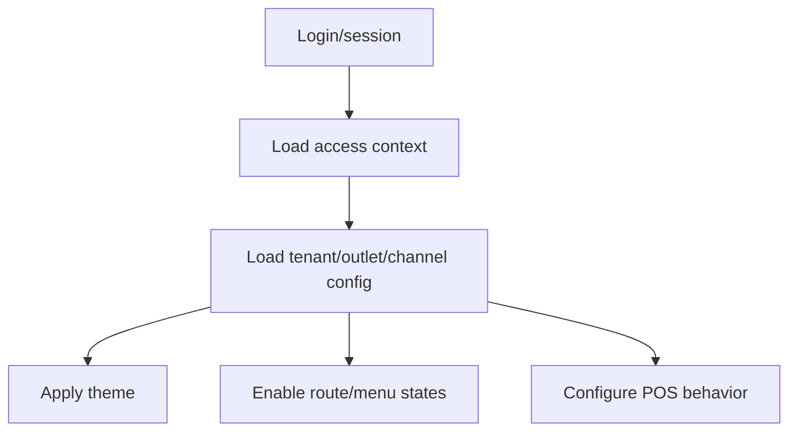

# Theme and Configuration Rules

This document defines how frontend uses tenant settings, feature flags and UI theme tokens.
It aligns with the database tables `tenant_settings`, `feature_flags` and `ui_themes`.

## Required reading

- [[00-start-here/README]] — entry point for the Unified Commerce 2nd Brain.
- [[01-product/project-scope]] — production scope and system boundary.
- [[01-product/production-module-catalog]] — product-level module map.
- [[02-architecture/frontend-architecture]] — source architecture for React frontend structure.
- [[02-architecture/offline-first-architecture]] — offline-first POS design.
- [[03-data/database-overview]] — source data model and table ownership.
- [[04-api/api-overview]] — API design and `/api/v1` rules.
- [[05-backend/backend-overview]] — backend authority, service, repository and transaction rules.
- [[09-security-and-compliance/authorization-model]] — RBAC, feature access and tenant isolation rules.

## Configuration source

The database design includes:

| Table | Frontend relevance |
|---|---|
| `tenant_settings` | Runtime tenant/outlet/channel settings. |
| `feature_flags` | Runtime feature state and parameters. |
| `ui_themes` | Tenant UI theme tokens. |
| `platform_features` | Feature catalog. |
| `tenant_feature_entitlements` | Tenant feature availability. |
| `role_feature_assignments` | Role-level feature access. |

Frontend must consume configuration from API/session/config endpoints.
It must not hard-code tenant behavior.

## Configuration scope

| Scope | Example frontend use |
|---|---|
| Tenant | Default theme, currency display, locale. |
| Outlet | POS outlet behavior, printer/receipt preference where returned by API. |
| Channel | POS vs e-commerce setting differences. |
| User | User-specific UI preferences where supported. |

If multiple scopes apply, the precedence must follow backend/config API response.
Frontend should not invent precedence rules.

## Theme tokens

`ui_themes.theme_tokens` is the source for configurable tenant UI styling.
Frontend may use tokens for:

- colors;
- spacing;
- typography;
- surface/background settings;
- receipt/theme preview where supported.

Theme tokens must be validated before use so UI remains readable.

## POS theme caution

POS screens must remain operational even with tenant theming.
Do not allow theme choices to break:

- contrast;
- payment button visibility;
- error visibility;
- offline warning visibility;
- disabled state clarity;
- cart total readability.

## Theme provider

`bootstrap/providers/ThemeProvider.tsx` should:

- load theme tokens from approved config source;
- apply default safe theme if missing;
- avoid blocking POS startup unnecessarily;
- expose theme values to components;
- fail safely with readable UI.

## Feature flags

Feature flags can influence UI availability.

Examples:

| Feature/config | UI result |
|---|---|
| Offline POS disabled | Do not offer offline billing flow. |
| E-commerce disabled | Hide storefront/admin e-commerce screens. |
| Reprint disabled or restricted | Hide/disable reprint action. |
| Discount approval enabled | Show approval state in discount UI. |
| Theme configured | Apply tenant theme tokens. |

Backend must still enforce feature access.

## Settings in frontend

Settings may affect:

- POS payment method display;
- receipt format selection;
- product grid behavior;
- offline mode indicator;
- channel visibility;
- tax/pricing display labels;
- reporting filters.

Do not use settings as a replacement for relational transaction data.

## Configuration loading sequence

## Caching configuration

Frontend may cache configuration for startup/performance, but must:

- tie cache to tenant/outlet/user context;
- refresh after configuration changes;
- avoid stale feature access after login/session changes;
- not cache secrets;
- clear config on logout or tenant change.

## Admin configuration UI rules

Configuration screens must:

- show current scope clearly;
- separate tenant, outlet and channel settings;
- explain feature disabled states;
- validate theme tokens;
- show preview where useful;
- save through backend APIs only;
- rely on backend audit for sensitive changes.

## Checklist

- [ ] ThemeProvider applies safe tokens.
- [ ] Theme does not break POS readability.
- [ ] Feature flags are backend-driven.
- [ ] Configuration scope is visible.
- [ ] Cache is tenant/outlet safe.
- [ ] Settings do not replace transaction data.
- [ ] Feature disabled UI matches backend result.
