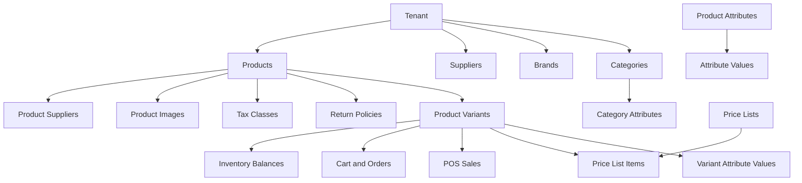

# Catalog Module

## Purpose

The Catalog module owns the tenant product master used by both E-POS and E-Commerce.

It covers product management, variants, categories, brands, suppliers, tenant-defined attributes,
product images, price-list assignment, channel availability, return policy assignment, publishing readiness,
and catalog search.

This folder is written for the production-ready Unified Commerce SaaS system, not for a basic POS or MVP.

## Source documents

- [[00-start-here/README]]
- [[01-product/project-scope]]
- [[01-product/production-module-catalog]]
- [[02-architecture/system-overview]]
- [[03-data/database-overview]]
- [[03-data/entities/product-catalog-entities]]
- [[04-api/api-overview]]
- [[05-backend/backend-overview]]
- [[06-frontend/frontend-overview]]
- [[09-security-and-compliance/authorization-model]]
- [[12-templates/feature-spec-template]]

## Module boundary

| Area | Catalog responsibility | Not owned here |
|---|---|---|
| Product master | Product name, type, slug, descriptions, status, channel flags | Stock quantities |
| Variants | SKU, barcode, variant name, selected attributes, purchase limits | Sale/order lines |
| Categories | Tenant category tree and sort order | Menu-specific UI layouts |
| Brands | Tenant-owned brand master | Global brand marketplace |
| Suppliers | Supplier master, addresses, product/variant supplier mapping | Purchase receipt posting |
| Attributes | Tenant attributes, values, platform templates/presets, variant attribute values | AI import extraction logic |
| Pricing | Price lists and variant price list items | Payment capture and refunds |
| Images | Product/variant image metadata and storage keys | Binary object storage service internals |
| Channel availability | POS/e-commerce sellable flags and publishing readiness | Order fulfillment workflow |
| Return policy | Policy assignment and rule definition | Return/exchange execution |
| Search | Tenant/channel-aware product and variant discovery | Checkout final validation |

## Module dependency map

## Owned database tables

| Table | Primary key | Important foreign keys | Purpose |
|---|---|---|---|
| `brands` | `id` | `tenant_id` | Tenant-owned brand master. |
| `suppliers` | `id` | `tenant_id` | Tenant supplier master. |
| `supplier_addresses` | `id` | `tenant_id`, `supplier_id` | Supplier address records. |
| `categories` | `id` | `tenant_id`, `parent_id` | Tenant category hierarchy. |
| `return_policies` | `id` | `tenant_id` | Product return/exchange policy definitions. |
| `products` | `id` | `tenant_id`, `category_id`, `brand_id`, `tax_class_id`, `return_policy_id` | Product master shared by POS and e-commerce. |
| `product_variants` | `id` | `tenant_id`, `product_id` | Sellable SKU/barcode units. |
| `product_attributes` | `id` | `tenant_id` | Tenant-defined product attributes. |
| `attribute_values` | `id` | `tenant_id`, `attribute_id` | Selectable attribute values. |
| `attribute_templates` | `id` | none | Platform-level reusable attribute definitions. |
| `attribute_template_values` | `id` | `attribute_template_id` | Default values under platform templates. |
| `attribute_presets` | `id` | none | Platform-level attribute bundles. |
| `attribute_preset_items` | `id` | `attribute_preset_id`, `attribute_template_id` | Maps templates into presets. |
| `category_attributes` | `id` | `tenant_id`, `category_id`, `attribute_id` | Maps categories to attributes. |
| `variant_attribute_values` | `id` | `tenant_id`, `variant_id`, `attribute_id`, `attribute_value_id` | Selected attribute values per variant. |
| `product_suppliers` | `id` | `tenant_id`, `product_id`, `variant_id`, `supplier_id` | Product/variant supplier mapping. |
| `product_images` | `id` | `tenant_id`, `product_id`, `variant_id` | Product and variant image metadata. |
| `price_lists` | `id` | `tenant_id` | Named channel price lists. |
| `price_list_items` | `id` | `tenant_id`, `price_list_id`, `variant_id`, `outlet_id` | Variant prices inside price lists. |

## Referenced tables from other modules

| Table | Why Catalog references it |
|---|---|
| `tenants` | Every tenant-owned catalog row belongs to a tenant. |
| `outlets` | Outlet-specific price overrides and optional outlet stock visibility. |
| `tax_classes` | Product-level tax class assignment. |
| `inventory_balances` | Search/listing may display availability; stock is not owned by Catalog. |
| `sales`, `sale_lines` | POS sells variants created by Catalog. |
| `carts`, `cart_items`, `orders`, `order_items` | E-commerce uses variants and frozen product details. |
| `returns`, `return_lines`, `exchanges`, `exchange_lines` | Return/exchange eligibility depends on catalog policy and variant identity. |
| `audit_logs` | Sensitive catalog changes should be traceable. |

## Production rules

- Catalog records are tenant-owned unless the uploaded database design marks them as platform-owned templates.
- SKU and barcode uniqueness must be enforced inside the tenant boundary at product variant level.
- Do not store stock quantity on `products` or `product_variants`; stock belongs to inventory balances and movements.
- A product may be POS-only, e-commerce-only, or available in both channels through the documented sellable flags.
- Every sellable item used by POS, cart, order, return, exchange, stock, and pricing must resolve to a `product_variants.id`.
- Tax class and return policy references are part of catalog validation, but tax calculation and return execution are owned by their modules.
- Backend validation is the final authority; frontend validation only improves operator speed and user feedback.
- Catalog changes that affect selling, pricing, tax, returns, or channel visibility must be auditable.

## Feature list

| Feature | Spec | History |
|---|---|---|
| Product Management | [[07-modules/catalog/features/product-management/feature-spec]] | [[07-modules/catalog/features/product-management/feature-history]] |
| Product Variant Management | [[07-modules/catalog/features/product-variant-management/feature-spec]] | [[07-modules/catalog/features/product-variant-management/feature-history]] |
| Category Management | [[07-modules/catalog/features/category-management/feature-spec]] | [[07-modules/catalog/features/category-management/feature-history]] |
| Brand Management | [[07-modules/catalog/features/brand-management/feature-spec]] | [[07-modules/catalog/features/brand-management/feature-history]] |
| Supplier Management | [[07-modules/catalog/features/supplier-management/feature-spec]] | [[07-modules/catalog/features/supplier-management/feature-history]] |
| Product Attribute Management | [[07-modules/catalog/features/product-attribute-management/feature-spec]] | [[07-modules/catalog/features/product-attribute-management/feature-history]] |
| Product Pricing | [[07-modules/catalog/features/product-pricing/feature-spec]] | [[07-modules/catalog/features/product-pricing/feature-history]] |
| Product Image Upload | [[07-modules/catalog/features/product-image-upload/feature-spec]] | [[07-modules/catalog/features/product-image-upload/feature-history]] |
| Product Channel Availability | [[07-modules/catalog/features/product-channel-availability/feature-spec]] | [[07-modules/catalog/features/product-channel-availability/feature-history]] |
| Product Publishing | [[07-modules/catalog/features/product-publishing/feature-spec]] | [[07-modules/catalog/features/product-publishing/feature-history]] |
| Product Return Policy | [[07-modules/catalog/features/product-return-policy/feature-spec]] | [[07-modules/catalog/features/product-return-policy/feature-history]] |
| Catalog Search | [[07-modules/catalog/features/catalog-search/feature-spec]] | [[07-modules/catalog/features/catalog-search/feature-history]] |

## API and backend alignment

| Layer | Rule |
|---|---|
| API | Follow [[04-api/endpoint-design]], [[04-api/request-response-standard]], and [[04-api/tenant-context-api-rules]]. |
| Backend | Use Clean Architecture, Service Pattern, Repository Pattern, validation, DTOs, and mapping rules from [[05-backend/backend-overview]]. |
| Frontend | Use feature folders, TanStack Query, Zustand only for workflow state, and POS-specific UI rules from [[06-frontend/frontend-overview]]. |
| Security | Use tenant isolation, RBAC, feature access, and audit rules from [[09-security-and-compliance/authorization-model]]. |
| Data | Keep table definitions aligned with [[03-data/entities/product-catalog-entities]]. |

## Developer checklist

- [ ] Confirm feature exists in this module before changing Catalog files.
- [ ] Read the feature spec and feature history before implementation.
- [ ] Verify tenant isolation for every catalog query and write.
- [ ] Validate FK ownership for category, brand, supplier, tax class, return policy, product, variant, price list, and outlet references.
- [ ] Do not store stock quantity in catalog tables.
- [ ] Do not bypass backend validation because the frontend appears valid.
- [ ] Keep transaction prices frozen on sale/order lines through pricing snapshots.
- [ ] Add or update audit behavior for sensitive catalog changes.
- [ ] Update related user flows when a change affects POS or e-commerce behavior.
- [ ] Update tests for search, SKU/barcode uniqueness, channel visibility, and pricing resolution.

## AI IDE rule

Before editing this module, an AI IDE must read:

1. [[00-start-here/README]]
2. [[01-product/project-scope]]
3. [[02-architecture/system-overview]]
4. [[03-data/entities/product-catalog-entities]]
5. [[04-api/api-overview]]
6. [[05-backend/backend-overview]]
7. [[06-frontend/frontend-overview]]
8. The target feature spec in this folder

Do not create new catalog entities, endpoints, workflows, or permissions unless they already exist in the uploaded scope, uploaded database design, or approved 2nd Brain context.
