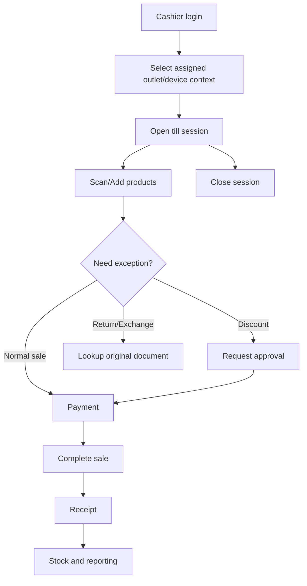

# Cashier User Flows

This folder documents cashier-facing POS workflows for the Unified Commerce E-POS + E-Commerce SaaS system.
The flows are written for real POS terminal operation: barcode-first, touchscreen-first, low typing, and fast checkout.

These flows must be read together with the production scope, database design, API rules, backend rules, frontend rules, and security rules.
They are not standalone UI ideas. They define how POS operations should behave across tenant, outlet, till, device, session, sale, payment, stock, receipt, discount, return, exchange, offline sync, and audit boundaries.

## Cashier Flow Files

| File | Purpose | Main tables involved |
|---|---|---|
| [[start-session]] | Open a cashier till session before billing | `till_sessions`, `tills`, `pos_devices`, `cash_count_denominations` |
| [[scan-add-pay]] | Main scan, add, cart, payment trigger, receipt trigger flow | `sales`, `sale_lines`, `product_variants`, `inventory_balances` |
| [[cash-payment]] | Record cash payment and cash change | `payments`, `sale_payment_allocations`, `till_sessions` |
| [[non-cash-payment]] | Record card, QR, wallet, or other non-cash payment reference | `payments`, `payment_transactions`, `tenant_payment_methods` |
| [[split-payment]] | Complete one sale using multiple payment rows | `payments`, `sale_payment_allocations` |
| [[hold-sale]] | Hold an incomplete sale/cart for later recall | `sales`, `sale_lines` |
| [[recall-sale]] | Recall a held sale and continue billing | `sales`, `sale_lines` |
| [[discount-request]] | Request and apply manager-approved discount | `discount_requests`, `discount_applications`, `discount_policies` |
| [[return-flow]] | Process return against original sale/order | `returns`, `return_lines`, `refunds`, `stock_movements` |
| [[exchange-flow]] | Process exchange using return + new item issue | `exchanges`, `exchange_lines`, `payments`, `refunds` |
| [[receipt-reprint]] | Reprint or resend existing receipt with audit | `receipts`, `receipt_print_logs` |
| [[void-cancel-sale]] | Cancel current cart or void completed sale where allowed | `sales`, `sale_lines`, `audit_logs` |
| [[close-session]] | Close till session with cash count and variance | `till_sessions`, `cash_count_denominations`, `cash_movements` |

## System Context

Cashier workflows depend on these production foundations:

1. Tenant isolation is mandatory.
2. POS device must belong to one tenant, outlet, and till.
3. Cashier access is controlled by role, permission, feature access, and outlet assignment.
4. Active till session is required when session control is enabled.
5. POS sale uses variant-level items, not product-level stock.
6. Completed sale must record sale lines, payments, stock movement, receipt, and audit where applicable.
7. Frontend may guide the cashier, but backend remains the final authority.
8. Offline POS can store local sale/payment/receipt data, but server validates during sync.
9. Sensitive operations require permission and audit.

## Cashier UX Rules

| UX rule | Why it matters |
|---|---|
| Search/scan input stays primary | Barcode scanner behaves like keyboard input. |
| Payable total is always visible | Cashier must not search for amount due. |
| Touch targets are large | Real POS users work quickly and may use touchscreens. |
| Critical actions need confirmation | Void, refund, reprint, and clear sale must prevent accidental taps. |
| Offline status must be visible | Cashier must know when sale is queued locally. |
| Printer/scanner state must be visible where relevant | Hardware failure must not confuse completed sale state. |

## Permissions Used by This Folder

The database stores permissions in `permissions` and maps them through roles and feature assignments.
This folder does not define final permission codes except where the database already uses examples.
The following permission categories must exist in the implementation model:

| Operation | Permission category |
|---|---|
| Create POS sale | Sale creation permission |
| Complete payment | Payment capture/record permission |
| Apply cashier-level discount | Discount permission within policy limit |
| Approve discount above limit | Manager discount approval permission |
| Process return/refund | Return/refund permission |
| Process exchange | Exchange permission |
| Void completed sale | Void/cancel permission |
| Reprint receipt | Receipt reprint permission |
| Approve cash variance | Cash session approval permission |

## Flow Documentation Standard

Every cashier flow file uses the same structure:

- Purpose
- Actors
- Preconditions
- Related entities
- Main flow
- Alternative flows
- Validation rules
- Error cases
- Frontend notes
- Backend notes
- Offline behavior
- Audit behavior
- QA checklist

## Implementation Boundary

Cashier flow documents do not replace:

- feature specs under [[07-modules/sales-pos/README]]
- database entity references under [[03-data/README]]
- API rules under [[04-api/README]]
- backend implementation rules under [[05-backend/README]]
- frontend POS UI rules under [[06-frontend/README]]

They connect those documents into practical operational workflows.

## Folder Checklist

- [ ] Every flow references related entities.
- [ ] Every sensitive flow includes audit expectations.
- [ ] Every payment flow distinguishes payment record from real gateway processing.
- [ ] Every return/exchange flow links back to original sale/order.
- [ ] Every offline-capable flow explains local queue and sync behavior.
- [ ] Every flow avoids fixed endpoint invention unless API docs define it.
- [ ] Every flow preserves tenant, outlet, till, device, and session context.
