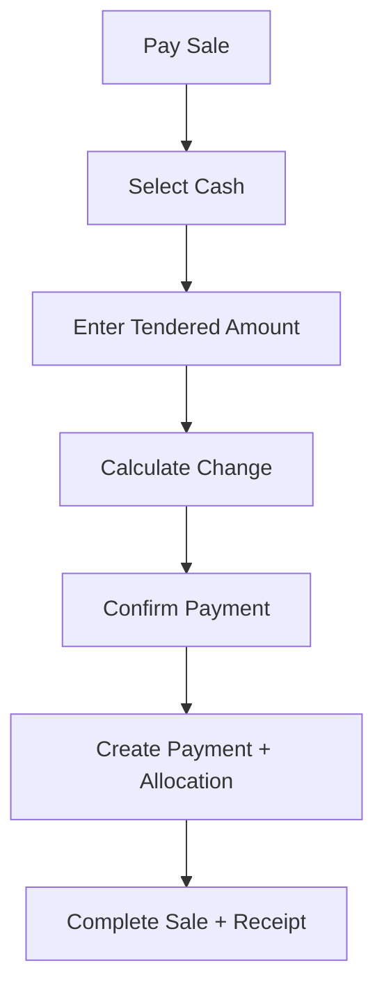

# Cash Payment Flow

## Purpose

This flow documents how a cashier records cash payment for a POS sale.
Cash payment is a payment record, a till cash impact, and part of shift reconciliation.

The flow must be fast and touch-friendly, with clear amount due, amount tendered, and change due.

## Actors

| Actor | Responsibility |
|---|---|
| Cashier | Enters or selects cash tendered amount. |
| POS frontend | Shows amount due, quick cash buttons, change due, and confirmation. |
| Backend service | Validates sale, session, payment amount, and allocation. |
| Manager | Reviews variance during session close if cash count differs. |

## Preconditions

- Active till session exists.
- Sale cart has at least one line.
- Payable amount is calculated.
- Cash payment method is enabled for tenant/outlet if payment configuration is enforced.
- Cashier has payment recording permission.

## Related Entities

| Entity | Use |
|---|---|
| `sales` | Sale to be paid. |
| `payments` | Cash payment record. |
| `sale_payment_allocations` | Link between sale and payment. |
| `payment_method_types` | Cash payment type reference. |
| `tenant_payment_methods` | Tenant-enabled payment method config. |
| `till_sessions` | Expected cash reconciliation. |
| `cash_movements` | Non-sale cash movement; not used for normal cash sale payment. |

## Main Flow

1. Cashier taps Pay from POS cart.
2. POS shows payable amount and payment method options.
3. Cashier selects Cash.
4. POS displays amount due and quick tender buttons.
5. Cashier enters amount received from customer.
6. POS calculates change due.
7. Cashier confirms payment.
8. Backend validates active session, payable amount, and payment amount.
9. Backend creates inbound `payments` row with purpose `sale`.
10. Backend creates `sale_payment_allocations` row.
11. Sale is completed if paid total covers grand total.
12. Receipt is generated and optionally printed.
13. Expected cash for session is affected by cash sale total.

## Alternative Flows

### Exact Cash

- Cashier taps exact amount.
- Change due is zero.
- Payment confirmation proceeds immediately.

### Over Tender

- POS calculates change.
- `change_total` is stored on sale.
- Payment amount should still reflect amount paid/received according to payment rules, while sale grand total remains unchanged.

### Under Tender

- POS does not complete sale.
- Cashier may add another payment using split payment flow.

### Offline Cash Payment

- Cash payment can be recorded offline if offline POS is enabled and required local data exists.
- Payment receives local `client_payment_id` and sale receives `client_transaction_id`.
- Server validates after sync.

## Validation Rules

| Rule | Expected behavior |
|---|---|
| Tendered amount must be positive | Reject zero or negative payment. |
| Sale must belong to active tenant/outlet/session | Backend validates context. |
| Cash method must be enabled | Reject disabled method. |
| Paid total must cover grand total to complete | Otherwise remain in payment flow. |
| Duplicate payment idempotency | Backend prevents duplicate payment creation. |

## Frontend Notes

- Display amount due in large text.
- Provide quick cash buttons based on common denominations if configured.
- Keep numeric keypad touch-friendly.
- Confirm large over-tender values if needed by UI rules.
- Show change due clearly before completion.

## Backend Notes

- Cash sale payment is not stored in `cash_movements`; `cash_movements` is for non-sale cash in/out.
- Create payment and allocation inside transaction with sale completion.
- Store method type as frozen payment method code.
- Do not store cash drawer expected cash as a manual total; derive from payments and session movements.

## Error Cases

| Error | Handling |
|---|---|
| Cash method disabled | Show payment method unavailable. |
| Session closed | Block payment and lock sale completion. |
| Amount below required balance | Keep sale in payment step. |
| Duplicate confirm tap | Idempotency prevents duplicate payment. |
| Offline sync rejected | Create offline conflict or rejected sync item. |

## Audit Behavior

Normal cash payment is traceable from `payments` and allocation tables.
Audit is required for void, refund, cash variance approval, or manager override.

## QA Checklist

- [ ] Exact cash completes sale.
- [ ] Over-tender calculates correct change.
- [ ] Under-tender requires additional payment.
- [ ] Cash payment updates session expected cash.
- [ ] Duplicate confirm does not create duplicate payment.
- [ ] Offline cash payment queues locally and syncs later.
- [ ] Receipt displays cash paid and change correctly.

## Links

- [[08-user-flows/cashier/scan-add-pay]]
- [[08-user-flows/cashier/split-payment]]
- [[08-user-flows/cashier/close-session]]
- [[03-data/entities/payments-entities]]
- [[04-api/payment-refund-api-rules]]
