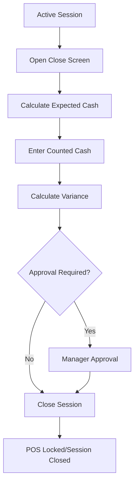

# Cashier Close Session Flow

## Purpose

This flow documents how a cashier closes an active till session and reconciles cash.
It confirms expected cash, counted cash, variance, manager approval if required, and final session close.

Closing the session is part of operational control and reporting. It is not only a UI logout.

## Actors

| Actor | Responsibility |
|---|---|
| Cashier | Counts cash and submits close. |
| Manager | Approves variance where required. |
| Backend service | Calculates expected cash and validates close. |
| POS frontend | Guides denomination count and close confirmation. |

## Preconditions

- Active till session exists.
- Cashier is authenticated and assigned to outlet/till context.
- Pending payments/sales are handled according to business rules.
- Cash count is required where cash reconciliation is enabled.

## Related Entities

| Entity | Use |
|---|---|
| `till_sessions` | Session open/close values. |
| `cash_count_denominations` | Denomination-level count. |
| `payments` | Cash payment totals affecting expected cash. |
| `cash_movements` | Cash-in/out, safe drop, paid out. |
| `sales` | Completed/voided sale context. |
| `audit_logs` | Variance approval and sensitive close actions. |

## Main Flow

1. Cashier opens Close Session screen.
2. POS shows session summary: opening float, sales, payments, non-sale cash movements.
3. System calculates expected cash.
4. Cashier counts drawer cash.
5. Cashier enters counted cash, optionally by denomination.
6. POS calculates variance.
7. If variance requires approval, manager approves/rejects.
8. Cashier confirms close.
9. Backend updates `till_sessions` with counted cash, variance, closed_by, closed_at, status `closed`.
10. POS locks billing screen for that session.
11. Shift/cash report becomes available.

## Alternative Flows

### No Variance

- Counted cash equals expected cash.
- Session closes without approval.

### Variance Requires Approval

- Manager approval required before close.
- Store approved_by and approved_at.

### Cashier Cancels Close

- Session remains open.
- No close values committed.

### Offline Close

- If close happens offline, local close record must sync later.
- Server validates session state during sync.

## Validation Rules

| Rule | Expected behavior |
|---|---|
| Counted cash cannot be negative | Reject invalid amount. |
| Denomination quantity cannot be negative | Reject invalid count. |
| Closed session cannot accept new sales | POS locked. |
| Variance approval required if policy requires it | Close blocked until approved. |
| Only open session can close | Backend rejects already closed session. |

## Frontend Notes

- Denomination input must be touch-friendly.
- Show expected cash, counted cash, and variance clearly.
- Confirm close because it locks billing.
- If printer/report fails, session close must not be corrupted.

## Backend Notes

- Expected cash should be derived from opening float, cash payments, refunds, and cash movements.
- Use transaction boundary for session close and denomination records.
- Do not let frontend submit arbitrary expected cash as authority.
- Store close note if provided.

## Error Cases

| Error | Handling |
|---|---|
| Session already closed | Show closed state. |
| Pending approval | Block close until manager decision. |
| Invalid denomination count | Show field error. |
| Offline sync conflict | Create conflict/rejection if server state differs. |

## Audit Behavior

Variance approval, forced close, manager override, and sensitive corrections must be audited.
Normal close is traceable through `till_sessions` and denomination records.

## QA Checklist

- [ ] Cashier can close session with exact count.
- [ ] Variance is calculated correctly.
- [ ] Approval required variance blocks close.
- [ ] Denomination totals sum correctly.
- [ ] Closed session prevents further sale completion.
- [ ] Shift report uses same session values.
- [ ] Offline close sync handles conflict safely.

## Links

- [[08-user-flows/cashier/start-session]]
- [[08-user-flows/cashier/cash-payment]]
- [[03-data/entities/pos-sales-entities]]
- [[10-testing-quality/reporting-reconciliation-test-cases]]
